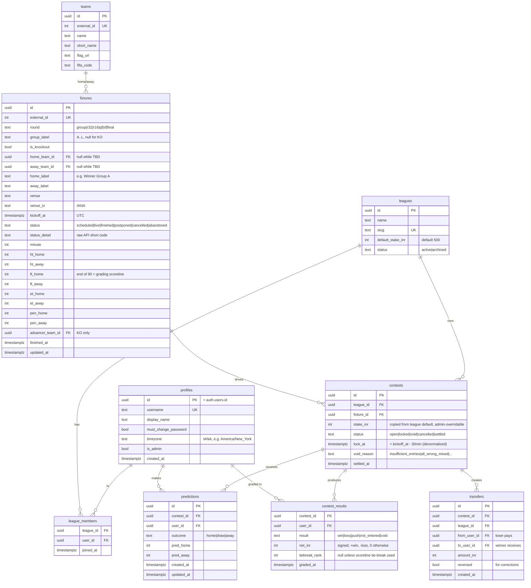

# ✨ Cashford — World Cup 2026 Prediction & Settle-Up Game

> A private, invite-only web app where two separate friend-leagues predict every FIFA World Cup 2026 match (winner/draw + scoreline), with money settled automatically after full-time and tracked in a running ₹ ledger.

**App name:** **Cashford** (Rashford + "cash" — a footballer-name money pun, fitting for a dues-tracking app).

⏱️ **Timing reality:** Today is **2026-06-18**. The World Cup is **already underway** (opener was June 11; group stage ends June 27; knockouts June 28 → final July 19). Most of the tournament — all 32 knockout matches + remaining group games — is still ahead. **This needs to ship fast.** Matches whose lock time has already passed cannot accept predictions and are treated as historical/void (see §7.6).

---

## 0. Enhancement Summary (deepened 2026-06-18)

Deepened with **6 parallel agents** — 4 adversarial reviewers (correctness, security, data-integrity, architecture) + 2 researchers (Supabase/cron reliability, real-world prediction-pool design). Full detail in **§17**. The ship-blocking findings:

1. **💰 Money rounding was undefined and would silently lose/create ₹.** `₹500 ÷ 3 winners = ₹166.67`, but ₹ columns are integers. Fixed: floor + deterministic remainder distribution; `net_inr` derived by summing actual transfer rows (§17.1, §7.4).
2. **🔓 Supabase Realtime could leak predictions before lock** — the core game guarantee. Fix: **never** subscribe clients to `predictions`; drop it from the realtime publication; v1 uses 30s client polling against our own DB (RLS re-checked every read). Realtime, if used, only on `fixtures` (§17.3).
3. **🔁 Settlement could double-pay** without an atomic claim under overlapping cron runs. Fix: `'settling'` intermediate status + `UPDATE…WHERE status='locked'` claim (or `FOR UPDATE SKIP LOCKED`) before any money write (§17.2).
4. **🔑 `must_change_password` was only a middleware redirect** — bypassable via direct API calls. Fix: enforce server-side at the RLS write layer (§17.4).
5. **🛡️ `contests`/`contest_results`/`transfers`/`leagues`/`league_members` had no write-deny RLS**, and the predictions write policy didn't check league membership; admin check read self-writable `user_metadata`. Fix: full hardened RLS set, service-role-only writes, `is_admin` read from `profiles` (§17.3–17.4).
6. **📡 Premature settlement on a flapping/early "FT"** and **null `advancer_team_id`** on knockouts. Fix: stability window (`finished_confirmed_at`) + score/advancer null-gates (§17.6).
7. **🧱 Many missing DB constraints** (no `pred≥0`, no "knockout≠draw", no `from≠to`, no composite PKs, FK behavior unset) + **`lock_at` goes stale on postponement**. Fix: full constraint list + a recompute trigger (§17.5).
8. **🧪 No test strategy & no observability** for a money app. Added golden-case tests for every §7.5 example + edge cases, settlement logging, and a ledger CSV backup (§17.10).
9. **🗺️ Missing UI states** (finished-but-not-settled, void-during-live, KO overlay) folded into §11.3.
10. **🏃 Mid-tournament Fast Path** — ship the playable core (predict/lock/reveal + manual settle) before **Jun 27**; defer live polling/auto-settle (§13 callout, §17.12).

**External validation:** the layered tie-break and 90-min-only knockout scoring match how Kicktipp / Superbru / World-Cup pools actually work; pot-splitting + end-of-tournament "settle-up" hardened with the Splitwise greedy debt-simplification algorithm (§17.8, §17.11). **Case C is resolved** (D9 — closest scoreline wins, else void) and the player/league inputs are in (§16); only the Supabase + API-Football keys remain to wire up.

---

## 1. Overview

Cashford is a mobile-first web app for a closed group of friends to run a World Cup prediction pool. There are **two independent leagues** (separate friend groups). For each match, every league runs a **contest**: members predict the **outcome** (Team A win / Draw / Team B win) and a **scoreline**. Predictions **lock 30 minutes before kickoff** and are then revealed to the whole league. After full-time, the app **automatically settles** who owes whom, in **₹ (INR)**, and maintains a running net + pairwise dues ledger per league.

Everything administrative — creating accounts, assigning people to leagues, setting the wager amount — is done by **Ananth via the backend only**. There is **no public signup, no self-serve league creation, and no admin UI** in v1.

### Goals
- Predict every WC2026 match; lock 30 min before KO; reveal after lock.
- Auto-fetch fixtures (incl. knockout slots that fill in over time) and live/final scores.
- Auto-settle stakes on confirmed full-time; track a per-league ₹ ledger (net + pairwise).
- Dead-simple username/password login with forced first-login password change.
- Localize all match times to each viewer's timezone (friends are in India **and** the US).

### Non-Goals (v1)
- No real money movement / payments integration (settlement is an informal ₹ IOU ledger).
- No public signup, no in-app account/league creation, no admin dashboard (backend only).
- No cross-league "global" view (everything is accessed *from within* a league).
- No player stats beyond the prediction game (no lineups, scorers, etc.).

---

## 2. Decisions Locked With Ananth (this session)

| # | Decision | Choice |
|---|----------|--------|
| D1 | **Knockout predictions** | **Advance-based.** Outcome is *who advances* (Team A / Team B — **no Draw** button in knockouts). Predicted scoreline = the **90-minute (regulation) score**. Winner-by-outcome = whoever actually advances, incl. via extra time/penalties. |
| D2 | **Scoreline tie-break** (only when *everyone* picked the same outcome) | **Layered:** ① exact score → ② smallest total goal error `\|pH−aH\|+\|pA−aA\|` → ③ closest goal margin → ④ closest total goals → ⑤ still tied = split. |
| D3 | **Same-outcome money flow** | **"Least-wrong always wins."** When all entrants pick the same outcome, the single closest scoreline wins and collects the stake from each other player — **even if the shared outcome was wrong**. (Same-outcome contests therefore always settle, never void on that basis.) |
| D4 | **Scores/fixtures API** | **Free tier only** → **API-Football (api-sports.io) free tier** (only free tier with live scores + WC2026). |
| D5 | **Settlement trigger** | **Fully automatic**, firing **only on the API's confirmed full-time/finished status** (`FT`/`AET`/`PEN`). Backend correction path if Ananth spots a mistake. |
| D6 | **Dues display** | **Net + pairwise** — each player's running net *and* a "who owes whom" breakdown. |
| D7 | **League membership** | **Many-to-many** — a player (incl. Ananth) can be in both leagues. |
| D8 | **App name** | **Cashford.** |
| D9 | **Case C** (mixed picks, nobody right on outcome) | **Closest scoreline wins**; if the scoreline *also* can't separate (all tied on the full layered key) → **VOID**. Unifies the model: the scoreline decides whenever the outcome doesn't split the field into both winners and losers. |

### Defaults adopted (Ananth to flag if any are wrong)
- **Stack:** Next.js (App Router, TypeScript) + Supabase (Postgres, Auth, Edge Functions, pg_cron) on **Vercel** (matches existing workflow).
- **Auth:** username + password (no email shown), admin-only creation, forced first-login password change, **no self-serve password reset** (Ananth resets via backend).
- **Admin = backend only:** wager amount, leagues, and membership are edited directly in Supabase tables. Ananth is also a player.
- **Currency:** everything in **₹ (display only)**; US friends see match **times** localized, but money stays ₹.
- **Entry model:** implicit — every league member is eligible for every match; you "enter" by submitting a prediction before lock. No prediction = not in that contest. **≥2 valid entries** needed or the contest is **void**.
- **Reveal:** predictions hidden until lock; after lock (incl. live & settled), everyone in the league sees everyone's pick for that match.

### ✅ Resolved (2026-06-18): Case C — mixed picks, nobody got the outcome right
**Ruling (D9): the closest scoreline wins.** E.g. one picks Team A, one picks Team B, result is a draw — neither got the outcome, so the closest predicted scoreline to the actual takes the pot. **If the scoreline can't separate them either** (all tied on the full layered key) → **VOID**. This generalizes the whole model — see the unified rule in §7.4.

---

## 3. Tournament Facts That Shape the Build (verified via research)

- **48 teams, 12 groups of 4** (A–L), **104 matches total** (72 group + 32 knockout).
- **Round of 32** = top-2 of each group (24) + **8 best third-placed teams**. The full R32 bracket is only confirmed **after the last group match on June 27**, so knockout fixtures come from the API with **`null` team IDs + placeholder labels** ("Winner Group A", "3rd C/D/F/G/H") until they resolve. → We must handle **TBD fixtures** gracefully.
- **Schedule:** Group stage ends **Jun 27**; R32 **Jun 28–Jul 3**; R16 **Jul 4–7**; QF **Jul 9–11**; SF **Jul 14–15**; **Final Jul 19** (MetLife, NY/NJ).
- **Venues span 3 US/Canada/Mexico time zones only:** **ET (UTC−4)**, **CT (UTC−5, incl. Mexico City/Guadalajara)**, **PT (UTC−7)**. No Mountain Time. → Localization matters; store everything UTC.

---

## 4. Architecture

```
┌────────────────────────────────────────────────────────────────────┐
│  Next.js (App Router, TS) on Vercel — mobile-first                   │
│  • Server Components read from Supabase (RLS-scoped)                  │
│  • Client components: prediction form, live score, countdowns, tz    │
│  • Supabase Realtime subscription on fixtures/contests (live push)   │
│  • Middleware: auth gate + force-password-change gate                │
└───────────────┬──────────────────────────────────────┬─────────────┘
                │ supabase-js (anon, RLS)                │ service role
                ▼                                        ▼ (server only)
┌────────────────────────────────────────────────────────────────────┐
│  Supabase (Postgres + Auth + Edge Functions + Vault + pg_cron)       │
│                                                                      │
│  pg_cron (pure DB):  lock_due_contests()   every 1 min               │
│                      settle_finished()     every 2 min               │
│  Edge Function + cron: sync-fixtures       daily (+2h Jun 27–28)     │
│                        poll-scores         every ~3 min, live windows│
│                          └─ guard: skip API call if nothing live/due │
└───────────────┬──────────────────────────────────────────────────────┘
                │ outbound HTTPS (key in Vault / EF Secrets)
                ▼
        API-Football  v3.football.api-sports.io  (league=1, season=2026)
```

**Why this split (from research):**
- **Score polling** = Edge Function + Supabase Cron (native `fetch`, clean JSON parsing, retries).
- **Lock & settle** = pg_cron + plain SQL functions (pure DB mutations, no outbound HTTP).
- **Secrets:** API key in **Supabase Vault** (DB-side) / Edge Function **Secrets** (function-side). `SUPABASE_SERVICE_ROLE_KEY` lives only in Vercel server env, never `NEXT_PUBLIC_`.

### 4.1 API-Football usage (free tier, 100 req/day)
- Bootstrap once: `GET /fixtures?league=1&season=2026` → all 104 fixtures (UTC kickoff, venue, status). **1 call.**
- Live polling: `GET /fixtures?live=all&league=1` → **all live WC matches in ONE call** regardless of how many are simultaneous. Poll **every ~3 min, only during live windows**, and only after a DB guard confirms a fixture is live/imminent. Peak matchday ≈ **50–75 calls** → safely under 100/day. User traffic never hits the API (clients read our DB).
- Knockout resolution: re-run the fixtures sync (esp. **Jun 27–28**) to fill `null` team IDs.
- Status field = `fixture.status.short`: `NS, 1H, HT, 2H, ET, BT, P, FT, AET, PEN, PST, CANC, ABD, SUSP, INT, AWD, WO`. Advancer = `teams.home.winner` / `teams.away.winner`. Scores: `goals.*` (live/final incl. ET), `score.fulltime.*` (**end-of-90 = our grading scoreline**), `score.halftime.*`, `score.penalty.*`.
- **Quota note:** free quota resets at **UTC midnight (8pm ET / 5pm PT)** — late US night games span two quota days, which actually *spreads* load. Fine.
- **Fallback** if quota ever bites: football-data.org free (delayed, no live) for next-morning grading, or the €-cheap API-Football tier later.

---

## 5. Data Model (ERD)



**Notes**
- `contests` has a **UNIQUE(league_id, fixture_id)** — one contest per league per match.
- `predictions` has **UNIQUE(contest_id, user_id)** — one prediction per player per contest.
- `lock_at` is denormalized onto `contests` so RLS/locking/indexing don't join `fixtures` every row. Composite indexes: `contests(id, lock_at)`, `predictions(contest_id, user_id)`, `league_members(user_id)`, `league_members(league_id)`.
- The **net view** reads `contest_results`; the **pairwise dues** view aggregates `transfers` per `{league, pair}` and nets reciprocal debts.

---

## 6. Status Taxonomy (every status field, every value)

| Field | Values | Set by | Meaning |
|-------|--------|--------|---------|
| `fixtures.status` | `scheduled` | sync | KO in future (API `NS`) |
| | `live` | poller | in play (API `1H/HT/2H/ET/BT/P`) |
| | `finished` | poller | full-time confirmed (API `FT/AET/PEN`) — **settlement trigger** |
| | `postponed` / `cancelled` / `abandoned` | poller | API `PST` / `CANC` / `ABD/SUSP/INT/AWD/WO` → contest `cancelled` |
| `fixtures.status_detail` | raw API `short` | poller | exact sub-state (drives HT/PEN badges) |
| `contests.status` | `open` | created | `lock_at` in future; predictions editable |
| | `locked` | `lock_due_contests()` | `lock_at` passed, not finished; **predictions frozen & revealed**; awaiting result |
| | `void` | locker / settler | **<2 valid entries** at lock (`insufficient_entries`), OR settlement found **no separation** by outcome or scoreline (`no_separation`, D9) |
| | `cancelled` | settler | underlying match postponed/cancelled/abandoned; no money |
| | `settled` | `settle_finished()` | graded; `contest_results` + `transfers` written |
| `contest_results.result` (per user) | `win` / `loss` / `push` / `not_entered` / `void` | settler | this player's outcome in the contest |
| `transfers.reversed` | `false` / `true` | correction fn | true if a settlement was reversed/re-run |

---

## 7. Game Mechanics — Precise Spec

### 7.1 Prediction
- **Group stage:** outcome ∈ `{home, draw, away}`; scoreline `(pred_home, pred_away)`, integers ≥ 0.
- **Knockout (advance-based, D1):** outcome ∈ `{home, away}` (no draw); scoreline = predicted **90-minute** score.
- Editable any time while contest is `open`; **frozen at `lock_at` = kickoff − 30 min**.
- Enforced in two layers: RLS `with check (lock_at > now())` on insert/update **and** the locker cron.

### 7.2 Grading inputs (what "actual result" means)
- **Scoreline graded on end-of-regulation score** = `fixtures.ft_home/ft_away` (API `score.fulltime`). Same for group and knockout (knockout scoreline is the 90-min score per D1).
- **Actual outcome:**
  - Group: derived from `ft_home` vs `ft_away` → home / draw / away.
  - Knockout: from `advancer_team_id` → home or away (incl. ET/penalties).

### 7.3 Validity gate (run at lock)
- Count valid predictions `N` for the contest.
- `N < 2` → contest `void` (`void_reason='insufficient_entries'`). No settlement, no money.
- `N ≥ 2` → proceed to settlement when the match finishes.

### 7.4 The unified settlement algorithm
Let stake = `S` (default ₹500), and `P` = the `N` players who submitted valid predictions.

**Step 1 — grade each player into Winners vs Losers.** Let `W_o` = players whose outcome == actual outcome, `N` = valid entrants.

- **Outcome splits the field** — `0 < |W_o| < N` (some right, some wrong): **Winners = `W_o`**, Losers = the rest. *Scoreline is ignored.* (The everyday case — your examples 1 & 2.)
- **Outcome does NOT split the field** — `|W_o| = 0` (nobody right) **or** `|W_o| = N` (everyone right, i.e. unanimous-correct): fall back to the **layered scoreline tie-break (§7.7)** across **all N players** vs the regulation score. **Winners = those tied at the best scoreline rank**; Losers = the rest. *(D3 "least-wrong always wins" and D9 Case-C both live here — scoreline decides whether everyone was wrong, everyone was unanimously right, or picks were mixed-but-all-wrong.)*
  - **If all N tie on the full scoreline key** (nobody is closer) → **VOID** (`void_reason='no_separation'`), no money.

> **The one rule to remember:** *the predicted scoreline is the tiebreaker whenever the outcome alone doesn't produce both winners and losers.*

**Step 2 — move the money (same formula for both branches):**
- Each **Loser** pays `S`. Pot = `S × |Losers|`.
- Pot is split **equally** among Winners: each Winner receives `S × |Losers| / |Winners|`.
- **Pairwise `transfers`:** for transparency, each Loser owes each Winner `S / |Winners|` → one directed `transfer` row per (Loser, Winner) pair.
- ⚠️ **Rounding (integer ₹) — see §17.1.** `S × |Losers| / |Winners|` and `S / |Winners|` are **not always integers** (e.g. ₹500 with 3 winners = ₹166.67). Policy: **floor** each per-pair transfer, then distribute the leftover ₹1s one at a time to winners in a deterministic order (by `user_id`). This conserves the pot exactly — every loser pays exactly `S`, and the sum of transfers equals the pot.
- ✅ **`net_inr` is DERIVED, not recomputed:** set `contest_results.net_inr = Σ(inbound transfers) − Σ(outbound transfers)` per user, *after* writing the (rounded) transfer rows — so the net leaderboard and the pairwise view reconcile **by construction**, never by coincidence.

**Players who didn't predict** get `contest_results.result='not_entered'`, `net_inr=0` — shown in the reveal but outside settlement.

### 7.5 Worked examples (3-player league, S = ₹500)

| # | Picks | Result | Branch | Winners / Losers | Money |
|---|-------|--------|--------|------------------|-------|
| 1 | A; B; B | **A wins** | Mixed | W={A-picker}, L={2} | A-picker **+₹1000**; each other **−₹500** ✓ *(your example 1)* |
| 2 | A; A; B | **A wins** | Mixed | W={2}, L={1} | each A-picker **+₹250**; B-picker **−₹500** ✓ *(your example 2)* |
| 3 | A; A; A; result 2-1, preds 2-1 / 3-1 / 1-0 | A wins | Unanimous | W={2-1 (exact)}, L={other 2} | exact **+₹1000**; others **−₹500** |
| 4 | A; A; A; **result = Draw** | (all wrong) | Unanimous | least-wrong scoreline wins (D3) | closest **+₹1000**; others **−₹500** |
| 5 | A; B (preds 1-1 / 2-0); result **1-1 Draw** | nobody right on outcome → scoreline fallback (D9) | W={1-1 picker}, L={2-0 picker} | 1-1 picker **+₹500**; other **−₹500** |
| 6 | only 1 player predicts | any | — | — | **VOID** (insufficient) |
| 7 | Everyone tied on the full scoreline key (e.g. identical predictions) | no separation by outcome *or* scoreline | — | — | **VOID / push** |

### 7.6 Mid-tournament & abnormal cases
- **Already-kicked-off matches at deploy time** (June 11–18): `lock_at` in the past → **no contest opens for entry**; shown read-only as historical (or omitted). We only create active contests for fixtures with `lock_at > now()` at deploy. Backfill past scores for context only.
- **Postponed/cancelled/abandoned match:** contest → `cancelled`, no money. If later replayed, sync creates a fresh fixture/contest.
- **TBD knockout fixtures:** contest exists but **predictions open only once both `home_team_id` & `away_team_id` are non-null** (teams resolved) **and** `lock_at > now()`. Card shows "Teams TBD — opens after group stage."

### 7.7 Layered tie-break (only for unanimous contests)
Against regulation score `(aH, aA)`, sort each prediction `(pH, pA)` by this **lexicographic key** (lower = better):
1. `exact` = `0` if `(pH,pA)==(aH,aA)` else `1`
2. `totalError` = `|pH−aH| + |pA−aA|`
3. `marginError` = `|(pH−pA) − (aH−aA)|`
4. `totalGoalsError` = `|(pH+pA) − (aH+aA)|`

Winner(s) = all sharing the minimal key. Sole min → sole winner. Ties at the top → they split (per §7.4 Step 2); all tied → void.

> Example: actual **2–1**. `2-1`→(0,…) wins. Else `3-1` (tot err 1) beats `1-0` & `3-2` (tot err 2). Between `1-0` and `3-2` (both tot err 2): equal margin err (0) and equal total-goals err (2) → they'd split.

### 7.8 Dues aggregation (per league)
- **Net leaderboard:** `Σ contest_results.net_inr` per user → "+₹1,250 / −₹500".
- **Pairwise "who owes whom":** aggregate `transfers` per ordered pair, then **net reciprocals** (A→B ₹300 and B→A ₹100 ⇒ "A owes B ₹200"). Drives the settle-up list.

---

## 8. Auth & Admin (backend-only)

- **Approach (from research): synthetic emails** — `username@cashford.internal` inside Supabase Auth; `profiles.username` is the real identity. (Avoids reimplementing sessions/JWT/RLS that a fully custom table would force.)
- **Account creation:** server-only Route Handler using `SUPABASE_SERVICE_ROLE_KEY` → `auth.admin.createUser({ email_confirm:true, user_metadata:{ username, must_change_password:true } })`. A trigger mirrors into `profiles`. *(I'll run this for the 5 users you name; you give me usernames + temp passwords to share.)*
- **Login:** username → `signInWithPassword({ email: \`${username}@cashford.internal\`, password })`.
- **Forced first-login change:** `must_change_password` flag in `user_metadata`; **middleware** redirects to `/change-password` until cleared after a successful `updateUser({ password })`.
- **Public signup disabled** (dashboard toggle + `enable_signup=false`). No self-serve reset in v1 (Ananth resets via service role).
- **League membership** assigned by Ananth via `league_members` inserts (backend). Many-to-many (D7).

---

## 9. Security — RLS (research-backed)

- `my_league_ids()` = **`security definer`** function returning the caller's league IDs (avoids recursive RLS on `league_members`).
- **League scoping:** `leagues / contests / contest_results / transfers / league_members` SELECT `using (… in (select my_league_ids()))`.
- **Predictions reveal (time-based):** a player may read **their own** prediction anytime, and **others'** only once `contests.lock_at <= now()`:
  ```sql
  using (
    contest_id in (select id from contests where league_id in (select my_league_ids()))
    and ( user_id = (select auth.uid())
          or (select lock_at from contests c where c.id = predictions.contest_id) <= now() )
  )
  ```
- **Predictions insert/update:** `with check (user_id = auth.uid() and lock_at > now())`.
- **Time-based RLS pitfalls:** trust the **Postgres clock** (not the app); add a small safety margin; service-role cron bypasses RLS for grading; index `contests(id, lock_at)`.

---

## 10. Background Jobs

| Job | Engine | Cadence | Does |
|-----|--------|---------|------|
| `sync-fixtures` | Edge Function + cron | daily; **every 2h Jun 27–28** | Upsert teams + 104 fixtures; resolve TBD KO slots; set `kickoff_at`, `lock_at`; **create a contest per league per new fixture** (stake = league default) |
| `poll-scores` | Edge Function + cron | every ~3 min **in live windows only** | DB **guard** (any fixture live or KO within ~3h?) → else exit w/o API call → `GET /fixtures?live=all&league=1` → upsert score/status/HT/advancer |
| `lock_due_contests()` | pg_cron | every 1 min | `open→locked` where `lock_at<=now()` & not finished; apply **§7.3 validity gate** (`<2 entries → void`) |
| `settle_finished()` | pg_cron | every 2 min | For `locked` contests whose fixture is `finished` → run **§7.4 settlement** → write `contest_results` + `transfers` → `settled`. Postponed/cancelled → `cancelled` |
| `resettle_contest(id)` | manual (service role) | on demand | Reverse prior `transfers`/`results` (`reversed=true`) and re-grade after a data correction (D5 mistake path) |

**Idempotency:** every job is a guarded state transition (only acts on the prior status), so re-runs are safe and double-settlement is impossible.

---

## 11. Screens & Components

### 11.1 Screens
1. **Login** — username + password; inline errors; link to forced first-time flow.
2. **Change Password** — forced (first login) + voluntary; new + confirm, strength, success → continue.
3. **Leagues Home** — cards for each league the user is in: name, member count, **your net (+/−₹)**, badge "N picks to make". Empty state if none.
4. **League View** — header (league name, your net, settle-up summary). **Tabs:** `Upcoming` · `Live` · `Completed` · `Dues`. Lists of **MatchCards**.
5. **Match / Contest Detail** — fixture header (teams/flags or TBD, **local-time kickoff + countdown**, round, venue) + state-dependent body:
   - *Open:* PredictionForm (outcome selector, score steppers, stake chip, lock countdown, submit/edit).
   - *Locked / Live / Settled:* RevealGrid (all members' picks), live or final score, your result, status badge, settlement breakdown.
6. **Dues Tab** — Net leaderboard + Pairwise "who owes whom" + settle-up suggestions.
7. **Profile / Settings** — timezone (auto-detected + override), change password, logout.
8. *(No admin UI — backend only.)*

### 11.2 Reusable component inventory (standardize, reuse everywhere)
`AppShell/TopBar` · `TabBar` · `LeagueCard` · **`MatchCard`** (+ sub: `TeamRow`, `StatusBadge`, `CountdownTimer`, `ScoreDisplay`, `ResultChip`) · `PredictionForm` (`OutcomeSelector` 2-/3-way segmented, `ScoreStepper`, `StakeChip`, `LockCountdown`) · `RevealGrid`/`RevealRow` · `DuesLeaderboard` · `PairwiseDuesList` · `Avatar`(initials) · `Badge` · `Button` · `Input` · `Sheet/Modal` · `Toast` · `EmptyState` · `Skeleton` · `LocalTime` (client-side `Intl` formatter, `suppressHydrationWarning`).

### 11.3 MatchCard — the full UI state matrix (the heart of the app)
Card visual derived from **(fixture.status × contest.status × did-current-user-predict)**:

| # | State | When | Card shows | Primary CTA |
|---|-------|------|-----------|-------------|
| S1 | **Open · no pick** | contest `open`, user has no prediction | teams, local KO time, countdown-to-lock, "OPEN" badge | **Make pick** |
| S2 | **Open · picked** | `open`, user predicted | your pick (private), countdown, "editable until {lock}" | **Edit pick** |
| S3 | **TBD** | KO fixture, teams `null` | placeholder labels ("Winner Grp A"), "opens after group stage" | disabled |
| S4 | **Locked · pre-KO** | `locked`, match not started | RevealGrid, "Locked · kicks off in {t}", "LOCKED" badge | View |
| S5 | **Live** | `locked`, fixture `live` | live score + minute, HT badge if `HT`, RevealGrid, provisional standing, "LIVE" pulse | View |
| S6 | **Settled · you won** | `settled`, user `win` | final score, RevealGrid w/ result chips, **+₹X**, winner highlighted | View |
| S7 | **Settled · you lost** | `settled`, user `loss` | final score, RevealGrid, **−₹X** | View |
| S8 | **Settled · push** | `settled`, user `push` | final score, "Push — no money" | View |
| S9 | **Settled · you sat out** | `settled`, user `not_entered` | final score + others' picks/results, "You sat this one out" | View |
| S10 | **Void** | contest `void` | "Void — not enough players entered" (or Case-C), greyed | View |
| S11 | **Cancelled** | contest `cancelled` | "Match cancelled — no contest" | View |
| S12 | **KO advancer** | settled knockout | "🇧🇷 Brazil advance on penalties (1-1, 4-3 pens)"; scoreline graded on 90-min | View |

Knockout cards use a **2-way** outcome selector (no Draw). Each card is one component with a `state` prop driving layout — **reuse, don't fork.**

**Additional states surfaced in review (see §17.9 — must be handled or the UI falls through):**
- **S5b · Full Time — settling:** `contest=locked AND fixture=finished` but the settle cron hasn't run yet (≤ a few min). Show final score + RevealGrid + a neutral "Full Time · settling…" badge (no LIVE pulse). Auto-resolves to S6–S9.
- **S12 is an overlay, not a separate outcome:** a settled knockout still resolves to S6/S7/S8/S9 (won/lost/push/sat-out) — the "Brazil advance on penalties" line *replaces the header scoreline*; the body (±₹, result chips) is identical to the group-stage state.
- **Void/Cancelled during a live/finished match (S10/S11):** still show the live/final **score** for context — only the *settlement* section is greyed, not the score panel.
- **Open but lock already passed** (cron lag): if `contest=open AND lock_at ≤ now()`, render as **S4 (locked)**, never S1/S2 — the RLS already blocks the prediction, so never show an "editable" CTA that will fail.

---

## 12. The Claude Design Prompt (copy/paste — build screens in parallel)

> Paste the block in **§12.1** into Claude (Artifacts), v0, Lovable, or Figma Make. It is self-contained: brand, tokens, every component + variant, every screen, and the full MatchCard state matrix.

### 12.1
```text
You are designing "Cashford" — a mobile-first web app where two private groups of
friends predict every 2026 FIFA World Cup match for ₹ stakes and settle up afterward.
It's playful, sporty, and money-aware (the name = Rashford + "cash"). Audience: friends
in India and the US. Design MOBILE-FIRST (375–430px), then a simple responsive desktop.

DELIVER a complete, consistent design system + all screens. Reuse components everywhere;
do not create one-off variants. Output: a component library page + every screen + the
full MatchCard state matrix (12 states below). Light theme primary; include a dark variant.

BRAND & TONE: energetic, clean, confident. Football-pitch + cash motifs used sparingly.
Rounded, friendly, legible. Big tap targets. No clutter.

DESIGN TOKENS (use exactly; expose as variables):
- Color: bg #0B0F14 (dark) / #F7F8FA (light); surface #FFFFFF / #131922;
  primary (pitch green) #15A66A; primary-press #0E8455; accent (cash gold) #F2C94C;
  win #16A34A; loss #EF4444; neutral/push #64748B; live #FF3B30;
  text #0F172A / #E6EAF0; muted #64748B; border #E5E8EC / #232B36.
- Type: Inter (or system). Scale: display 28/700, h1 22/700, h2 18/600, body 15/450,
  small 13/500, mono for scores (tabular nums) 18/700.
- Radius: 16 (cards), 12 (inputs/buttons), 999 (pills). Spacing 4-pt grid.
- Shadow: subtle (y2 blur8 8% on light). Motion: 150–200ms ease; LIVE badge pulse.

COMPONENTS (with all variants/states):
1) TopBar: "Cashford" wordmark + small ball/coin glyph; right = avatar menu (initials).
2) TabBar (in-league): Upcoming · Live · Completed · Dues. Active = primary underline.
3) Button: primary / secondary / ghost / destructive; default·hover·press·disabled·loading.
4) Input + PasswordInput (show/hide, strength meter). InlineError. Toast (success/error).
5) Badge/StatusBadge: OPEN, LOCKED, LIVE(pulse), HT, FT, VOID, CANCELLED, SETTLED, TBD.
   Each a distinct, legible color chip.
6) SegmentedControl OutcomeSelector: 3-way [Home | Draw | Away] AND 2-way [Home | Away]
   (knockouts). Show team short-names; selected = filled primary.
7) ScoreStepper: two −/number/+ steppers (Home goals, Away goals), big tabular numerals.
8) StakeChip: "₹500" read-only pill (label "Stake").
9) CountdownTimer: "Locks in 12:43" / "Kicks off in 03:10"; turns amber under 5 min.
10) LeagueCard: league name, member count, your net (+₹ green / −₹ red), "N picks to make".
11) Avatar: colored initials circle.
12) RevealGrid: one RevealRow per member = avatar + name + outcome pill + predicted score
    + ResultChip (+₹ / −₹ / push / —). Winner row highlighted. "You" tag on own row.
13) DuesLeaderboard: ranked members with signed net. PairwiseDuesList: "You owe Sam ₹250",
    "Dev owes you ₹500" rows with settle-up styling.
14) EmptyState + Skeleton loaders for lists/cards.
15) MatchCard: ONE component, a `state` prop. Header = TeamRow (flag/short-name/score) ×2,
    round + local kickoff time + venue, StatusBadge. Body changes per state.

MATCHCARD — DESIGN ALL 12 STATES (consistent header, body varies):
S1 Open·no pick (countdown + "Make pick");           S2 Open·picked (your pick + "Edit");
S3 TBD ("Winner Grp A vs Runner-up Grp B", disabled); S4 Locked·pre-KO (RevealGrid + countdown);
S5 Live (live score, minute, HT badge, RevealGrid, pulse);  S6 Settled·WON (final score, +₹, winner glow);
S7 Settled·LOST (−₹);  S8 Settled·PUSH ("no money");  S9 Settled·sat-out ("You sat this out" + others);
S10 Void ("Not enough players entered", greyed);  S11 Cancelled ("Match cancelled");
S12 KO advancer ("Brazil advance on penalties 1-1 (4-3)", scoreline = 90-min).

SCREENS:
A) Login (username + password, error, "first login → set password" hint).
B) Change Password (forced + voluntary; new + confirm + strength; success).
C) Leagues Home (LeagueCards; empty state).
D) League View (header: name + your net + settle-up summary; TabBar; lists of MatchCards
   under Upcoming/Live/Completed; Dues tab = DuesLeaderboard + PairwiseDuesList).
E) Match Detail (expanded MatchCard: full header, PredictionForm when open, full RevealGrid
   + settlement breakdown when locked/settled).
F) Profile/Settings (timezone auto-detected + override dropdown, change password, logout).

RULES: every match time shows in the VIEWER's local timezone with a tz hint (e.g.
"Sat 21 Jun, 9:30 PM IST"). Money always "₹". Predictions are hidden in RevealGrid until
the contest locks. Knockout cards never show a Draw option. Keep it phone-thumb friendly.
Provide the component library sheet first, then all screens, then the 12 MatchCard states.
```

### 12.2 After designs land
Bring the output (screens/tokens/Figma) back here. I'll wire components to the live Supabase data, enforce the state machine, and reconcile any token differences. (If you'd rather I theme it from your Cradlewise tokens instead, say so — default is the standalone Cashford palette above, since this is a personal side project.)

---

## 13. Implementation Phases

| Phase | Deliverable | Notes |
|-------|-------------|-------|
| **0 Scaffold** | Next.js + TS + Supabase + Vercel; envs; design tokens | repo `cashford` on GitHub (private), Vercel auto-deploy |
| **1 Schema** | Migrations for all tables + indexes + **RLS** (§9) | `my_league_ids()` security-definer fn |
| **2 Auth** | Login, forced password change, admin create-user route; seed **5 users + 2 leagues + memberships** | needs your usernames + temp passwords |
| **3 Fixtures** | `sync-fixtures` EF; bootstrap 104 fixtures + teams; generate contests | API key in Vault/Secrets |
| **4 Predict** | Open MatchCard + PredictionForm + lock RLS | per §7.1 |
| **5 Lock/Reveal** | `lock_due_contests()`; reveal via time-based RLS; void-on-insufficient | per §7.3 |
| **6 Live** | `poll-scores` EF (+guard); live UI; Supabase Realtime push | per §10 |
| **7 Settle** | `settle_finished()` + unified algorithm + `contest_results` + `transfers`; Dues views | per §7.4 |
| **8 Localize/Polish** | tz detection + override; all 12 card states; empty/error/skeleton | per §11.3 |
| **9 Knockouts** | bracket resolution sync; advance-based grading; `resettle_contest()` | per §7.6 |
| **10 QA/Deploy** | walk the full state matrix; ship to Vercel | mid-tournament → ship ASAP |

> 🏃 **Fast Path (review-recommended, given mid-tournament).** Ship the *playable core* before **June 27** (last group day; first knockout locks **June 28**): **Phases 0–5** (scaffold → schema/RLS → auth+seed → fixture sync → predict → lock/reveal). Run **settlement manually** (`resettle_contest()` / a one-off script) until Phase 7 auto-settle lands. Then, before knockouts: **Phase 9** (advance-based + TBD) by **Jun 28**, then **6/7/8** (live polling, auto-settle, full state polish). Don't block the first playable build on live scores. Hard deadline: knockout logic tested before **Jun 28**.

---

## 14. Acceptance Criteria

### Functional
- [ ] Ananth (only) can create accounts + assign leagues via backend; **no public signup** anywhere.
- [ ] First login forces a password change; subsequent logins go straight to Leagues Home.
- [ ] A user sees only the leagues they belong to; many-to-many works (a user can be in both).
- [ ] All 104 fixtures sync with correct **UTC kickoff**; knockout TBD slots resolve after group stage.
- [ ] Predictions editable until **lock = KO − 30 min**, then frozen (UI + RLS).
- [ ] Others' predictions are **invisible before lock**, **visible after** (incl. live/settled).
- [ ] Group games offer Home/Draw/Away; **knockouts offer Home/Away only**; scoreline captured.
- [ ] `<2` valid entries → contest **void**; settlement only on **confirmed full-time**.
- [ ] Settlement matches §7.4/§7.5 exactly (incl. both of Ananth's examples → ₹1000 and ₹250).
- [ ] Dues tab shows **net** + **pairwise** with reciprocal netting; reconciles with `contest_results`.
- [ ] Match times render in each viewer's **local timezone**; money always **₹**.
- [ ] Stake is **₹500 default**, changeable **only** by Ananth via backend (per-league or per-contest).
- [ ] All **12 MatchCard states** render correctly.

### Non-Functional
- [ ] API usage stays **< 100 req/day** (verified on a peak matchday).
- [ ] No `service_role` key or API key in client bundle; RLS enforced on every table.
- [ ] Settlement is **idempotent** (no double-pay on cron re-runs); correction path reverses cleanly.
- [ ] No hydration mismatch from timezone rendering.

---

## 15. Risks & Mitigations

| Risk | Mitigation |
|------|------------|
| Free API **100/day** quota | Bulk `?live=all` (1 call/cycle), poll only in live windows w/ DB guard, react to HT/FT only; ~50–75/day peak. Fallback tier documented. |
| API mislabels **advancer/penalties** | D5 manual-correction path: `resettle_contest()` reverses + re-grades. |
| **Clock skew** on lock | Trust Postgres clock; small safety margin; lock derived from DB, not client. |
| **TBD knockout** teams | Null-team handling + placeholder labels; predictions open only when teams known. |
| **Built mid-tournament** | Only open contests for future `lock_at`; past matches read-only/omitted. |
| Timezone/**DST** bugs | Store UTC `timestamptz`; format client-side via `Intl`; tz override saved per user. |
| **Double settlement** | Guarded status transitions; idempotent jobs. |
| Case-C ambiguity (§2) | Flagged for confirmation; default = void. |

---

## 16. Inputs — status (updated 2026-06-18)
1. ✅ **Case C** resolved (D9): closest scoreline wins; if scoreline also fully tied → void.
2. ✅ **Players & leagues** received:
   - **KK Bois** (4): `ananth`, `utkarsh`, `sharan`, `hashir`
   - **PES Bois** (3): `ananth`, `utkarsh`, `harsh`
   - `ananth` = admin **+** player; `ananth` & `utkarsh` are in **both** leagues (many-to-many confirmed). I generate temp passwords at account creation for Ananth to share.
3. ✅ **League names:** "KK Bois" / "PES Bois" (renamable later via backend; no rename UI needed).
4. ⏳ **Supabase project** — `NEXT_PUBLIC_SUPABASE_URL`, `NEXT_PUBLIC_SUPABASE_ANON_KEY`, `SUPABASE_SERVICE_ROLE_KEY` → fill into `.env.local`.
5. ⏳ **API-Football key** — `API_FOOTBALL_KEY` (free `x-apisports-key`) → fill into `.env.local`.
6. ✅ **Live updates:** 30s client polling, no Realtime in v1 (§17.3). **Palette:** standalone Cashford (§12).

---

## 17. Deepening — Production Hardening (researched & adversarially reviewed 2026-06-18)

> Copy-ready specs distilled from the 6-agent deepening pass. These supersede the lighter inline descriptions where they conflict.

### 17.1 Money correctness — rounding & reconciliation (CRITICAL)
The payout `S × |Losers| / |Winners|` is frequently non-integer (₹500: any |Winners| ∈ {3,6,7,9,…}). With integer ₹ columns, a naïve floor destroys money (3×₹166=₹498 vs ₹500 collected) and a ceiling creates it. **Rule:**
1. `base = floor(S / |Winners|)` per loser→winner transfer.
2. `remainder = S − base × |Winners|` (in ₹). Distribute these `remainder` extra ₹1s **one per winner**, winners ordered by `user_id` ascending (deterministic, auditable).
3. Each loser thus pays **exactly `S`** across their transfers; Σ(transfers) = pot exactly.
4. `contest_results.net_inr := Σ(inbound) − Σ(outbound)` from the **actual transfer rows** — never the formula — so net view ⇔ pairwise view reconcile by construction.
5. **Invariant to assert in tests & a CHECK/trigger:** for every settled contest, `Σ net_inr = 0`.

*(Validated against pari-mutuel "breakage" practice and tournament-pool calculators; floor-with-remainder-distribution conserves the pot without carry-forward, which is cleaner than rollover for a friends pool.)*

### 17.2 Settlement idempotency & the `settling` state (CRITICAL)
pg_cron guarantees only one instance *per named job*, but a crash mid-batch or a future second worker can still double-write. **Pattern:** add `'settling'` to `contests.status`; claim atomically before any money write:
```sql
-- inside settle loop, per contest:
UPDATE contests SET status='settling'
 WHERE id = _cid AND status='locked';      -- only the winner of this race proceeds
IF NOT FOUND THEN CONTINUE; END IF;        -- someone else claimed it
-- ... grade + insert transfers + contest_results ...
UPDATE contests SET status='settled', settled_at=now() WHERE id=_cid;
EXCEPTION WHEN OTHERS THEN
  UPDATE contests SET status='locked' WHERE id=_cid;  -- roll back; next tick retries
```
Batch alternative: `SELECT … FOR UPDATE SKIP LOCKED LIMIT n`. ⚠️ **Avoid the CTE-`SKIP LOCKED`-`LIMIT` materialization bug** (planner can loop the subquery and over-claim) — use `WITH … AS MATERIALIZED` or the row-loop above. Add `cron.job_run_details` cleanup (7-day retention) and alert on `status='failed'`.

### 17.3 Hardened RLS + Realtime safety (CRITICAL/HIGH)
**Realtime rule (non-negotiable):** clients **never** subscribe to `predictions`. Remove it from the publication so an accidental subscribe is impossible:
```sql
ALTER PUBLICATION supabase_realtime DROP TABLE predictions;
```
v1 reveal = **30s client polling** against our DB (RLS re-evaluates `lock_at` every query — correct by design). If a live-score "pulse" is wanted later, subscribe to `fixtures` only. *(postgres_changes re-checks RLS per event but is fragile with time-based policies; Broadcast caches authz at subscribe time — both are footguns here. Polling sidesteps all of it.)*

**Policy set (every client-facing table; writes are service-role-only unless listed):**
- Wrap `auth.uid()` and `now()` in `(select …)` so the planner runs them **once per query, not per row** (initPlan optimization — turns a 5 s policy into 5 ms at scale).
- `my_league_ids()` must be `security definer STABLE` (avoids recursive RLS on `league_members` *and* prevents per-row re-execution).
- **predictions SELECT:** own row always; others' only when `lock_at ≤ now() − interval '10 seconds'` (skew margin) AND contest is in caller's league.
- **predictions INSERT/UPDATE:** `user_id = auth.uid()` AND `must_change_password` cleared AND an `EXISTS` join proving the caller is a **member of that contest's league** AND `lock_at > now() + interval '10 seconds'` (close early to kill the skew exploit).
- **predictions:** no DELETE for `authenticated`.
- **contests / contest_results / transfers / leagues / league_members:** `SELECT` scoped via `my_league_ids()`; **no INSERT/UPDATE/DELETE for `authenticated`** (service-role only). This blocks stake-tampering (`contests.stake_inr`) and fake-ledger escalation.
- **profiles:** select/update own row only; the update policy must pin `is_admin` to its current value (no self-escalation).

### 17.4 Auth hardening (CRITICAL/HIGH)
- **`must_change_password` enforced server-side**, not just middleware. Add `auth.must_change_password_is_clear()` (security definer) and require it in every prediction write policy (above). Middleware redirect stays as UX, but the DB is the guard.
- **Admin authz reads `profiles.is_admin` via the service role — NOT `user_metadata`** (users can self-set their own metadata via `updateUser`, which would otherwise grant admin). The create-user route: authenticate caller → look up `profiles.is_admin` with service client → 403 if false.
- **Brute force:** enable Supabase Auth rate limits (≈5 failed sign-ins/min); generate temp passwords with `openssl rand -base64 16`. The forced first-login rotation limits temp-password exposure.

### 17.5 Schema constraints, FK behavior & postponement trigger (HIGH)
Add in the Phase-1 migration:
- **predictions:** `CHECK (pred_home>=0 AND pred_away>=0)`, `CHECK (outcome IN ('home','draw','away'))`, `UNIQUE(contest_id,user_id)`, all cols `NOT NULL`. **Knockout ≠ draw:** denormalize `is_knockout` onto `contests`; `CHECK (outcome<>'draw' OR NOT is_knockout)`.
- **contests:** `CHECK (stake_inr>0)`, `status IN ('open','locked','settling','void','cancelled','settled')`, `UNIQUE(league_id,fixture_id)`, `lock_at NOT NULL`.
- **fixtures:** scores `>=0`; `CHECK (advancer_team_id IS NULL OR advancer_team_id IN (home_team_id,away_team_id))`; `CHECK (advancer_team_id IS NULL OR is_knockout)`; `round IN (...)`; `status IN (...)`; `kickoff_at/external_id NOT NULL`.
- **contest_results:** PK `(contest_id,user_id)`; `result IN ('win','loss','push','not_entered','void')`; `net_inr NOT NULL`.
- **transfers:** `CHECK (from_user_id<>to_user_id)`, `amount_inr>0`, `reversed NOT NULL DEFAULT false`.
- **FKs:** financial/record FKs (predictions, contests, contest_results, transfers, league_members) → **`ON DELETE RESTRICT`**; `fixtures.*_team_id` → **`ON DELETE SET NULL`** (TBD slots are legitimately null).
- **Postponement trigger** on `fixtures`: when `kickoff_at` or `status` changes, recompute `contests.lock_at` for open contests; if fixture → postponed/cancelled/abandoned, set affected open/locked contests → `cancelled`; if a locked match is rescheduled to a future kickoff, re-open it. (Prevents stale `lock_at` blocking predictions on a moved match.)

### 17.6 Poller robustness (HIGH)
- **Status flap / premature settle:** the free API can momentarily report `FT` then revert (VAR, injury-time recalcs). Add `fixtures.finished_confirmed_at`, set only on **two consecutive** finished polls; settle only when `finished_confirmed_at < now() − interval '3 minutes'`. (3 min is nothing for a settled-after-match game.)
- **Null-gates in settle:** skip (and retry) if `ft_home/ft_away IS NULL`, or if a **knockout** has `advancer_team_id IS NULL`. Write `status='finished'` and `advancer_team_id` in the **same upsert** to shrink the window. After N retries, flag for Ananth.
- **Quota circuit-breaker:** track 429s; back off (skip polls) when hit; the DB guard ("anything live or kicking off within ~3h?") must be the **first** statement in the poller so a guard bug can't burn the 100/day quota.

### 17.7 `settled → cancelled` & resettle correctness (HIGH)
- Define the missing transition: if a fixture is abandoned **after** settlement, `cancel_contest(id)` reverses all transfers, zeroes/voids `contest_results`, sets `cancelled`.
- `resettle_contest()` runs in **one transaction** (mark old transfers `reversed=true` → re-grade → write fresh rows → stamp); a crash must not leave a contest with zero active transfers.
- **Every aggregation over `transfers` MUST filter `WHERE reversed = false`** (dues view, net, reports) — else a correction doubles the displayed debt.
- Add a `contest_audit_log(contest_id, action, triggered_by, at, note)` — a money app needs a record of *who re-graded what, when, why*.

### 17.8 Dues — end-of-tournament settle-up (Splitwise greedy)
Running ledger = `Σ net_inr` per player per league. For the **"settle up"** suggestion, simplify with the greedy net-balance algorithm: compute each player's net; match largest debtor ↔ largest creditor repeatedly → **≤ N−1 transactions** (vs up to N² pairwise). O(N log N); minimal-transaction is NP-hard but greedy is excellent in practice. Show both the raw pairwise grid *and* the simplified "easiest way to square up."

### 17.9 State-matrix additions
Folded into §11.3: **S5b** (finished-but-not-settled), **S12 = overlay** on S6–S9 (not a separate outcome), **void/cancelled still show the score**, **open-with-past-lock renders as locked**.

### 17.10 Test strategy & observability (was missing)
- **Golden-case unit tests** for the settlement grader (pure function — inputs: predictions, actual result, stake → winners/losers/transfers). Cover **all of §7.5** plus: 3-winner non-integer split (assert remainder distribution + `Σ=pot` + `Σ net=0`); distinct-but-equal-tie-break-key (split); Case-C void; N=2 each branch; knockout advancer-vs-90min-scoreline independence; resettle round-trip. Engine: **pgTAP** if settlement stays in SQL (owns the DB contract, runs in a rolled-back txn), **Vitest** if it's a pure TS module called by an Edge Function. Either way, these tests gate Phase 7.
- **Observability:** one structured log line per settlement (contest, N, picks, result, winners/losers/transfers); a saved SQL query listing `void/cancelled` contests + `void_reason`; an alert if a `finished` fixture has a `locked` contest unsettled > 10 min.
- **Ledger backup:** `COPY transfers TO CSV` after each settlement run into a private repo — Supabase free-tier backups are daily and unschedulable; the ledger is the record of who owes whom.

### 17.11 Tie-break & rules validation (external standards)
- The **layered tie-break** (exact → total goal error → margin → total goals → split) is sound and *more legible* than Superbru's opaque Closeness Index; it correctly resolves the "5-4 vs 1-0 when actual 2-1" case. Keep it. (Superbru weights margin before total-goals; our order is a defensible, transparent variant.)
- **90-minute-only scoreline** for knockouts is the **dominant industry standard** (Sportspoule, ESPN pools, Tippspiel) — validates D1.
- **Own goals are irrelevant**; anchor to the **official FIFA final scoreline** (re-fetchable next day). **Abandoned < 90' → void; postponed > 48 h → void.** Two identical/equal-key predictions → split.

### 17.12 Revised build path (mid-tournament)
See the **Fast Path** callout under §13: ship Phases 0–5 (playable core + **manual** settle) before **Jun 27**; **Phase 9** (knockout/TBD) before **Jun 28**; then **6/7/8** (live polling, auto-settle, full polish). Don't gate the first playable build on live scores.

### 17.13 Architecture decisions (simplify vs. keep)
- **Keep settle/lock as transactional Postgres functions** (money safety, exactly-once, no HTTP hop) on **pg_cron**; **keep sync/poll as Edge Functions** (native `fetch`, retries). This split is validated — don't move money logic behind an async HTTP hop. *(The "consolidate everything into Edge Functions" option trades transactional safety for one log surface; rejected for the money path, fine for sync/poll.)*
- **Drop `pg_net`** for anything needing a response in the same run — it's fire-and-forget; use a direct SQL function call.
- **No Realtime in v1** (see §17.3) — 30s polling is invisibly different here and removes the leak risk.

---

## Sources & References

### External (research, this session)
- API-Football WC2026 guide / rate limits — `league=1, season=2026`, `?live=all`, status codes `HT/FT/AET/PEN`, knockout `null` team IDs: https://www.api-football.com/news/post/fifa-world-cup-2026-guide-to-using-data-with-api-sports · https://www.api-football.com/news/post/how-ratelimit-works
- football-data.org (fallback; delayed/no-live on free): https://www.football-data.org/pricing · https://docs.football-data.org/general/v4/lookup_tables.html
- WC2026 structure/seeding/venues: https://en.wikipedia.org/wiki/2026_FIFA_World_Cup
- Supabase: RLS https://supabase.com/docs/guides/database/postgres/row-level-security · Admin createUser https://supabase.com/docs/reference/javascript/auth-admin-createuser · Cron https://supabase.com/docs/guides/cron/quickstart · Schedule EF https://supabase.com/docs/guides/functions/schedule-functions · pg_net https://supabase.com/docs/guides/database/extensions/pg_net
- Next.js timezone/hydration: https://nextjs.org/docs/app/guides/preventing-flash-before-hydration · https://francoisbest.com/posts/2023/displaying-local-times-in-nextjs

### Deepening research (§17, 2026-06-18)
- Supabase RLS perf / initPlan: https://supabase.com/docs/guides/troubleshooting/rls-performance-and-best-practices-Z5Jjwv
- Realtime authorization (Broadcast vs postgres_changes): https://supabase.com/docs/guides/realtime/authorization · https://supabase.com/blog/realtime-row-level-security-in-postgresql
- pg_cron single-instance + `cron.job_run_details`: https://github.com/citusdata/pg_cron
- CTE + `SKIP LOCKED` + `LIMIT` materialization bug: https://www.shayon.dev/post/2025/124/another-look-into-postgresql-cte-materialization-and-non-idempotent-subqueries/
- `pg_try_advisory_xact_lock` / `FOR UPDATE SKIP LOCKED`: https://viprasol.com/blog/postgres-advisory-locks/ · https://www.netdata.cloud/academy/update-skip-locked/
- Supabase RLS default-off pitfall (CVE-2025-48757): https://vibeappscanner.com/supabase-row-level-security
- pgTAP for DB-contract tests: https://supabase.com/docs/guides/database/extensions/pgtap · https://www.capitalone.com/tech/software-engineering/automated-postgres-unit-testing/
- Prediction scoring/tie-breaks: https://www.kicktipp.com/info/service/help/2/213 · https://www.6000.co.za/closeness-index-equation-apollo-11/ · https://wcculture.com/brackets/scoring/ · https://sportspoule.com/en/blog/world-cup-pool-rules
- Debt simplification (Splitwise greedy, NP-hardness): https://blog.splitwise.com/2012/09/14/debts-made-simple/ · https://www.alexirpan.com/2016/05/10/may-10.html
- Pari-mutuel breakage / pot rounding: https://en.wikipedia.org/wiki/Parimutuel_betting

### Internal
- Master context / workflow: `~/CLAUDE.md` (projects in `~/AI/projects/`, Vercel auto-deploy, GitHub `ananthmenon10`).
