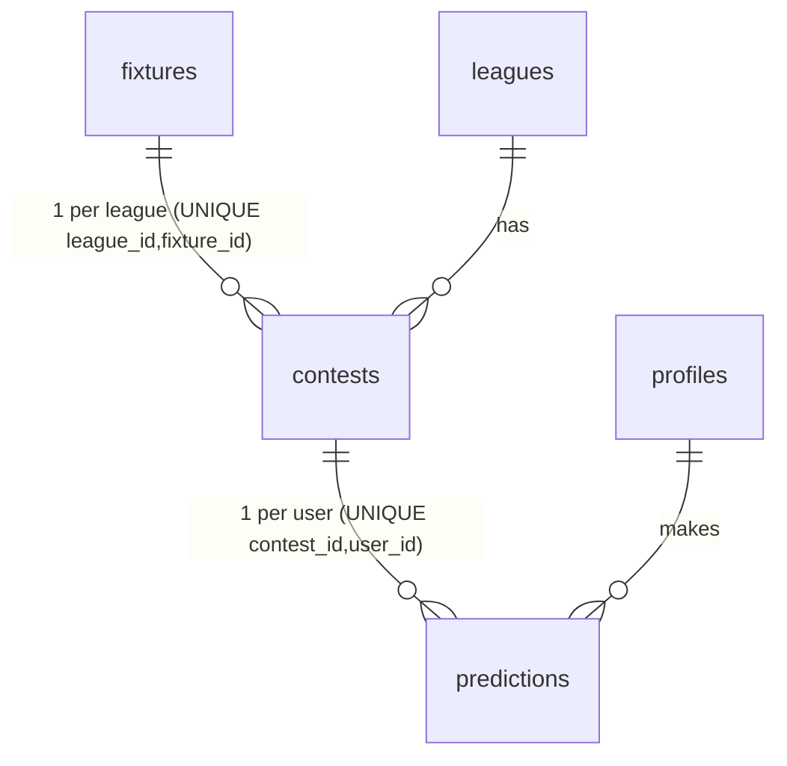

# Duplicate a match prediction across the user's other leagues

## Enhancement summary (deepened 2026-06-19)

Refined after parallel research (Next.js/Supabase docs) + adversarial review (correctness,
data-integrity, security). Material changes from the first draft:

- **Mirror writes must LOOP, not batch.** A single `upsert([row1,row2,…])` is all-or-nothing
  under Postgres RLS `WITH CHECK` (SQLSTATE 42501 aborts the whole statement) — one locked
  sibling would roll back the *primary* save too. Confirmed against Postgres docs. Each target
  gets its own `.upsert()` call → independent transaction → real partial success.
- **Cache invalidation via route pattern, not client slugs.** Replace per-slug
  `revalidatePath(\`/leagues/${slug}\`)` (which (a) trusts a client string and (b) misses the
  nested match pages) with one `revalidatePath("/leagues/[slug]", "layout")` — busts every
  league list + match page in a single call. Removes the only trust-the-client smell.
- **Two server-side guards** beyond RLS: strip the primary contestId from targets; **fixture-bind**
  targets server-side (mirror only to contests of the *same* fixture) so a tampered client can't
  splat this pick onto an unrelated match in the user's own league.
- **Exact `fixture_id` placement** specified (a real bug trap), **widened render-time eligibility
  margin** (RLS stays the true gate), reactive overwrite hint, strip-succeeded-targets on retry,
  date-based prefill sort.
- **Overwrite is opt-in (resolved).** A sibling with no pick (or one already matching) is
  checked by default (auto-fill); a sibling whose existing pick *differs* starts **unchecked**
  with a "Replaces …" note, so a deliberate divergent pick is never silently clobbered. No
  history table (decided: the hint + result summary are sufficient for a friends' game).

## Overview

A user in 2+ leagues currently re-enters the same prediction (outcome + scoreline) separately
in each league's copy of the match. This feature mirrors a single prediction to the **same
fixture's contest in the user's other leagues**, plus a **copy-from-other-league** prefill for
when a pick already exists elsewhere. Designed to scale to **N leagues**.

## Problem / motivation

Same match = a separate `contests` row per league (`UNIQUE(league_id, fixture_id)`), so a
prediction is a separate `predictions` row per `contest_id`. Ananth and Utkarsh are in both KK
Bois and PES Bois (and could be in more), so every match means entering the identical pick 2+
times — tedious and error-prone.

## Why this is clean to build

- **RLS already permits the cross-league write.** The `predictions` insert/update policies
  (`supabase/migrations/20260618000002_rls_functions.sql:187-214`) let an authenticated user
  upsert their **own** prediction in **any contest of any league they belong to**, gated by
  `lock_at > now()+10s` and `password_change_done()`. The policy joins `league_members` — it is
  *not* scoped to "the current league". So mirroring needs **no service-role path**, and RLS
  independently re-enforces membership + lock on every write. (Security review confirmed: a
  crafted target list cannot write outside this scope, cannot touch another user's row, cannot
  beat the lock, cannot bypass the no-draw trigger.)
- One `fixtures` row → one contest per league. Siblings normally share the fixture's
  `kickoff_at`, hence the same `lock_at`, so they lock together — *unless* a sibling was locked
  independently (admin/early cron), in which case the `sync_contest_on_fixture_change` trigger
  (which only updates `status='open'` rows) leaves it diverged. The per-contest eligibility
  filter handles that correctly; don't rely on lock_at being identical.
- `contests` SELECT RLS is member-scoped (the match page already relies on this), so the
  "find sibling contests for this fixture" query returns **only the user's own leagues**.


Cross-league copy = take this contest's `fixture_id`, find the user's *other* contests with the
same `fixture_id`, and upsert the same `(outcome, pred_home, pred_away)` into each.

## Decisions

- **Both mechanisms:** submit-time "Also save to …" checkbox list (push) + copy-from prefill (pull).
- **Smart default + opt-in overwrite:** eligible siblings with **no** pick (or a pick already
  matching the current form) are **checked** by default; a sibling with a *different* existing
  pick starts **unchecked**, labeled "Replaces <their pick>", so overwriting is a conscious tap.
- **No recovery trail** (decided): the live "Replaces …" hint + result summary are the
  safeguards; `prev_*` columns remain optional future hardening.
- **Scale to N leagues:** one checkbox per eligible other league, all ON by default.
- **Push/pull are temporally separated** (UX best practice): the prefill button shows only when
  the form is empty; the "also save to" list shows at submit. They never appear as two live
  actions at once.

## How it works

1. The **match page** resolves the current contest and — only when the form will render — loads
   the user's sibling contests for this fixture and the user's existing picks in them.
2. It passes **eligible** siblings (open, lock comfortably ahead) as a checkbox list — empty (or
   matching) siblings **checked**, different-pick siblings **unchecked** with a "Replaces …" note
   — shows **locked** siblings as disabled rows, and passes the most-recent sibling pick as a
   **prefill** suggestion.
3. On submit, the form sends the primary write **+ the checked target contestIds**.
4. The action upserts the primary; on success it **server-validates** the targets (same fixture,
   not the primary), then upserts each individually (RLS guards each), and returns a per-target
   result. One pattern-based `revalidatePath` busts all affected pages.

## Changes by file

### 1. `app/leagues/[slug]/m/[id]/page.tsx` — gather siblings

- **Add `fixture_id` as a bare column on the contests select** (line 22-24). It must sit on the
  outer `contests` select, **not** inside the `fixtures(...)` embed, or `c.fixture_id` is
  `undefined` and `.eq("fixture_id", undefined)` silently misbehaves. Exact target string:
  ```
  .select("id, league_id, fixture_id, status, lock_at, stake_inr, is_knockout, fixtures(...)")
  ```
- When the form will render, query siblings (RLS-scoped to the user's leagues) + the user's picks
  in them:
  ```tsx
  const willPredict = state === "open_nopick" || state === "open_picked";
  const RENDER_MARGIN_MS = 60_000; // hide siblings within ~60s of lock so a checked box is
                                    // realistically writable; RLS (10s) remains the true gate.
  let otherLeagues: OtherLeague[] = []; let prefillFrom: PrefillPick | null = null;
  if (willPredict) {
    const { data: siblings } = await supabase.from("contests")
      .select("id, status, lock_at, leagues(name)")
      .eq("fixture_id", c.fixture_id).neq("id", c.id);
    const ids = (siblings ?? []).map((s) => s.id);
    const { data: sibPreds } = ids.length
      ? await supabase.from("predictions")
          .select("contest_id, outcome, pred_home, pred_away, updated_at")
          .in("contest_id", ids).eq("user_id", user!.id)
      : { data: [] };
    const pickBy = new Map((sibPreds ?? []).map((p) => [p.contest_id, p]));
    otherLeagues = (siblings ?? []).map((s) => ({
      contestId: s.id, leagueName: s.leagues.name,
      eligible: s.status === "open" && new Date(s.lock_at).getTime() > now + RENDER_MARGIN_MS,
      existingPick: pickBy.get(s.id) ?? null,
    }));
    // prefill = most-recent existing sibling pick (parse dates; do NOT localeCompare ISO strings)
    const latest = (sibPreds ?? []).slice().sort(
      (a, b) => new Date(b.updated_at).getTime() - new Date(a.updated_at).getTime())[0];
    if (latest) {
      const src = (siblings ?? []).find((s) => s.id === latest.contest_id);
      prefillFrom = { leagueName: src?.leagues.name ?? "other league",
                      outcome: latest.outcome, predHome: latest.pred_home, predAway: latest.pred_away };
    }
  }
  ```
- Pass `otherLeagues` + `prefillFrom` to `<PredictionForm>` (line 116-121). No slug needed.

### 2. `components/PredictionForm.tsx` — checkboxes + prefill

- New props: `otherLeagues: { contestId; leagueName; eligible: boolean; existingPick?: {...}|null }[]`
  and `prefillFrom?: {...}|null`.
- **Prefill (pull)** — render above the outcome selector only when `prefillFrom` exists **and**
  `!initial` (no own pick here yet). One tap fills the fields (no submit). It disappears once a
  value is entered. *(Intentionally suppressed when you already have a pick in this league; edit
  manually if you want to re-align — noted so this isn't mistaken for a bug.)*
- **"Also save to" list (push)** — when any `otherLeagues` exist, render below the score stepper.
  Two-line rows: line 1 = league name; line 2 = `existingPick` state. Eligible rows are checkboxes
  checked by default **only for empty/matching siblings**; locked rows are disabled with "🔒 Locked".
  ```tsx
  const same = (p) => initial && p.outcome === initial.outcome
    && p.predHome === initial.predHome && p.predAway === initial.predAway;
  // Checked by default ONLY when eligible AND (no existing pick OR it already matches my pick
  // here). A DIFFERENT existing pick starts UNCHECKED → overwriting is an explicit opt-in.
  const [applyTo, setApplyTo] = useState<Set<string>>(() => new Set(
    otherLeagues.filter((l) => l.eligible && (!l.existingPick || same(l.existingPick)))
                .map((l) => l.contestId)));
  // Reactive overwrite hint: compute against LIVE form values, not server snapshot, so it
  // vanishes once they match (fixes the stale "replaces …" lie after using prefill):
  const replaces = (l) => l.existingPick &&
    !(l.existingPick.outcome === outcome && l.existingPick.predHome === h && l.existingPick.predAway === a)
      ? `Replaces ${pickLabel(l.existingPick)}` : null;
  ```
- **Submit** (await inside `useTransition`; disable ALL controls while `pending`, not just the
  button, to block double-tap):
  ```tsx
  const alsoTargets = [...applyTo]; // contestIds only
  const r = await submitPrediction({ contestId, slug, outcome, predHome: h, predAway: a, alsoTargets });
  if (r.error) setError(r.error);
  else if (r.mirrored.every((m) => m.ok)) router.push(`/leagues/${slug}`); // all good → leave
  else { setResult(r); setApplyTo(new Set(r.mirrored.filter((m) => !m.ok).map((m) => m.contestId))); }
  // ^ partial: stay, swap the checkbox list for ✓/🔒 per-row result, keep ONLY failed targets
  //   checked so a re-submit retries just those (succeeded ones aren't needlessly re-written).
  ```

### 3. `app/leagues/[slug]/m/[id]/actions.ts` — mirror writes

- Extend input with `alsoTargets?: string[]` (contestIds; **no slug** — see revalidate below).
- Upsert the **primary first**; on error return it (don't touch targets). Then:
  ```ts
  let mirrored: { contestId: string; ok: boolean; reason: string | null }[] = [];
  if (alsoTargets?.length) {
    // Server-side guards (defense in depth on top of RLS):
    //  • fixture-bind: only mirror to contests of the SAME fixture as the primary
    //  • exclude the primary contest itself
    const { data: primary } = await supabase.from("contests").select("fixture_id").eq("id", input.contestId).single();
    const { data: valid } = await supabase.from("contests")
      .select("id").eq("fixture_id", primary!.fixture_id)
      .in("id", alsoTargets).neq("id", input.contestId);   // RLS already scopes to the user's leagues
    for (const t of valid ?? []) {
      const { error } = await supabase.from("predictions").upsert(
        { contest_id: t.id, user_id: user.id, outcome: input.outcome,
          pred_home: input.predHome, pred_away: input.predAway, updated_at: new Date().toISOString() },
        { onConflict: "contest_id,user_id" });
      // return null (not undefined) for ok — undefined → null over the action boundary anyway
      mirrored.push({ contestId: t.id, ok: !error,
        reason: error ? (/row-level security/i.test(error.message) ? "locked" : "error") : null });
    }
  }
  revalidatePath("/leagues/[slug]", "layout"); // one call → busts every league list + match page
  revalidatePath(`/leagues/${input.slug}`);     // keep the existing literal for the current view too
  return { error: null, ok: true, mirrored };
  ```
- Loop is required (batch upsert is all-or-nothing under RLS — see Enhancement summary).

## Multi-league (N) behavior

- Sibling query returns **every** other league the user belongs to that has this fixture
  (RLS-scoped) — no hard-coded "2 leagues".
- Each eligible sibling = its own checkbox (ON); 3 leagues → two checkboxes; uncheck any.
- Locked siblings show as disabled "🔒 Locked" rows so the user isn't confused by omissions.
- Prefill uses the most-recently-updated pick across all other leagues, labeled by source.
- Per-target results are individual: a 4-league save that locks one still succeeds for the rest
  and names the skipped one.

## Edge cases

- **One league only / no sibling contest** → no toggle, no prefill; form unchanged.
- **Sibling near lock** → hidden from checkboxes by the 60s render margin; if it locks between
  render and submit, the RLS write fails and is reported (not fatal). RLS is the true gate.
- **Sibling already has a different pick** → its checkbox starts **unchecked** with a reactive
  "Replaces …" hint; you opt in to overwrite. Empty/matching siblings stay checked (auto-fill).
- **Prefill source is also a checked target** → after "Use", form matches it, so the reactive hint
  clears and the re-write is an idempotent no-op.
- **Tampered target id** → fixture-bind + RLS reject anything that isn't the user's own open
  contest for *this* match; reported, never fatal.
- **Knockout draw / negative score** → impossible to mismatch (siblings share the fixture; mirrored
  values equal the already-accepted primary).
- **Partial failure / process death mid-loop** → primary saved first; targets independent; the
  action awaits all writes before returning and only navigates on full success. Worst case is a
  half-applied mirror that the user re-submits (idempotent). See *Out of scope* for the atomic RPC
  option if multi-league grows.

## System-wide impact

- **Security (reviewed, safe):** RLS enforces own-row + membership + lock + password-change + no-draw
  on every write; the form supplies only contestIds, validated server-side (fixture-bound, primary
  stripped) and by RLS. No service-role, no IDOR, no cross-user overwrite. Per-target `reason`
  leaks nothing the client didn't already send. Client slug removed entirely.
- **Cache:** one `revalidatePath("/leagues/[slug]", "layout")` busts all league + nested match
  pages (over-invalidation is acceptable at this scale) — fixes the stale sibling-match-page read.
- **Interaction graph:** each write still fires `trg_no_draw_knockout`; settlement, scoring, reveal
  unaffected.

## Reviewer findings → resolution

| Sev | Finding | Resolution in this plan |
|-----|---------|--------------------------|
| HIGH | `fixture_id` placement ambiguity | Exact select string; bare column, not in `fixtures()` embed |
| HIGH | Batch upsert all-or-nothing under RLS | Keep the per-target loop (confirmed required) |
| HIGH | Sibling match page cache never busted | Pattern revalidate `("/leagues/[slug]","layout")` |
| HIGH | Client `slug` trusted for revalidate | Removed; pattern revalidate needs no slug |
| HIGH | Primary id could appear in targets | Server strips `!== primary` |
| HIGH | Stale "replaces" hint after prefill | Compute hint client-side vs live form values |
| HIGH | 10s render margin too tight | Widen render filter to 60s; RLS 10s stays the gate |
| MED | Targets not fixture-bound | Server validates targets share the primary's fixture |
| MED | Retry re-writes succeeded targets | Strip succeeded from `applyTo` on partial result |
| MED | `localeCompare` on timestamps | Sort by parsed `Date` |
| MED | "siblings share lock_at" overstated | Qualified; rely on per-contest filter |
| MED | Double-tap submit | Disable all controls while pending |
| MED | Silent overwrite of a deliberate pick | Different-pick siblings default **unchecked** (opt-in); empty/matching auto-checked |
| LOW | Prefill suppressed for open_picked | Documented as intentional |

## Acceptance criteria

- [ ] On a match open in 2+ of my leagues, an "Also save to <league>" checkbox appears per
      eligible other league — empty/matching ones checked, a different-pick one unchecked with a
      "Replaces …" note; locked ones disabled.
- [ ] Submitting writes the identical pick to each checked league; a summary confirms which saved.
- [ ] Unchecking a league excludes it; a partial result leaves only failed targets checked for retry.
- [ ] Opening a match I predicted elsewhere shows "Copy your <league> pick: …"; tapping fills the form.
- [ ] A different existing pick is left alone unless I opt in (its box starts unchecked); the
      "Replaces …" hint reflects live form values.
- [ ] A tampered/locked/foreign target is rejected server-side and reported; primary still saves.
- [ ] No toggle/prefill when I'm in one league or no sibling exists.
- [ ] `npm run typecheck`, `build`, `test` pass.

## Testing & verification

- Pure helper `eligibleSiblings(siblings, nowMs, marginMs)` extracted + unit-tested (vitest),
  covering the lock-margin boundary.
- Manual (logged-in `/chrome`, post-deploy): predict a Next-24h match in KK Bois with the box
  checked → appears in PES Bois; edit → mirrors; uncheck → left alone; open a match predicted only
  in one league from the other → prefill appears; force a locked sibling → reported, primary saves.
- Reviewer-named gaps to cover if/when tests are added: (T1) primary ok + one mirror fails → only
  the failure stays checked; (T2) primary id in targets is stripped; (T3) sibling rescheduled
  before submit → RLS reject reported without aborting others; (T4) prefill source locked after
  render → still prefilled but absent from checkboxes.

## Out of scope / future

- **Atomic RPC** wrapping all upserts in one `security invoker` plpgsql function with per-row
  exception handling — only if multi-league use grows and half-applied mirrors become a real risk.
- **Overwrite recovery:** `prev_outcome/prev_home/prev_away` columns and/or an "Undo" toast —
  decided against for V1 (the opt-in default + "Replaces …" hint + result summary suffice).
- **Remember last per-league choice** (keyed by league id), and a bulk "copy all my open picks
  from League A → League B".
- Cross-league global match view (explicit non-goal in the original app plan §1).

## Sources & references

- Write path: `app/leagues/[slug]/m/[id]/actions.ts`, `components/PredictionForm.tsx:10-37`,
  `app/leagues/[slug]/m/[id]/page.tsx:22-24,115-121`.
- RLS enabler: `supabase/migrations/20260618000002_rls_functions.sql:187-214`.
- Schema/triggers: `supabase/migrations/20260618000001_schema.sql` (UNIQUE constraints,
  `enforce_knockout_no_draw`, `sync_contest_on_fixture_change`).
- Postgres: RLS `WITH CHECK` raises 42501 and aborts a multi-row statement (no partial commit) →
  loop required. `revalidatePath(pattern, "layout")` busts a segment + its nested pages (Next.js 15).
- Origin app plan: `docs/plans/2026-06-18-001-feat-cashford-worldcup-prediction-game-plan.md`.
