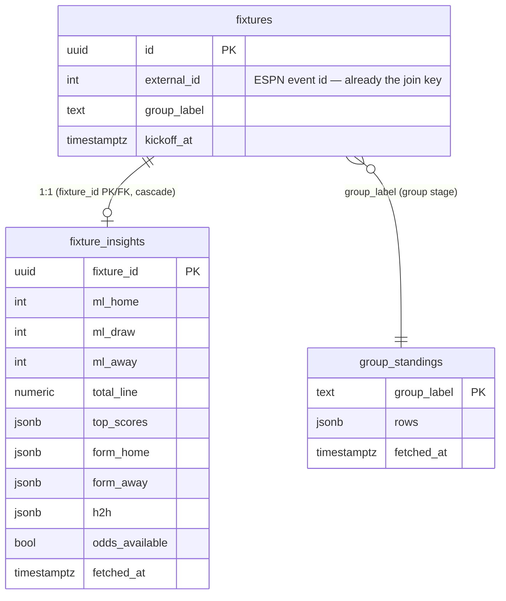

> **Superseded by [-003](2026-06-20-003-feat-predict-screen-redesign-tabbed-insights-plan.md)**
> after the design finalized into a two-tab redesign. The data source, Poisson model, cache table,
> RLS and ESPN probe results below are all **still valid** and were carried forward — only the UI
> approach changed (additive card → tabbed screen). Read this for the backend/data rationale; read
> -003 for what to build.


# ✨ Match insights on the predict screen

Add a decision-helping **Match insights** panel to the scoreline-prediction screen
(`app/leagues/[slug]/m/[id]/page.tsx`), shown above the prediction form while a contest is
open. It surfaces betting-market signals and recent-form context for the fixture, sourced
**entirely from ESPN** (keyless) and **anchored to the ESPN event id we already store**, plus
a small in-repo **Poisson model** that derives the most-likely scorelines and related stats.

## Overview

Users currently pick a scoreline with no information beyond the team names and kickoff time.
This feature gives them market and form context to make a better-informed pick, without
turning Cashford into a betting product (it stays a friends' settle-up game — odds are shown
"for guidance only").

### Two findings that reshaped the original request

1. **The "mapping" problem is already solved.** Every fixture stores its ESPN event id in
   `cashford.fixtures.external_id` (`int unique`, schema `20260618000001_schema.sql:76`), and
   `lib/espn.ts:50` already matches ESPN events to our fixtures via `.in("external_id", ids)`.
   ESPN's per-match `summary` endpoint — same event id — returns **odds, last-5 form, and
   head-to-head** in a single keyless call. So odds/form/H2H need **zero new mapping and no API
   key**. (Only group standings needs a small extra mapping — see Unit 6.) A separate betting
   site would *reintroduce* the team-name-matching + "not listed yet" problem the request
   flagged; anchoring to ESPN avoids it. **Decision: reuse ESPN (confirmed with user).**

2. **No free source sells a "correct score" market** — not ESPN, not The Odds API, none. The
   robust way to get "the scoreline with the highest probability" is to **derive** it with a
   small **Poisson model** from the 1X2 moneyline + over/under line. We *compute* it; we don't
   fetch it. This works for any match that has odds and is the industry-standard approach.

### Selected feature set (confirmed with user)

| Group | Items to display |
|-------|------------------|
| **Odds / market** | 1X2 win probabilities (Home/Draw/Away %); over/under goals line; raw bookmaker odds + provider name |
| **Scoreline (Poisson-derived)** | Top 3–5 most-likely scorelines with %; both-teams-to-score %; clean-sheet % (each team) |
| **Team context** | Recent form (last 5, W/D/L); head-to-head history; group standings (group-stage matches) |

*Explicitly excluded:* point spread/handicap (niche), injuries (ESPN returns empty for most
national squads — unreliable), venue/kickoff (already on the screen), win-probability
"predictor" (ESPN has none for soccer — we de-vig the moneyline instead).

---

## Problem statement / motivation

- The predict screen is information-free; good predictors want signal (who's favoured, likely
  scorelines, form, history).
- The request explicitly asked to (a) reuse the ESPN integration, (b) get betting odds via a
  direct/free API (not a paid one), (c) get the highest-probability scoreline, and (d) figure
  out fixture↔source **mapping** since not all games are listed early.
- All four are best served by one source we already trust: ESPN, keyless, mapped by
  `external_id`, with the scoreline derived locally.

---

## Proposed solution / architecture

```
ESPN (keyless)                      Supabase cache                 Next.js predict page
──────────────                      ──────────────                 ───────────────────
summary?event={external_id}  ──┐
  → pickcenter / odds[]         │   lib/espn-insights.ts           page.tsx (server):
  → lastFiveGames               ├──▶ refreshInsights(admin, fx) ──▶  read fixture_insights
  → headToHeadGames             │     • fetch + parse              ──▶  read group_standings
                                │     • run lib/odds-model.ts           (group stage only)
core .../standings  ───────────┘     • upsert fixture_insights    ──▶  <MatchInsights d={…}/>
  (all groups, 1 call)               • upsert group_standings           rendered above
                                                                        <PredictionForm/>
   warmed by:  cron tick (primary)  +  page after() (opportunistic)  +  guarded blocking
               fill on first-view cache miss (tight timeout)
```

**Why a cache table, not a per-render fetch:** odds move on the order of hours, and the page
must not call ESPN on every load (rate-limit + latency). We persist a normalized snapshot per
fixture and refresh on a TTL, mirroring the existing pattern where `pollScores` writes
ESPN-derived state into Supabase and pages read from Supabase.

**Where it renders:** a new `<MatchInsights>` card between the fixture-header card
(`page.tsx:152`) and `<PredictionForm>` (`page.tsx:154`), and **only for open states**
(`open_nopick` / `open_picked`). Because `lock_at = kickoff_at` (denormalized;
`20260618000001_schema.sql:133`), "open" means "before kickoff" — exactly when a pre-match
decision aid is useful. Live/finished/locked states never render it.

### Data source endpoints

| Purpose | Source (keyless) |
|---------|------------------|
| Odds + form + H2H + **standings** | `https://site.api.espn.com/apis/site/v2/sports/soccer/fifa.world/summary?event={external_id}` — **one call returns everything** |

**Probe results — CONFIRMED LIVE 2026-06-20** (event 760448, Ivory Coast v Germany), so the
plan's shapes are no longer assumptions:
- `summary.hasOdds: true`; `summary.pickcenter[0].provider.name` = `"DraftKings"`.
  `pickcenter[0].moneyline.{home,draw,away}.close.odds` = `"-195" / "+370" / "+500"` (strings);
  `pickcenter[0].total.over.close.line` = `"o2.5"` (strip the `o/u` prefix). Legacy
  `summary.odds[]` is *also* present as a fallback (`drawOdds.moneyLine`, `overUnder`).
- `summary.lastFiveGames[0|1]` = home|away; `.team` identifies the side; each
  `.events[].gameResult` is `"W"|"L"|"D"`, with `.opponent`, `.score`, `.gameDate`,
  `.competitionName`.
- `summary.headToHeadGames[0].events[]` = past meetings (`.score`, `.gameDate`, team ids).
- **`summary.standings.groups[].standings.entries[]`** carries the group table
  (`.team`, `.id`, `.stats[]` with `gamesPlayed/wins/losses/.../points`) — **no separate
  core-API call and no `group_label` mapping needed** (this simplifies Unit 6 to "parse what's
  already in the summary").

**Resilience (Rule 6):** even though `pickcenter` is confirmed populated today, the parser
tries `summary.pickcenter[]` → legacy `summary.odds[]` and normalizes whichever populates, so a
future ESPN change (the pickcenter shape has shifted before) degrades to "no odds" instead of
crashing. `hasOdds` is the quick gate.

---

## The Poisson model (`lib/odds-model.ts` — pure, unit-tested)

Pure functions, no external library (~50 lines). This is the part that must be *correct* —
it's the high-value test target (a wrong model shows users a wrong "most likely score").

**Inputs:** American moneyline (home/draw/away) + total-goals line (optional).
**Outputs:** de-vigged 1X2 probabilities, λ_home, λ_away, scoreline grid, top-N scorelines,
BTTS %, clean-sheet % per team.

```ts
// lib/odds-model.ts
export function americanToProb(odds: number): number {           // implied prob incl. vig
  return odds < 0 ? -odds / (-odds + 100) : 100 / (odds + 100);
}
export function devig3(h: number, d: number, a: number) {        // remove margin, normalize
  const [rh, rd, ra] = [americanToProb(h), americanToProb(d), americanToProb(a)];
  const s = rh + rd + ra;                                        // ~1.05–1.08 (the overround)
  return { pHome: rh / s, pDraw: rd / s, pAway: ra / s };
}
function poissonPMF(k: number, l: number) { /* l^k e^-l / k! */ }
// 1) solve λ_sum from the under prob + line (binary search on Poisson CDF), OR
//    fall back to WC historical mean ≈ 2.70 when totals are missing.
// 2) solve the split: search r = λ_home/λ_away so the model's (pH,pD,pA) match the de-vigged
//    1X2 (grid sum over h,a ≤ 8). λ_home = λ_sum·r/(1+r), λ_away = λ_sum/(1+r).
// 3) grid P(h,a) = poissonPMF(h, λh)·poissonPMF(a, λa) over 0..6.
export function modelFromOdds(ml: {home:number;draw:number;away:number}, totalLine?: number): {
  pHome:number; pDraw:number; pAway:number; lambdaHome:number; lambdaAway:number;
  topScores: {h:number;a:number;p:number}[];   // sorted desc, top 5 (top[0] = most likely)
  pBtts: number; pCleanSheetHome: number; pCleanSheetAway: number;
} { /* … */ }
```

- **Most-likely scoreline** = `topScores[0]`; **top 3–5** = `topScores.slice(0,5)`.
- **BTTS** = `1 − P(home=0) − P(away=0) + P(0,0)`.
- **Clean sheet (home)** = `P(away=0)` (home concedes 0); **away** = `P(home=0)`.
- **Totals-missing fallback:** λ_sum ≈ 2.70 (WC2022 avg ≈ 2.69 goals/game), split from 1X2 only.

### Tests (`lib/odds-model.test.ts`)
- `americanToProb`/`devig3`: known odds → known probabilities; three probs sum to 1.0.
- Symmetric odds (even H/A, typical draw) → most-likely score is a low draw or 1–0 band; pHome ≈ pAway.
- Heavy favourite (e.g. −300 / +600) → pHome high; most-likely score in {1–0, 2–0, 2–1}.
- Higher totals line → higher λ_sum → higher-scoring argmax; clean-sheet % falls.
- Missing totals → fallback path returns sane probabilities (no NaN, grid sums ≈ 1).

---

## Data layer

### New migration `supabase/migrations/20260620000005_match_insights.sql`

```sql
-- 1:1 cache of ESPN-derived insights per fixture (service-role writes; authed read-only)
create table if not exists cashford.fixture_insights (
  fixture_id     uuid primary key references cashford.fixtures(id) on delete cascade,
  -- raw odds (regulation/90-min, consensus or first provider)
  ml_home        int,
  ml_draw        int,
  ml_away        int,
  total_line     numeric,
  provider       text,
  -- derived (stored so the page does no math)
  p_home         numeric, p_draw numeric, p_away numeric,
  lambda_home    numeric, lambda_away numeric,
  top_scores     jsonb,            -- [{h,a,p}, …] top 5
  p_btts         numeric,
  p_cs_home      numeric, p_cs_away numeric,
  -- raw context (all from the one summary call)
  form_home      jsonb,            -- [{result:'W',score:'2-1',opponent:'…',date:'…'}, …]
  form_away      jsonb,
  h2h            jsonb,            -- [{score:'1-1',competition:'…',date:'…'}, …]
  standings      jsonb,            -- summary.standings.groups[] (group-stage table), as-is
  -- meta
  odds_available boolean not null default false,
  fetched_at     timestamptz,
  updated_at     timestamptz not null default now()
);

alter table cashford.fixture_insights enable row level security;
-- mirror teams/fixtures: any authenticated user may read; writes are service-role only
create policy fixture_insights_select on cashford.fixture_insights for select to authenticated using (true);
-- (no insert/update/delete policies → only service_role, which bypasses RLS, can write)
```
RLS pattern mirrors `teams_select` / `fixtures_select` (`20260618000002_rls_functions.sql:152-153`).
The blanket `grant all … to … service_role` (`:223-225`) already covers writes; service role
bypasses RLS regardless. Re-affirm the grant in the new migration for clarity.

### ERD



---

## Fetch / refresh layer (`lib/espn-insights.ts`)

Mirrors `lib/espn.ts` conventions: keyless `fetch`, defensive `try/catch`, service-role
client, TTL-guarded, windowed so we never fetch the whole tournament.

```ts
const SUMMARY = "https://site.api.espn.com/apis/site/v2/sports/soccer/fifa.world/summary";
const INSIGHTS_TTL_MS = 3 * 3600e3;      // odds move on hours; 3h refresh is ample
const WINDOW_MS       = 5 * 24 * 3600e3; // odds typically appear ≤ ~5 days pre-kickoff

// Refresh one fixture's insights if its cache is stale. No-op when fresh.
export async function refreshInsights(admin, fixture): Promise<void> { /* fetch→parse→model→upsert */ }

// Cron entry: refresh upcoming open fixtures whose cache is stale. Bounded by WINDOW_MS.
export async function pollInsights(admin): Promise<{checked:number; updated:number}> {
  // select fixtures: status='scheduled', both teams known, kickoff within WINDOW_MS,
  // left-join fixture_insights where fetched_at is null or older than INSIGHTS_TTL_MS.
  // For group-stage fixtures present, refresh group_standings once if its cache is stale.
}

// Parser: pickcenter[] → odds[] → core /odds (first that populates). Returns null if no odds.
function parseOdds(summaryJson): {mlHome,mlDraw,mlAway,totalLine,provider} | null { /* … */ }
function parseForm(summaryJson): {home: FormGame[]; away: FormGame[]} { /* lastFiveGames */ }
function parseH2H(summaryJson): H2HGame[] { /* headToHeadGames */ }
```

**Wiring:**
- **Cron (primary warm):** add `const insights = await pollInsights(admin);` to `handle()` in
  `app/api/cron/tick/route.ts:18-24`, after `pollScores`, and include it in the JSON response.
  No new cron registration — pg_cron already drives this route.
- **Page after() (opportunistic):** in `page.tsx:19`'s existing `after(...)`, also call
  `refreshInsights(admin, fixture)` when the contest is open and within the window (TTL-guarded,
  so it's a cheap no-op when already fresh; non-blocking — freshens for the *next* view).
- **First-view cache-miss fallback (guarded blocking):** in the server load, if the contest is
  open + within window + no fresh row exists, `await refreshInsights(...)` with a tight timeout
  (e.g. `AbortController`, ~2s) wrapped in try/catch, then read the row. Worst case is a small
  one-time delay on a true cold miss; cron keeps misses rare. Never hangs (timeout + catch).

---

## UI (`components/MatchInsights.tsx`)

A dark-mode-aware card (semantic tokens only — `bg-surface`, `border-border`, `text-muted`,
`text-win`/`text-loss`/`text-push`, `bg-mint`, `bg-subtle`, etc., per the dark-mode work in
`docs/plans/2026-06-20-001`). Reference `docs/design/Cashford System.dc.html` for spacing/type.
Each sub-section renders only when its data exists. Primary block always visible; form/H2H/
standings in a collapsible "Form & history" to keep the CTA reachable.

```
┌─────────────────────────────────────────────┐
│ MATCH INSIGHTS              Odds via ESPN ⓘ   │  ← muted disclaimer "for guidance only"
│                                               │
│ Win probability                               │
│ Brazil  ███████████░░░░  58%                  │  ← 1X2 bars (de-vigged)
│ Draw    ████░░░░░░░░░░░  22%                  │
│ Korea   ███░░░░░░░░░░░░  20%                  │
│                                               │
│ Likely scores   1–0 18% · 1–1 14% · 2–1 12%   │  ← top 3–5 chips (top[0]=most likely)
│ Goals: market expects Over 2.5  ·  BTTS 47%   │  ← over/under + BTTS
│ Clean sheet  BRA 41% · KOR 24%                │  ← clean-sheet %
│ Odds (DraftKings)  +160 / +210 / +180         │  ← raw moneyline + provider, muted
│ ───────────────────────────────────────────  │
│ ▸ Form & history                              │  ← collapsible
│   Brazil  W W D L W      Korea  L W W D L      │  ← last-5 chips
│   H2H  BRA 3W · 1D · 1L (last 5)               │  ← H2H summary
│   Group E   1 BRA 6pts  2 …                    │  ← standings (group stage only)
└─────────────────────────────────────────────┘
```

**Page integration (`page.tsx`):** load `fixture_insights` for `c.fixture_id` and (if
`f.round === "group"`) `group_standings` for `f.group_label`; pass to `<MatchInsights>` rendered
in the `open_nopick`/`open_picked` branch, above `<PredictionForm>` (`page.tsx:154`). When
`odds_available` is false but kickoff is within the window, show a one-line muted
"Odds & insights appear closer to kickoff." Otherwise render nothing.

---

## System-wide impact

- **Interaction graph:** `cron tick → pollInsights → ESPN fetch → upsert fixture_insights/
  group_standings`. `predict page load → read caches → render`; `page after() → refreshInsights`.
  No settlement, scoring, locking, or prediction write path is touched. The `trg_fixture_change`
  trigger (`20260618000002:116`) fires on `fixtures` updates only — `fixture_insights` writes
  don't touch `fixtures`, so they trigger nothing.
- **Error propagation:** every ESPN call is wrapped in try/catch and degrades to "no insights"
  (the panel hides). A standings failure omits only the standings section. A parser miss sets
  `odds_available=false`. Nothing in this feature can fail a prediction, a lock, or a settlement.
- **State lifecycle:** the cache is derived/disposable — `on delete cascade` cleans it with the
  fixture; staleness is bounded by TTL; no orphan risk (single upsert per fixture, idempotent).
- **API surface parity:** read-only display data; no agent/alternate interface to keep in sync.
- **Rate-limit safety:** TTL + window + open-only rendering bound ESPN calls to a handful of
  upcoming matches per cron tick — far under the safe 30–60s/call floor research identified.

---

## Acceptance criteria

### Functional
- [ ] Opening an **open** contest within ~5 days of kickoff shows the Match insights panel above
      the form with: 1X2 probability bars, top 3–5 scorelines + %, over/under read, BTTS %,
      clean-sheet %, raw odds + provider, last-5 form (both teams), H2H, and — for group-stage —
      group standings.
- [ ] Probabilities are **de-vigged** (Home+Draw+Away = 100%).
- [ ] `topScores[0]` is the single most-likely score; the list is sorted descending by probability.
- [ ] No new mapping table and no new API key/secret are introduced; insights join via existing
      `fixtures.external_id`.
- [ ] When odds aren't listed yet, the panel hides odds/scoreline sections gracefully (no errors,
      no NaN/`undefined%`), showing the "appears closer to kickoff" line for upcoming fixtures.
- [ ] Panel renders only for `open_nopick`/`open_picked`; absent for tbd/locked/live/finished/
      void/cancelled.
- [ ] Full dark-mode parity (semantic tokens; verified in both themes).
- [ ] A visible "Odds via ESPN — for guidance only" disclaimer is present.

### Non-functional
- [ ] Predict-page TTFB is unchanged on a cache hit; a cold miss adds at most the ~2s bounded
      blocking fill (then cached). `after()`/cron keep misses rare.
- [ ] ESPN is never called from the browser; all fetches are server-side.
- [ ] `lib/odds-model.ts` has unit tests; `npm test` stays green (settlement goldens unaffected).

---

## Edge cases & defaults

- **Odds not listed yet** (match > ~5 days out, or ESPN hasn't priced it) → `odds_available=false`
  → hide odds + scoreline blocks; show form/H2H if present, else the "closer to kickoff" line.
- **Totals line missing but moneyline present** → Poisson fallback (λ_sum ≈ 2.70); still show
  scorelines, hide the explicit over/under read.
- **Knockout fixture** → ESPN moneyline is the 90-min 3-way (incl. draw); the derived score is
  the 90-min regulation score, which is exactly what Cashford grades — so it aligns. The pick is
  "advancer + score"; insights inform both.
- **TBD knockout** (teams unknown) → no resolved event/odds → panel absent.
- **Provider/odds malformed** → parser returns null → `odds_available=false`.
- **Standings endpoint fails or group mapping unknown** → omit standings only; rest renders.
- **Stale cache** → TTL refresh via cron/after(); page always renders last-known snapshot.
- **Boundary:** kickoff exactly at the window edge → included (`<=`).

---

## Out of scope (don't touch)

- `lib/settlement.ts`, `lib/settle-contest.ts`, `lib/contest-state.ts`, scoring/locking, the
  prediction write path, RLS on existing tables.
- Any real wagering / money-on-odds behaviour — this is informational only.
- The home page, league page, reveal grid, dues.
- A second odds provider / The Odds API (ESPN-only for v1; revisit only if ESPN soccer odds
  prove sparse in production).

---

## Risks & mitigations

- **Undocumented ESPN endpoints can change without notice** (the pickcenter shift is precedent).
  Mitigation: 3-path parser + normalized internal shape + parser snapshot test that fails loudly;
  feature degrades to "no insights", never crashes the page.
- **ESPN ToS gray area** for non-commercial/personal use. Cashford is a private friends' game;
  data is shown "for guidance only". Keep server-side, cached, low-volume. (Flagged, not blocking.)
- **Responsible framing:** showing bookmaker odds in a prediction game. Mitigation: "for guidance
  only" disclaimer; no "bet"/wager language; frame as "what the market says".
- **Model correctness:** a wrong scoreline misleads users. Mitigation: unit-tested pure model.

---

## Implementation units (suggested order & commit boundaries)

1. **Poisson model** — `lib/odds-model.ts` + `lib/odds-model.test.ts`. Pure, no deps. *Execution
   note: test-first* (the math is the correctness-critical core). Verify: `npm test` green.
2. **Migration** — `supabase/migrations/20260620000005_match_insights.sql` (two tables + RLS).
   Verify: types regenerate / typecheck clean; RLS mirrors teams/fixtures.
3. **Fetch/parse lib** — `lib/espn-insights.ts` (`refreshInsights`, `pollInsights`, `parseOdds`/
   `parseForm`/`parseH2H`) + a parser snapshot test against a captured `fifa.world` summary JSON.
   *Probe the live endpoint first* to confirm the odds shape (Observation A vs B).
4. **Cron + after() wiring** — edit `app/api/cron/tick/route.ts` (add `pollInsights`) and
   `page.tsx` `after()` (opportunistic `refreshInsights`).
5. **UI + page integration** — `components/MatchInsights.tsx` + read caches in `page.tsx` and
   render above `<PredictionForm>`; dark-mode parity. *Patterns to follow:* `MatchCard.tsx`,
   `PredictionForm.tsx`, `components/ui.tsx` (Avatar, badges), `RevealGrid.tsx`.
6. **Group standings** — parse `summary.standings.groups[]` (already in the same call — confirmed
   live). Store in `fixture_insights.standings` (jsonb) alongside the rest, or in
   `group_standings` if we prefer shared rows. No extra endpoint, no `group_label` mapping. This
   collapses into Unit 3's parser — keeping it numbered only as a distinct display section.

---

## Deferred to implementation (resolve while building)

- Exact ESPN odds shape for `fifa.world` (pickcenter vs odds[] vs core /odds) — probe live.
- Exact field paths for `lastFiveGames` / `headToHeadGames` and how many H2H rows to show.
- The standings endpoint URL + `group_label` ↔ ESPN group id mapping (Unit 6).
- Whether to average odds across providers or take the first/primary provider (default: primary).
- Final blocking-fill timeout value (start ~2s; tune against observed ESPN latency).

---

## Verification

1. `npm run typecheck` (`tsc --noEmit`) — clean (new tables in generated types; new lib exports).
2. `npm run build` (`next build`) — succeeds.
3. `npm test` — new `odds-model` + parser tests pass; settlement goldens unchanged.
4. Manual probe: `curl` the `fifa.world` summary for a near-term WC event; confirm the parser
   path that populates and that derived numbers look sane (probs sum to 1; argmax in a plausible
   low-scoring band).
5. UI walk (logged-in `/chrome` route — predict screen needs auth; **read-only states only, never
   write a pick on a real league**): open an upcoming open contest → panel shows all selected
   sections; toggle dark mode → parity; open a far-future fixture → graceful "closer to kickoff".

---

## Deploy (gated — only on user's go-ahead)

Established Cashford flow: apply the migration in Supabase (SQL editor / CLI), then
`node scripts/stamp-version.mjs` (bumps `lib/version.ts`), commit, `git push origin main`
(Vercel auto-deploys, region bom1). Do **not** commit/push or apply the migration until the
user explicitly asks. Never run write-tests against real leagues.

---

## Sources & references

### Internal
- ESPN scoreboard poll + `external_id` join: `lib/espn.ts:6,41,50`
- Predict screen + `after(pollScores)`: `app/leagues/[slug]/m/[id]/page.tsx:13-19,154`
- Prediction form (insertion point context): `components/PredictionForm.tsx`
- Cron tick (where `pollInsights` slots in): `app/api/cron/tick/route.ts:18-24`
- Schema (`fixtures.external_id`, `group_label`, `lock_at=kickoff_at`):
  `supabase/migrations/20260618000001_schema.sql:76,78,86,133`
- RLS read pattern to mirror: `supabase/migrations/20260618000002_rls_functions.sql:152-153,223-225`
- Dark-mode tokens to honour: `docs/plans/2026-06-20-001-feat-dark-mode-toggle-plan.md`, `app/globals.css`

### External (ESPN hidden API + Poisson method)
- Public ESPN API (soccer endpoints): https://github.com/pseudo-r/Public-ESPN-API/blob/main/docs/sports/soccer.md
- ESPN hidden API gist: https://gist.github.com/akeaswaran/b48b02f1c94f873c6655e7129910fc3b
- Expected goals from over/under odds: https://opisthokonta.net/?p=1835
- Poisson models for soccer betting: https://signalodds.com/blog/poisson-models-in-sports-betting-predicting-goals-and-value-bets-in-lowscoring-sports
- The Odds API (evaluated, not chosen — needs key + mapping, no correct-score): https://the-odds-api.com/liveapi/guides/v4/
