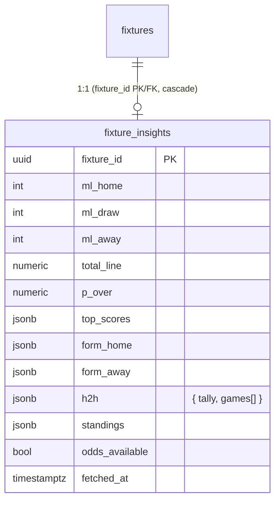

# ✨ Predict-screen redesign — tabbed Match insights

Redesign the match/predict screen (`app/leagues/[slug]/m/[id]/page.tsx`) into a **two-tab layout
(`Predict` | `Full insight`)** that surfaces ESPN-sourced odds, a Poisson-derived scoreline read,
recent form, head-to-head and the group table — per the finalized design
`~/Downloads/Match Insight Blend.dc.html`. This **supersedes plan -002** (which scoped an additive
card); the data source, model and cache are unchanged and **already built + tested** — this plan is
mostly the UI restructure plus three small backend additions.

## Enhancement summary (deepened 2026-06-20)

Deepened with a stack-relevant review/research panel (TS, correctness, architecture, performance,
security, data-integrity, simplicity, testing, frontend-races/hydration, Next.js/Tailwind framework
docs; Rails/Ruby/Python agents skipped as N/A). **No structural change** to the design — the findings
sharpen *how* to build it safely. Full detail in **§ Deepening notes**; the must-do deltas:

1. **`p_over` from de-vigged over/under odds, not a grid sum** — the grid `Σ h+a>floor(line)` drops
   push mass on whole-number lines and is less accurate. Return the de-vigged `ro/(ro+ru)` from the
   model; grid only as fallback.
2. **H2H orientation is computable & confirmed** — ESPN H2H events carry `homeTeamId/awayTeamId/
   homeTeamScore/awayTeamScore` (verified live), so orient + tally from the *current home team's* POV;
   enrich `parseH2H` + `H2HGame` type accordingly (the historical-home-≠-current-home case is the bug
   to test).
3. **Atomic chip handler** — set `h`,`a`,`outcome` in one `applyChip` (not two `updateScore` calls →
   stale-closure bug).
4. **Type the JSONB boundary** — the Supabase client is untyped; validate/narrow `top_scores`,
   `form_*`, `h2h`, `standings` into typed shapes in `page.tsx` before crossing into components, and
   **cast `numeric` columns to `Number`** (Supabase returns them as strings).
5. **Forward `AbortSignal.timeout(2000)` into `fetchSummary`**; `refreshInsights` **returns the row**
   so the cold-miss fill is read→fill→use (no double read).
6. **Migration hardening** (applied to shared prod, so be careful): drop the redundant `updated_at`,
   add `[0,1]` + sum≈1 CHECKs, `revoke insert,update,delete … from anon,authenticated`, filter
   `standings` to the fixture's group, add `import "server-only"` to the service client.
7. **Cron `pollInsights`**: cap concurrency at 3, one upfront staleness SELECT, widen the lower
   kickoff bound to `now−30m` so just-kicked-off-but-scheduled fixtures still warm.
8. **Accessible tabs** — `MatchTabs` gets full ARIA (`tablist/tab/tabpanel`, `aria-selected`,
   `aria-controls`, roving `tabIndex`, arrow keys, `useId`); keep it a small **route-local** client
   component (not a `LeagueTabs` mirror), and `WinProbBar` can be inlined.

**One conflict surfaced (Rule 6):** simplicity review says *drop the bounded blocking fill*;
architecture/perf/framework reviews say *keep it (it's the right pattern for above-the-fold data)*.
**Decision: keep it**, because first-views and staging QC must not show an empty hero — but make it
cheap and correct (signal-forwarded `AbortSignal.timeout`, `refreshInsights` returns the row, single
read). Revisit if production shows it's never hit.

## What changed vs plan -002

-002 added a `<MatchInsights>` card **below** the form. The finalized design instead **reframes the
whole open-contest screen into tabs**, folds three signals **into** the prediction form, and replaces
the fixture header. So the work is now a UI restructure of `page.tsx` + `PredictionForm.tsx`, not an
additive component. The Poisson model, ESPN fetch/parse lib, cache table and RLS from -002 stand.

## Confirmed decisions (from review)

1. **Open-only.** Tabs + insights render **only for open/pre-kickoff contests** (`open_nopick`,
   `open_picked`). Once `locked`/`live`/`settling`/`won`/`lost`/`push`/`notentered` (and
   `tbd`/`void`/`cancelled`), **no tabs, no insights** — the existing reveal-grid/result layouts are
   kept **untouched** (odds are stale at lock; the reveal is the story then).
2. **1X2 colours:** Home = **primary green**, Draw = **grey**, Away = **blue**. (Replaces the
   mockup's CIV-orange `#FF7900`, which is a team brand colour, not a token, and won't generalise.)
   Added as semantic tokens so both themes work.
3. **Replace the fixture header.** Build the mockup's **centred team header** properly as a shared
   `<FixtureHeader>` that handles pre-match (`vs`) *and* scored states (centred score), replacing the
   current vertical fixture card across all states. The top nav row (back · round · status badge) and
   the reveal-grid/result content below stay as today.

## Already built & tested (foundation — do not rebuild)

- `lib/odds-model.ts` (+ `lib/odds-model.test.ts`, 9 tests) — de-vig → λ split → scoreline grid →
  top scores, BTTS, clean sheets.
- `lib/espn-insights.ts` (+ `lib/espn-insights.test.ts`, 7 tests) — fetch/parse the ESPN `summary`
  (odds/form/H2H/standings, pickcenter→legacy fallback), `buildInsightsRow`, `refreshInsights`
  (TTL-guarded), `pollInsights` (windowed). Anchored to `fixtures.external_id` (no mapping).
- `supabase/migrations/20260620000005_match_insights.sql` — `fixture_insights` table + RLS (not yet
  applied).
- **ESPN shapes confirmed live 2026-06-20** (event 760448): `pickcenter[0].moneyline.{home,draw,away}
  .close.odds`, `total.over.close.line`, `lastFiveGames[].events[].gameResult`, `headToHeadGames`,
  and **`standings.groups[].standings.entries[].stats[]` ship inside the same summary call** (no extra
  endpoint, no group-label mapping).

---

## Proposed solution — screen architecture

```
MatchPage (server, page.tsx)
├─ <header> back · round/"Match" · <StatusBadge>            (unchanged)
├─ <FixtureHeader>  centred GER ⚪ vs ⚪ CIV · meta line     (NEW — all states)
│
├─ IF state ∈ {open_nopick, open_picked}:        ← tabs + insights ONLY here
│   └─ <MatchTabs predict={…} insight={…} />      (NEW client; mirrors LeagueTabs)
│       ├─ Predict panel:
│       │   ├─ <WinProbBar p={…}/>                (NEW — 1X2 hero card)
│       │   ├─ <PredictionForm … insights={…}/>   (MODIFIED — chips + O/U folded in)
│       │   └─ "Form · H2H · group table →"        (MatchTabs-owned → switches tab)
│       └─ Full insight panel:
│           └─ <MatchInsights d={…}/>             (NEW — BTTS/CS, form, H2H, standings, odds note)
│
├─ ELSE IF state == tbd / void / cancelled:  existing messages           (unchanged)
└─ ELSE (live/settling/won/lost/push/notentered): result banner + <RevealGrid>  (unchanged)
```

- The server page loads `fixture_insights` **only for open states**; non-open states skip the query
  and the new components entirely (caveat 1).
- `<MatchTabs>` owns tab state (default `Predict`) and the bottom "see insight" button, exactly like
  `components/LeagueTabs.tsx` takes `ReactNode` panels. `<PredictionForm>` (client) nests inside the
  Predict panel; the Full-insight panel is server-rendered markup.

### Warming insights (so the Predict tab never paints empty)
The Predict tab now *leads* with the win-prob hero + chips, so insights must be present at render:
1. **Cron warm (primary):** add `pollInsights(admin)` to `app/api/cron/tick/route.ts` `handle()` —
   refreshes upcoming open fixtures within the 5-day window every tick.
2. **`after()` warm (opportunistic):** in `page.tsx`'s existing `after(...)`, also call
   `refreshInsights(admin, {id, external_id})` (TTL-guarded no-op when fresh).
3. **Bounded blocking fill (cold-miss only):** if open + within window + no fresh row, `await
   refreshInsights` with a ~2s `AbortController` timeout in try/catch, then read the row. Misses are
   rare because cron warms ahead. If still absent → hero/chips/O-U collapse gracefully, form works.

---

## Three small backend additions (extend the foundation)

1. **`p_over` for the over/under chip.** Add to `OddsModel` in `lib/odds-model.ts`:
   `pOver = Σ p(h,a) for h+a > floor(totalLine)` from the grid. Display rule: `p_over ≥ .5` →
   "leans high-scoring · Over X.5"; else "leans low-scoring · Under X.5". Add `p_over numeric` to the
   migration; set it in `buildInsightsRow`; extend the two unit tests.
2. **Enrich H2H** (`parseH2H` in `lib/espn-insights.ts`). Today it returns `{score, competition,
   date}` — not enough to orient ("GER 2–1 CIV") or tally ("lead 3–1"). Use the summary header
   competitors to get the home ESPN id, then per H2H event compute result from the **home team's**
   POV and an oriented label. Store:
   ```ts
   h2h: { tally: { w: number; d: number; l: number },   // from the page's home team POV
          games: { date: string; competition: string; label: string; result: "W"|"D"|"L" }[] }
   ```
3. **Verify standings stat keys live** before trusting them: confirm ESPN's `stats[].type` names for
   soccer (`wins`, `losses`, draws = `ties`?, GD = `pointDifferential` vs `goalDifferential`,
   `points`) against a live group-stage summary, and confirm `standings.groups` is scoped to the
   fixture's group (filter by `group_label` if it returns all). `parseStandings` already has
   fallbacks; tighten to the verified keys.

> These are additive to a not-yet-applied migration and already-tested libs — low risk.

---

## New design tokens (`app/globals.css`)

Add to `@theme` (light) and `html.dark` (dark) so the 1X2 colours are theme-able utilities
(`bg-draw`, `bg-away`, `text-away`, …). Home reuses `--color-primary`.

```css
@theme {
  /* … existing … */
  --color-draw: #cbd5e1;   /* 1X2 draw segment/dot */
  --color-away: #2563eb;   /* 1X2 away segment/dot — blue (caveat 2); blue-600 for contrast */
}
html.dark {
  /* … existing … */
  --color-draw: #475569;
  --color-away: #60a5fa;
}
```
> **Contrast (WCAG, from research):** the light away token is **`#2563eb`** (blue-600), not
> `#3b82f6` — white text on `#3b82f6` is only 3.68:1 (fails AA); `#2563eb` gives 5.17:1. If any
> `%` label sits *on* the blue segment it must be white-on-`#2563eb` (light) / `text-fg`-on-dark;
> per the mockup the `%` readout sits *below* the bar on the surface, so prefer `text-fg`/`text-muted`
> there and keep colour as decoration (dot + segment) only — never colour-only encoding (always the
> team code + `%` text beside it).
All other mockup hexes map to existing tokens (no new ones): `#94a3b8`→`muted`, `#F1F4F7`/`#E5E8EC`
→`border`, `#EEF1F4`→`subtle`, `#F7F8FA` inner box→`subtle` (dark: `subtle`), W chip `#DCFCE7`/`#16a34a`
→`text-win` on a green tint (`bg-mint dark:bg-[#16a34a26]`), L chip `#FEE2E2`/`#EF4444`→`text-loss` on
a red tint (`bg-[#FEE2E2] dark:bg-[#ef44441f]`), D chip `#EEF1F4`/`#64748b`→`bg-subtle text-muted`.

---

## Components — APIs & responsibilities

### NEW `components/FixtureHeader.tsx` (server-safe)
Centred header replacing `page.tsx:128-152`. Props: home/away label+short, `homeShort`/`awayShort`,
`kickoffIso`, `venue`, round/group label, `state`, scores (`ftHome`/`ftAway`), `minute`,
`statusDetail`, `advancerLabel`. Renders: `<Avatar>` (existing, chipColor/flag — **not** the mockup's
solid circles) + name on each side, centred `vs` (pre-match) or centred mono score `2 — 1` (scored),
live pill + `liveLabel` when live, meta line `Group E · <LocalTime> · venue`, advancer note. Dark-aware.

### NEW `components/MatchTabs.tsx` (`"use client"`)
Mirror of `LeagueTabs.tsx`. Props: `predict: ReactNode`, `insight: ReactNode`. Segmented tab bar
(`bg-subtle`, active = `bg-surface` + shadow + `text-fg`, inactive `text-muted`), default `Predict`.
Renders the active panel, and below the Predict panel a full-width outline button
"Form · H2H · group table →" that calls `setActive("insight")`. Holds tab state client-side (safe —
AutoRefresh doesn't mount for open states).

### NEW `components/WinProbBar.tsx`
1X2 hero card. Props: `pHome,pDraw,pAway` (0–1), `homeShort`,`awayShort`. Label "WIN PROBABILITY";
14px segmented bar widths = de-vigged %, segments `bg-primary` / `bg-draw` / `bg-away`; readout row of
3 columns (coloured dot + code + mono `%`). Hidden by caller when `!oddsAvailable`.

### NEW `components/MatchInsights.tsx` (Full-insight panel content; server-safe)
Props: the `fixture_insights` row (mapped). Sections, each rendered only when its data exists:
- **Stats strip** — 3 cells w/ dividers: `Both score {pBtts}` · `{homeShort} clean sheet {pCsHome}` ·
  `{awayShort} clean sheet {pCsAway}` (mono %).
- **Recent form** — two rows: `<Avatar>` + name + five W/D/L circles (most recent right). Colours per
  token mapping above.
- **Head-to-head** — label + "`{homeShort}` lead {w}–{l} in last {n}" + up to 5 rows
  `date · competition` / mono oriented label.
- **Group standings** (group stage only) — "GROUP {label}" + header `TEAM P W D L GD PTS` + rows; the
  two fixture teams **bold**. Hidden for knockout.
- **Odds footnote** — muted centred "Odds: {provider} · {decimal H/D/A} · for guidance only".
  (Decimal = american→decimal in the component.)

### MODIFIED `components/PredictionForm.tsx`
Add **two conditional blocks**, preserve everything else (cross-league "Also save to" + prefill,
knockout advancer mode, validation, partial-save retry, "Update pick"/"Lock in pick"). New prop:
```ts
insights?: {
  oddsAvailable: boolean;
  topScores?: { h: number; a: number; p: number }[]; // for chips
  totalLine?: number | null;
  pOver?: number | null;
} | null;
```
- **Likely-score chips** ("Or tap a likely score") between the stepper and stake — **non-knockout
  only** (a level chip can't set a draw advancer in knockout). Each chip shows mono `h–a` + small `%`;
  tapping calls the existing `updateScore`/`setScore` path (derives outcome). Active chip (matches
  current `h`/`a`) → mint bg + green border (reuses the chip styling from the mockup's `DCLogic`).
- **Over/under line** between chips and stake — only when `oddsAvailable && totalLine != null`:
  label "Total goals · leans {high|low}-scoring" + pill "Over/Under {line}" using `pOver`.
- Both hidden entirely when `insights` is null/`!oddsAvailable` → form is identical to today.
- Section label may change "Your prediction" → "Who wins?" to match the mockup (minor).

### MODIFIED `app/leagues/[slug]/m/[id]/page.tsx`
- Replace fixture card (`:128-152`) with `<FixtureHeader …/>` (all states).
- Open states: load `fixture_insights` for `c.fixture_id` (+ bounded blocking fill); map to props;
  render `<MatchTabs predict={<><WinProbBar/><PredictionForm insights=…/></>} insight={<MatchInsights/>}/>`.
- Non-open states: unchanged (existing messages / result banner / `<RevealGrid>`).
- Extend the existing `after(...)` to also `refreshInsights` for open+in-window fixtures.

### MODIFIED `app/api/cron/tick/route.ts`
Add `const insights = await pollInsights(admin);` after `pollScores`, include in the JSON response.
(pg_cron already drives this route — no new registration.)

---

## ERD (additive — one new table)



---

## System-wide impact

- **Interaction graph:** `cron tick → pollInsights → ESPN summary → upsert fixture_insights`;
  `open predict page → read fixture_insights (+bounded fill) → render`; `page after() → refreshInsights`.
  No settlement / scoring / locking / prediction-write path is touched. `trg_fixture_change` fires on
  `fixtures` updates only — insights writes don't touch `fixtures`.
- **Error propagation:** every ESPN call is try/catch → degrades to "no insights" (hero/chips/O-U
  collapse, Full-insight sections hide). Nothing here can fail a pick, lock, or settlement.
- **State lifecycle:** cache is derived/disposable, `on delete cascade`, TTL-bounded, idempotent upsert.
- **Prediction integrity:** chips/O-U are *display + a score shortcut*; the actual write path
  (`submitPrediction`, validation, cross-league mirror) is unchanged.
- **Rate-limit safety:** TTL + 5-day window + open-only render bound ESPN calls to a handful of
  fixtures per tick.

---

## Acceptance criteria

### Functional
- [ ] Open contest shows: new centred `<FixtureHeader>`, a `Predict | Full insight` tab bar (default
      Predict), the win-prob hero, the form with likely-score chips + over/under folded in, and the
      "Form · H2H · group table →" button; Full insight shows BTTS/CS strip, form, H2H, standings, odds note.
- [ ] Tabs + insights appear **only** for `open_nopick`/`open_picked`; every other state is visually
      unchanged from today (reveal grid / result banners / tbd-void-cancelled messages) except for the
      shared new `<FixtureHeader>`.
- [ ] 1X2 colours: home green, draw grey, **away blue**; probabilities sum to 100% and bar widths match.
- [ ] Likely-score chips set the score and derive the outcome; the active chip is highlighted;
      **chips/over-under hidden for knockout** and when odds aren't available.
- [ ] All existing form features still work: cross-league "Also save to", prefill, knockout advancer
      mode, validation errors, partial-save retry, "Update pick" vs "Lock in pick".
- [ ] H2H shows the correct **oriented** scores + lead tally; form home/away not swapped; standings
      columns correct and the two teams bold.
- [ ] Over/under chip reads the right lean from `p_over`.
- [ ] "Odds not available yet" → hero/chips/O-U gracefully absent, form fully usable, Full-insight
      shows whatever context exists.
- [ ] **Full dark-mode parity** in both tabs and the header.

### Non-functional / quality gates
- [ ] `npm run typecheck`, `npm run build`, `npx vitest run` all green (incl. updated model/parser tests).
- [ ] No ESPN calls from the browser; cache hit keeps page TTFB unchanged (cold miss ≤ ~2s once).
- [ ] Thorough staging QC pass (below) with all visual + data bugs fixed.

---

## Edge cases & defaults

- **Knockout:** no Draw chip-picking, no likely-score chips; win-prob bar still shows 1X2 (90-min
  market), H2H/form/standings(n/a for KO)/odds still show. Form keeps advancer semantics.
- **Odds not listed yet** (>5 days out / unpriced) → `odds_available=false` → hero/chips/O-U hidden.
- **Totals missing** → model fallback (λ_sum≈2.7); hide the explicit O/U chip, keep chips/probs.
- **Standings absent** (knockout, or summary omits) → hide standings only.
- **H2H empty** (first-ever meeting) → hide H2H card.
- **Team without `short_name`** → fall back to label (existing pattern).
- **Tab state + AutoRefresh:** AutoRefresh only mounts for live/settling (non-open) → never resets the
  open-state tab.
- **Cold-miss timeout fires** → render without insights; `after()`/cron warm for next view.

## Out of scope (don't touch)
`lib/settlement.ts`, `lib/settle-contest.ts`, `lib/contest-state.ts`, scoring/locking, the prediction
write path & RLS on existing tables, the reveal grid / result banners / dues, home & league pages.

## Risks & mitigations
- **Undocumented ESPN endpoint changes** → 3-path odds parser + `hasOdds` gate + parser tests; degrades
  to "no insights".
- **ESPN ToS gray area** (non-commercial/personal, private friends' game) → server-side, cached,
  low-volume, "for guidance only" disclaimer; flagged, not blocking.
- **Form/H2H orientation bugs** → unit-test orientation with a fixture; QC verifies on real matches.
- **Responsible framing** → "for guidance only", no wager language.

---

## Deepening notes (research + review synthesis)

Grouped by area; each item is concrete and turnkey for `/ce:work`. Severity: 🔴 must-fix · 🟡 should · ⚪ optional.

### Model & data parsing (`lib/odds-model.ts`, `lib/espn-insights.ts`)
- 🔴 **`p_over` accuracy.** Compute over-probability from the **de-vigged 2-way total** when over/under
  odds exist: `pOver = americanToProb(over) / (americanToProb(over)+americanToProb(under))` — this
  value is already computed inside `solveLambdaSumFromTotal`; return it out and store it. Use the grid
  sum `Σ p(h,a) for h+a > floor(line)` **only** as a fallback when odds are missing. Rationale: the
  grid drops the push mass for whole-number lines (`pOver+pUnder<1`) and can flip the "leans
  high/low" label. Display: `pOver ≥ .5` → "leans high-scoring · Over X.5" else "Under".
- 🔴 **H2H orientation + tally.** Confirmed live: `headToHeadGames[0].events[]` carry
  `homeTeamId`,`awayTeamId`,`homeTeamScore`,`awayTeamScore`. Get the **current** home ESPN id from
  `header.competitions[0].competitors` (homeAway==='home'), then per event compute result from that
  team's POV (`W/D/L`) and an oriented label `"{homeShort} a–b {awayShort}"`. Return
  `{ tally:{w,d,l}, games:[{date,competition,label,result}] }`. Update the `H2HGame` interface +
  `buildInsightsRow`'s `h2h` type at the same commit (no stale flat-array type).
- 🟡 **`parseStandings`: filter to the fixture's group + type it.** ESPN may return all 12 groups —
  pass the fixture's `group_label` and keep only the matching group (avoids ~12× JSONB bloat and
  showing other groups). Replace `any | null` return with a `StandingsGroup[]` interface.
- 🟡 **`parseForm` swap guard.** When the home ESPN id can't be resolved, the code falls back to
  `lf[0]` and can silently swap home/away form. Add a `console.warn` on unresolved id so QC/cron logs
  surface it; add a test for the fallback branch.
- 🟡 **Type the JSONB boundary.** Supabase client is untyped → `data` is `any`. Define shared types
  (`ScoreProb`, `FormGame`, `H2HData`, `StandingsGroup`, and a `FixtureInsightsRow`) and a small
  mapper in `page.tsx` that **validates/narrows** before passing into components. Remove the redundant
  `as ScoreProb[]` cast in `buildInsightsRow`. ⚪ Optionally add a `Database` generic to the client
  (bigger lift; the typed mapper is enough for now).
- 🔴 **`numeric` → `Number`.** Supabase returns `numeric` columns as **strings**. Cast `p_home/p_draw/
  p_away/p_over/p_btts/p_cs_*` and any `top_scores[].p` to `Number` at the `page.tsx` mapping site, or
  width math (`width:${p*100}%`) and `p < .5` comparisons misbehave.

### Migration (`supabase/migrations/20260620000005_match_insights.sql`) — applied to shared prod
- 🟡 **Add `p_over numeric`.** New column for the O/U chip.
- 🟡 **Drop `updated_at`.** It only ever duplicates `fetched_at` (the TTL check reads `fetched_at`);
  the ERD already omits it.
- 🟡 **Guard rails (CHECK constraints), nullable-safe:** `check (p_home is null or p_home between 0 and 1)`
  (same for draw/away/btts/cs_*), `check (p_home is null or abs(p_home+p_draw+p_away-1) < 0.01)`. Catches
  a model regression before it persists to the shared DB.
- 🔴 **Lock the write surface.** The repo's blanket `grant all … to anon, authenticated` (RLS file
  :223) already grants DML on every table; the intent here is service-role-writes-only. Add:
  `revoke insert, update, delete on cashford.fixture_insights from anon, authenticated;` (RLS still
  guards rows; this makes the grant posture match intent).
- ⚪ `top_scores` is already `slice(0,5)` in the model — keep it capped (optionally
  `check (jsonb_array_length(top_scores) <= 5)`).
- ✅ Confirmed safe to apply live: pure `create table if not exists` + new-table FK/RLS/grants, no lock
  on `fixtures` beyond a brief catalog write.

### Fetch / refresh / cron (`lib/espn-insights.ts`, `app/api/cron/tick/route.ts`)
- 🔴 **Forward an abort signal into `fetchSummary`.** Today it has no timeout → on a slow ESPN call the
  page's 2s budget isn't honored and the connection lingers. Use the idiomatic
  `fetch(url, { cache:"no-store", signal: AbortSignal.timeout(2000) })` and `catch` the
  `DOMException`/`TimeoutError` → return null. Thread the signal from the cold-miss caller.
- 🟡 **`refreshInsights` returns the row** it upserts, so the cold-miss path is read → (miss & in
  window) `await refreshInsights({ttlMs:0})` → use returned row (no second SELECT).
- 🟡 **`pollInsights` perf:** cap concurrency at **3** (manual chunk or a tiny limiter — avoid firing
  ~12 simultaneous ESPN calls), and do **one** upfront SELECT of all in-window `fixture_insights`
  rows → Map → decide staleness per fixture (drops O(n) per-fixture SELECTs). Sequentially it's
  ~3.6–6s; capped-parallel ~2s. Keep well under the function limit.
- 🟡 **Widen the cron lower bound** to `kickoff_at ≥ now − 30m` (not `≥ now`) so a fixture that just
  kicked off but is still `scheduled` (cron/ESPN lag) still gets warmed.
- ⚪ Double-fetch (after() + cron in the same 2s window) is harmless — idempotent `onConflict`
  upsert, last-write-wins. No lock needed.

### Components / React (App Router, hydration)
- 🔴 **Atomic chip handler** (concrete bug): a chip must set state in **one** function —
  `const applyChip = (h,a) => { setError(null); setH(h); setA(a); setOutcome(deriveOutcomeFromScore(h,a)); }` —
  not two sequential `updateScore` calls (the 2nd reads stale `h`/`a` from closure).
- 🟡 **Accessible tabs.** `MatchTabs`: `role="tablist"`/`tab`/`tabpanel`, `aria-selected` on every tab,
  `aria-controls`/`aria-labelledby` with `useId()`, roving `tabIndex` (active=0 else −1), Arrow/Home/End
  keys, inactive panel via the `hidden` attribute. Default tab is the **literal** `"predict"` (never
  read `localStorage`/`window` in the `useState` initialiser → hydration mismatch; use `useEffect` if a
  remembered-tab feature is ever added).
- ⚪ **Tab re-entry flicker:** switching back to Predict remounts `Countdown` (brief `…`). Acceptable;
  if QC dislikes it, render both panels and toggle `hidden` instead of conditional mount.
- ✅ Passing server-rendered `ReactNode` panels (incl. the client `PredictionForm`) into the client
  `MatchTabs` is the canonical RSC slot pattern — safe, no serialization issue, provided `WinProbBar`/
  `MatchInsights` stay **server components** (no `"use client"`) and `MatchTabs` doesn't clone/introspect
  the nodes. Keep `active` state inside `MatchTabs` (don't lift to the page). No `<Suspense>` wrapper.
- ✅ Dark-mode: new tokens are plain CSS vars resolved at the same pre-paint pass as the existing theme
  — no flash. `WinProbBar` widths are server-computed inline styles (in the HTML before paint).

### Chip UX & anchoring (UI/UX research)
- ✅ **Differentiated, not risky:** no major score-prediction game (Superbru, FotMob, SofaScore, Sky
  Super 6) embeds an AI/odds suggestion *inline* in the score entry — the "model suggests, user edits"
  inline pattern is unoccupied. Good design bet.
- 🟡 **Label the source** on/near the chips ("Model estimate · ~16%") — transparency *increases*
  acceptance and trust (not manipulation). The mockup's "Or tap a likely score" + `%` is close; keep
  the `%` and frame as a model estimate.
- 🟡 **Discoverability = persistent visual weight, not animation.** Flat chips get ~0 taps unprompted
  (NNGroup). Use a filled resting background tint (the mockup's bordered/mint chips are on the right
  track); selected state = accent fill + a ✓ prefix, not border-colour alone.
- 🟡 **No "confirm override" step** between the user and disagreeing with the model (extra taps worsen
  automation bias) — our chips just set the score; fine.
- 🟠 **PRODUCT FLAG — anchoring vs the game's economics (R5/R1).** Showing the most-likely score
  *before* the user picks compresses everyone toward the same scoreline. In Cashford's settle-up
  (correct pickers split incorrect pickers' stakes), convergence **flattens money movement** and
  penalises contrarian players. Two mitigations exist: **(R1)** reveal chips only *after* the user's
  first stepper tap (chip = comparator, not pre-fill — strongest anchoring mitigation, CHI 2022); or
  accept it as a deliberate "help everyone play" choice. **The finalized mockup shows chips upfront, so
  the default build follows the mockup (chips visible).** Flagged for the user — a one-line change to
  gate chips behind first interaction if they prefer the anchoring-safe variant.

### Architecture / placement (`page.tsx`)
- 🔴 **`<FixtureHeader>` renders unconditionally**, *above* the open/non-open conditional chain, so
  non-open layouts below stay untouched (caveat 1). Keep advancer/label derivation in `page.tsx`; pass
  a single **shaped object** to `FixtureHeader` (not ~13 individual props).
- 🟡 **Order the cold-miss fill correctly:** SELECT insights → if missing & in-window → `await
  refreshInsights(...)` (returns row) → render. Gate the `after()` warm and the fill on the
  already-computed `state` (open only) — don't re-derive state inside `after()`.
- 🟡 **Run the insights read concurrently** with the existing `teams` fetch (`Promise.all`), not as a
  trailing sequential await (~15ms saved on the open path).

### Security
- 🔴 `revoke insert,update,delete … from anon,authenticated` on `fixture_insights` (see migration).
- 🟡 Add `import "server-only";` to `lib/supabase/service.ts` (and it transitively protects
  `espn-insights.ts`) — build-time guard against the service-role client ever reaching a client bundle.
- ⚪ Integer-guard the ESPN URL param: `if (!Number.isInteger(externalId) || externalId <= 0) return null;`
  (defense-in-depth; column is `int` so low risk).
- ⚪ Pre-existing (out of scope, note only): the cron route accepts `?secret=` in the query string
  (logged); prefer the `Authorization: Bearer` path. Not changing it here.
- ✅ RLS `using (true)` is correct for this public, non-user reference data (mirrors `teams`/`fixtures`).
  React escapes ESPN strings; no `dangerouslySetInnerHTML` on ESPN data.

### Simplicity (adopted)
- `MatchTabs` is a **small route-local** client component (`app/leagues/[slug]/m/[id]/MatchTabs.tsx`)
  with the 2-tab + ARIA pattern — **not** a mirror of `LeagueTabs` (different needs). `WinProbBar` may be
  a co-located sub-component rather than its own file. "Verify standings keys" is a **QC/data check**,
  not a code unit (moved to QC). Reuse `Avatar`/`chipColor`/`LocalTime`/`Countdown`.

### Performance targets (added)
- Warm TTFB ≤ ~500ms (one extra PK SELECT, bom1-collocated). Cold-miss TTFB ≤ ~2.5s (2s ESPN budget +
  reads), one-time. Cron tick wall time with `pollInsights` ≤ ~8s (≤3 concurrent × ~2s). Poisson grid
  (11×11) runs in `refreshInsights`, never in render — confirmed.

### New tests to add (vitest, pure functions — do these)
- `odds-model.test.ts`: `pOver > .5` for the FAVOURITE (-170 over) fixture; `pOver < .5` for a
  low-total/under-biased fixture; `pOver` finite on the no-totalLine fallback.
- `espn-insights.test.ts`: replace the flat `parseH2H` test with an **oriented** fixture — home id `481`,
  one event where `481` was home & won (→ `W`, label `"GER 2–1 CIV"`), one where `481` was the
  historical **away** side & lost (→ `L`, correct orientation); assert `tally`. Add empty-H2H →
  `{tally:{0,0,0},games:[]}`. Assert `buildInsightsRow.p_over` present/finite with total, finite
  without total, null when odds absent. Extend the standings fixture to include draws (`ties`) + GD
  (`pointDifferential`) using the **live-verified** keys and assert those columns. Add a `parseForm`
  unresolved-home-id fallback test.
- State-gating (open vs locked) + knockout chip-suppression are React render branches → covered by the
  **staging QC matrix**, not new unit tests (no component-test harness in the repo).

## Implementation units (order + commit boundaries)

1. **Backend additions** — `p_over` (model + migration column + tests); enrich `parseH2H`
   (tally + oriented rows) + tests; verify standings keys live and tighten `parseStandings`.
   *Verify:* `npx vitest run` green.
2. **Tokens** — add `--color-draw` / `--color-away` (light + dark) to `app/globals.css`.
3. **`<FixtureHeader>`** — centred header for all states (reuse `Avatar`, `LocalTime`, `liveLabel`);
   swap into `page.tsx`. *Verify:* every state still renders correctly (open + scored + tbd/void/cancelled).
4. **`<WinProbBar>` + `<MatchInsights>`** — the hero + Full-insight panel content; dark-aware.
5. **`<MatchTabs>`** — client tabs + the "see insight" button (mirror `LeagueTabs`).
6. **`PredictionForm`** — fold in likely-score chips + over/under (conditional, non-knockout),
   preserve all existing behaviour. *Patterns to follow:* current `PredictionForm.tsx`, `LeagueTabs.tsx`,
   `MatchCard.tsx`, `components/ui.tsx`.
7. **`page.tsx` wiring** — load insights (open only) + bounded fill, render `<MatchTabs>` for open
   states, keep non-open branches; extend `after()`.
8. **Cron** — add `pollInsights` to `app/api/cron/tick/route.ts`.
9. **Local verification** — typecheck + build + tests; quick light/dark walkthrough with
   `chrome-devtools-axi` against `localhost` (display-only).

## Verification (local)
1. `npm run typecheck` · `npm run build` · `npx vitest run` — all green.
2. Component-level walk on `localhost`: open contest (group + knockout), odds-available vs not, both
   themes, tab switching, chip → score, form submit path intact.

---

## Staging QC (REQUIRED — this is a large change)

Deploy to staging and test end-to-end with the **Ananth10 Chrome profile** via the logged-in
`claude-in-chrome` route against **`https://cashford-staging.vercel.app`** (user is signed in on Vercel
there, so the SSO-gated link resolves). **Fix all visual and data bugs**, iterate until clean.

**Deploy flow (established):**
- Apply migration `20260620000005_match_insights.sql` to the Supabase project (purely additive — new
  table + RLS; safe). *Confirm DB target with user if staging ≠ prod DB.*
- `vercel deploy --yes` → `vercel alias set <deployment-url> cashford-staging.vercel.app`.

**QC matrix (capture screenshots; verify data correctness, not just layout):**
- [ ] **Open group-stage** fixture with real odds: hero %s sum to 100 & match bar; chips set scores;
      O/U lean correct; BTTS/CS sane; **form not swapped**; **H2H oriented correctly** + tally right;
      standings columns + bolded teams correct; odds footnote provider/decimals right.
- [ ] **Open knockout** fixture: no Draw-chip semantics, no likely-score chips, no standings; 1X2 +
      H2H + form + odds still correct; advancer pick still works.
- [ ] **Odds-not-available** fixture (far-future): hero/chips/O-U absent; form fully usable.
- [ ] **Already-picked** open contest (`open_picked`): pick shown, "Update pick", cross-league section.
- [ ] **Post-lock states** (locked/live/settled): **no tabs/insights**; reveal grid/result unchanged;
      new `<FixtureHeader>` shows score correctly.
- [ ] **Dark + light** parity across both tabs and the header; blue away segment legible in dark.
- [ ] **Cross-league "Also save to"** and prefill still function from the new layout.
- [ ] Console/network clean; no ESPN calls from the browser.

**Safety:** any pick-submission testing must use a **dedicated test league/contest** — never write
picks on real leagues (incl. *Solid Yenne Boys*). Display-only checks are safe anywhere.

## Deploy to prod (gated — only on user's go-ahead, after staging QC passes)
`node scripts/stamp-version.mjs` → commit → `git push origin main` (Vercel auto-deploys, bom1). Don't
push to prod until staging QC is signed off.

---

## Sources & references
- **Design:** `~/Downloads/Match Insight Blend.dc.html` (finalized two-tab mockup + `DCLogic` behaviour).
- **Origin/foundation plan:** `docs/plans/2026-06-20-002-feat-predict-screen-match-insights-plan.md`
  (data source, Poisson model, cache, RLS, ESPN probe results — all carried forward).
- **Design brief:** `docs/design/match-insights-design-brief.md`.
- Built foundation: `lib/odds-model.ts`, `lib/espn-insights.ts`, `supabase/migrations/20260620000005_match_insights.sql`.
- Predict screen + `after(pollScores)`: `app/leagues/[slug]/m/[id]/page.tsx:13-19,128-152`.
- Prediction form: `components/PredictionForm.tsx`. Tabs pattern: `components/LeagueTabs.tsx`.
- Tokens (light + dark): `app/globals.css` `@theme` / `html.dark`.
- Cron: `app/api/cron/tick/route.ts`. RLS read pattern: `supabase/migrations/20260618000002_rls_functions.sql:152-153`.
