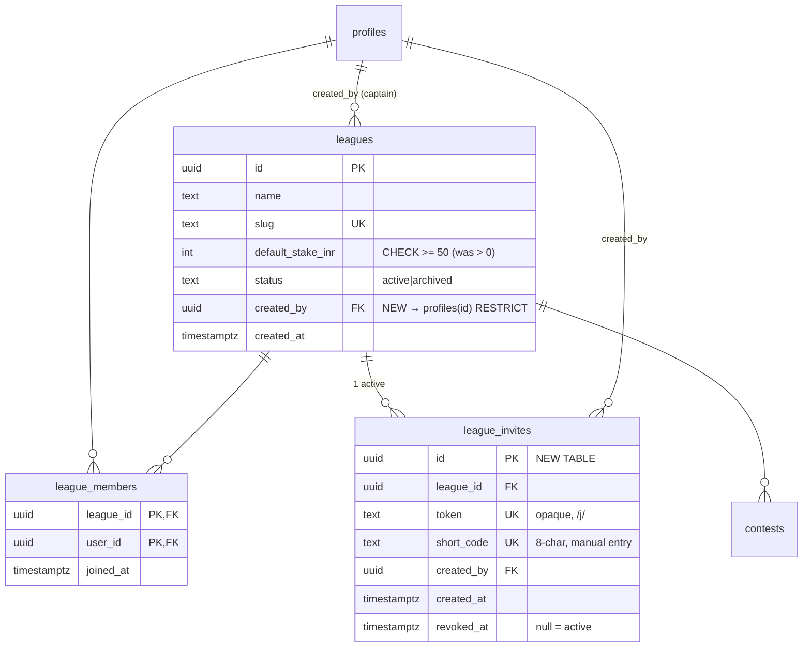

# Self-serve accounts, league creation & invite-link joining

> Three coupled features that turn Cashford from an admin-seeded app into a self-serve,
> friend-grows-friend product: **(1)** a player can create their own account, **(2)** any
> logged-in player can create a World-Cup league and becomes its captain, and **(3)** anyone
> can join a league via a shareable link (opaque URL + short code), signing up inline if needed.

## Overview

Today Cashford has **no self-serve anything**. Every account is created by a service-role seed
script (`scripts/seed-solid-yenne.mjs`), every league is a hand-run script, and there is no
invite/join concept at all — `leagues`, `league_members`, and `contests` have **no
authenticated-write RLS policies**, so all writes go through the service-role client server-side.

This plan adds, on top of that existing model (without fighting it):

- A public **signup** flow that reuses the synthetic `<username>@cashford.internal` email model
  (no real email, no email service, no verification) via a server action calling
  `admin.auth.admin.createUser()`.
- A tiny **league-creation** wizard (name → stake → editable slug → share link).
- A **join** flow: `/j/<token>` confirmation screen → join, with inline signup that
  auto-joins after account creation, plus an 8-char short code for WhatsApp manual entry.
- **Captain controls**: revoke/regenerate the invite, remove members, archive the league.

All new writes stay server-side via the service-role client — consistent with the app's
current security model. No new authenticated-write RLS policies are introduced.

## Problem Statement / Motivation

Onboarding a friend today means: Ananth runs a script to create their account with a temp
password, manually adds them to a league, and shares the password out-of-band. That doesn't
scale past the three seeded leagues and blocks the obvious growth loop ("send the WhatsApp group
a link"). The three flows above are the minimum to make Cashford self-sustaining for the 2026
World Cup.

## Confirmed Decisions (from planning discussion, 2026-06-24)

| # | Decision | Choice |
|---|----------|--------|
| 1 | **Login method** | Username + password. **No email, no verification, no email service.** New accounts created server-side via service-role `admin.createUser` with synthetic `<username>@cashford.internal` email. |
| 2 | **Signup access** | Public signup button **and** signup via invite link both exist. |
| 3 | **League creators** | Any logged-in player can create a league. |
| 4 | **League admin** | Single captain = the creator (`leagues.created_by`). No co-captains. |
| 5 | **Invite form** | One active invite per league = opaque URL token (`/j/<token>`) **+** 8-char short code, both resolving to the same league. |
| 6 | **Join window** | Open all tournament; a late joiner is simply absent from already-locked matches. Captain controls access by **revoking** the link and/or **removing** players. No deadline field. |
| 7 | **Creation config (v1)** | Name + stake-per-match + **editable slug/invite URL**. Fixture scope = all remaining future-lock fixtures (no stage selection). No member cap, no deadline. |
| 8 | **Password recovery** | **Global admin (you) only** — issue a temp password + `must_change_password` flag. Captains cannot reset passwords. |
| 9 | **Minimum stake** | **₹50/match minimum.** UI copy frames it as *"treat as points / fake money if you don't play for real — it's only there so the leaderboard works."* |
| 10 | **Remove player** | Membership row deleted; **locked/settled predictions & results/dues preserved**. Player vanishes from future matches & standings only. |
| 11 | **Removal stickiness** | **Soft removal** — if the invite is still active, a removed player can rejoin. To keep someone out, the captain must **revoke + regenerate** the link. |
| 12 | **Re-join semantics** | "Resume" — old predictions/results still count (a consequence of #10 + #11; predictions are never deleted). Pot/dues math must source from `contest_results.user_id`, not a `league_members` join. |
| 13 | **Captain exit** | Captain **cannot** leave or remove themselves. Exit path = **archive** the league. |

**Fixed assumption (not changing):** money is an **informal tally only** — no payment gateway —
settled outside the app via the existing Dues tab.

## ERD — schema changes

Only two structural changes: **`leagues.created_by`** (new column) and **`league_invites`**
(new table). `league_members` and `contests` are unchanged in shape; `leagues.default_stake_inr`
gets a tightened CHECK.

---

## Technical Approach

### Architecture principles (inherited — do not violate)

1. **All league/membership/contest/invite writes go through the service-role client**
   (`lib/supabase/service.ts`), server-side only. There are no authenticated-write RLS policies
   for these tables and we are **not adding any**. (Ref: `migrations/20260618000002_rls_functions.sql`
   — leagues/members/contests are SELECT-only for `authenticated`.)
2. **Reads of sensitive management data** (invite token/code, logged-out join preview) also go
   through the service client in a server action / route handler — never expose the service key
   to the client, and return only minimal DTOs.
3. **Schema is `cashford`** — every client is configured with `{ db: { schema: "cashford" } }`.
   (Ref: all three `lib/supabase/*.ts`.)
4. **DDL is applied via the Supabase Management API + PAT** (`SUPABASE_ACCESS_TOKEN`, `sbp_…`),
   not the service-role key. (Ref: `CLAUDE.md:29-39`.) The repo also keeps the SQL as a migration
   file for record. Staging shares the prod Supabase, so the migration must be **additive & safe**.
5. **`my_league_ids()` (security definer STABLE)** gates everything a user sees. A new user with no
   memberships sees an empty app — already handled by the "No leagues yet" state (`app/page.tsx:85`).

### Auth model for signup (the key design choice)

Self-serve signup is implemented **server-side with the service-role client**, mirroring the seed
scripts — **not** `supabase.auth.signUp()`. Reasons:

- Supabase's "Enable email signups" toggle is off, and synthetic `@cashford.internal` emails can't
  receive a confirmation mail — so `signUp()` would dead-end on confirmation.
- `admin.createUser({ email_confirm: true })` bypasses confirmation entirely, exactly as the seed
  scripts already do.

Flow: validate → `admin.createUser(... must_change_password: false)` → `signInWithPassword()` on
the same request to mint the session cookie → redirect. The `handle_new_user()` trigger mirrors
`user_metadata` → `profiles` (username, display_name).

### Invite token design

- **token**: opaque, URL-safe, ~32 chars (e.g. base64url of 24 random bytes). Unguessable —
  correct for a money pool (best-practice research: opaque tokens over guessable codes).
- **short_code**: 8 chars from an unambiguous alphabet (Crockford base32 minus `I L O U`), for
  WhatsApp/dictation. 32^8 ≈ 1.1×10^12 space; generation retries on the rare unique-constraint hit.
- **One active invite per league**, enforced by a partial unique index
  `(league_id) WHERE revoked_at IS NULL`. Revoke = set `revoked_at`. Regenerate = revoke old + mint
  new (old link/code dead immediately).

---

## Implementation Phases

### Phase 0 — Schema & DB migration (foundation; blocks everything)

**File:** `supabase/migrations/20260624000006_accounts_leagues_invites.sql` (applied via Management API).

**Approach:**
1. `alter table cashford.leagues add column created_by uuid references cashford.profiles(id) on delete restrict;`
2. **Backfill** existing leagues' `created_by` to the `ananth` profile id
   (`update … set created_by = (select id from cashford.profiles where username = 'ananth')`),
   then `alter column created_by set not null;`
3. `alter table cashford.leagues drop constraint <default_stake_inr check>, add check (default_stake_inr >= 50);`
   (Existing rows: ₹50 / ₹500 — all comply. Safe.)
4. Create `cashford.league_invites` (see ERD) + `unique index … (league_id) where revoked_at is null`
   + index on `short_code`, `token` (unique already).
5. **Grants**: `grant select, insert, update on cashford.league_invites to service_role;`
   **No** grants/policies for `authenticated` or `anon` (service-role-only, by design).
6. **Backfill invites** for the 3 existing leagues so their captains immediately have a shareable
   link (optional but expected): one active `league_invites` row each, `created_by = created_by`.
7. Verify `handle_new_user()` raises (not silences) on `profiles.username` unique violation so a
   failed signup rolls back the `auth.users` insert (no orphaned auth row). The existing
   `on conflict (id) do nothing` only guards the `id` PK; a `username` 23505 propagates and aborts
   the `auth.users` insert transaction. **Confirm this empirically** (Phase 1 test).

**Verification:** Management API query returns the new column + table; existing 3 leagues have
non-null `created_by`; a `default_stake_inr = 40` insert is rejected; the partial unique index
rejects a 2nd active invite for one league.

---

### Phase 1 — Self-serve signup

**Files:**
- `app/signup/page.tsx` (NEW) — public page; form: **username**, **display name**, **password** (+ confirm).
- `app/signup/actions.ts` (NEW) — `signUpUser(formData)` server action.
- `middleware.ts` (MODIFY) — `PUBLIC_PATHS` += `"/signup"`, and prefix-allow `"/j"`.
- `app/login/page.tsx` (MODIFY) — add "New here? **Create an account**" link → `/signup`.
- `app/page.tsx` (MODIFY) — enrich the existing zero-leagues empty state with
  **"Create a league"** + **"Join with a code"** CTAs.
- `lib/validation.ts` (NEW or extend) — `normalizeUsername`, `USERNAME_RE = /^[a-z0-9_-]{3,20}$/`,
  password rules, reserved-slug list (shared with Phase 2).

**`signUpUser` approach (patterns: `scripts/seed-solid-yenne.mjs` createUser block; `app/login/actions.ts` synthetic-email + signIn):**
1. Validate username (regex, lowercased), display name (default to username if blank), password
   (min length, match confirm). Server-side — not just client.
2. Availability pre-check: `select 1 from profiles where username = $1` (fast UX feedback).
3. `admin.auth.admin.createUser({ email: \`${u}@cashford.internal\`, password, email_confirm: true,
   user_metadata: { username: u, display_name: d, is_admin: false, must_change_password: false } })`.
   - The trigger creates the profile. Hard guarantee against races = `profiles.username UNIQUE`
     (the trigger raises → `createUser` errors → no orphan).
   - Map a username/email-exists error to **"Username taken"** (never a raw Supabase string).
4. `supabase.auth.signInWithPassword({ email, password })` to set the session cookie. On failure,
   **rollback**: `admin.auth.admin.deleteUser(newId)`; return a generic error.
5. **Consume a pending invite cookie** if present (see Phase 3) → `joinLeague` → redirect to that
   league. Else redirect to `/`.

**Verification:** see Acceptance Criteria → Signup. Includes the orphan-prevention test.

---

### Phase 2 — League creation

**Files:**
- `app/leagues/new/page.tsx` (NEW) — wizard (single screen, progressive): name → stake → slug → create.
- `app/leagues/new/actions.ts` (NEW) — `createLeague(formData)` + `checkSlug(slug)` server action.
- `lib/invite.ts` (NEW) — `generateToken()`, `generateShortCode()` (Crockford-32, retry-on-collision helpers).
- `lib/validation.ts` (MODIFY) — `slugify(name)`, `SLUG_RE`, `RESERVED_SLUGS`.

**Wizard UI:**
- **Name** (required).
- **Stake/match**: default **₹500**, quick-pick chips ₹50 / ₹100 / ₹500 / ₹1,000, free numeric
  input, **min ₹50**. Helper copy (decision #9): *"Stakes are an honour-system tally settled
  outside the app. Treat it as points if you don't play for money — it's just so the leaderboard
  works."* Show auto-calculated "₹X across N remaining matches" for context.
- **Slug / invite URL**: auto-derived from name (`slugify`), **editable**; show
  `cashford.app/l/<slug>` live; debounced `checkSlug` availability + reserved-word check.
- On success: **share panel** — the `/j/<token>` link + the 8-char short code, Copy buttons,
  WhatsApp share. Then "Open league →".

**`createLeague` approach (patterns: `scripts/seed-solid-yenne.mjs` steps 1/3/4):** service-role,
sequential with rollback (no multi-statement transaction over PostgREST — compensate on failure):
1. Validate name; `stake >= 50`; slug format + **not in `RESERVED_SLUGS`** (`new`, `create`,
   `settings`, `login`, `rules`, `api`, `j`, `change-password`, `leagues`, `signup`) + available.
2. Insert `leagues` (`created_by = me`, `default_stake_inr = stake`). On `slug` 23505 → "Slug not available".
3. Insert `league_members` (me). *(Required — else `my_league_ids()` excludes the new league and the
   creator can't see it.)*
4. `generateToken()` + `generateShortCode()` (retry loop, max 3, on `token`/`short_code` 23505);
   insert `league_invites` (active).
5. Bulk-insert `contests` for every fixture with `kickoff_at > now()`, `stake_inr = stake`,
   `status = 'open'`, `lock_at = kickoff_at`, `is_knockout` from fixture —
   **`onConflict: "league_id,fixture_id", ignoreDuplicates: true`** (idempotent on retry).
   Strictly filter `kickoff_at > now()` (don't create already-lockable contests).
6. Rollback rule: if step 2 succeeds but a later step fails, delete the league row (cascades clean up).

**Verification:** see AC → League Creation (atomic create, slug taken/reserved, creator sees league,
stake min enforced at DB + UI).

---

### Phase 3 — Join via invite link

**Files:**
- `app/j/[token]/page.tsx` (NEW) — public confirmation screen (Server Component, service-role DTO fetch).
- `app/j/[token]/route.ts` or inline action (NEW) — sets the **pending-invite cookie** when a
  logged-out user chooses "Create account".
- `app/leagues/join/actions.ts` (NEW) — `joinLeague(tokenOrCode)`; `resolveInvite(tokenOrCode)` (DTO).
- `app/leagues/join/page.tsx` (NEW, optional) — "Join with a code" box (8-char manual entry) →
  resolves to the `/j` flow.
- `app/page.tsx` (MODIFY) — wire the "Join with a code" CTA.

**`resolveInvite` (service-role, public-safe DTO):** look up active invite by `token` **or**
`short_code` (`revoked_at IS NULL`). Return `{ leagueName, captainDisplayName, memberCount,
stakeInr, status }` only — never the token/secrets, never picks. Distinguish:
- not found → **"Invite not found."**
- found but revoked → **"This invite link is no longer active. Ask the captain for a new link."**

**`/j/[token]` page branches:**
| Viewer | UI |
|--------|-----|
| Logged out | Confirmation card (league, captain, N members, ₹stake/match) → **"Create account to join"** (sets cookie → `/signup`) + "Already have an account? Log in" (carries invite). |
| Logged in, **already a member** | "You're already in this league" → open league (no join button). |
| Logged in, **captain of it** | "You manage this league" (read-only) → open league. |
| Logged in, **not a member** | Confirmation → **"Join — ₹{stake}/match"** → `joinLeague`. |

**`joinLeague(tokenOrCode)` (service-role):**
1. `SELECT … FOR UPDATE` the invite row (re-validate `revoked_at IS NULL` **at submit time**, not
   just at render — closes the revoke-mid-join TOCTOU). Revoked → clear error.
2. Already a member? → idempotent success (redirect to league), no insert.
3. Insert `league_members(league_id, me)`. On PK `(league_id, user_id)` 23505 → **treat as
   idempotent success** (double-submit), not a 500.
4. Redirect to `/leagues/<slug>`.
   *(No per-member contest creation — contests are per-league and already exist for future fixtures;
   joining = a membership row only.)*

**Pending-invite cookie coordination (the auto-join-after-signup mechanism):**
- When a logged-out user clicks "Create account to join", set `cf_invite=<token>`: **HttpOnly,
  SameSite=Lax, Secure, ~15 min, session-scoped, path `/`**.
- `signUpUser` (Phase 1, step 5) and `login` action read & consume the cookie post-auth → call
  `joinLeague` → clear cookie → redirect to the league.
- **Shared-device caveat** (report edge #07): a different user on the same browser could pick up a
  stale pending invite. Accepted as out-of-scope for a friends' app; the cookie is short-lived and
  the join still requires the viewer to be authenticated as *someone*. Documented, not engineered around.

**Verification:** see AC → Join.

---

### Phase 4 — Captain management & pot/dues integrity

**Files:**
- `app/leagues/[slug]/manage/page.tsx` (NEW) — captain-only management (invite + members + archive).
  *(Child of the `[slug]` dynamic segment — not a sibling — so it doesn't collide with the slug denylist.)*
- `app/leagues/[slug]/manage/actions.ts` (NEW) — `revokeInvite`, `regenerateInvite`, `removeMember`,
  `archiveLeague`. Each asserts `caller is league.created_by OR profiles.is_admin` (read via
  service-role, never trusting client claims).
- `app/leagues/[slug]/page.tsx` (MODIFY) — show a "Manage" entry to the captain only; verify
  standings sourcing (below).

**Captain actions:**
- **Revoke** → set `revoked_at` on the active invite. Link & code die immediately.
- **Regenerate** → revoke old + mint new token+code (retry-on-collision). UI surfaces the new link.
- **Remove member** → delete the `league_members` row. Blocked for **self** (decision #13) and for
  the **captain** generally. Confirm dialog includes: *"They keep their settled results. To stop
  them rejoining, regenerate the invite link too."* (decision #11).
- **Archive league** → `status = 'archived'` (the captain's only exit; decision #13).

**🔴 Pot/dues integrity (critical — report edge #01, ranked #1):**
Because a removed player keeps their locked/settled `contest_results` but loses their
`league_members` row, **any standings/dues query that inner-joins through `league_members` will
silently drop that player's `net_inr` and the pot will not balance** — and the `settle()` ₹1
floor-remainder distribution (by `user_id` sort) is sensitive to exactly which winners are present.

- **Requirement:** dues/settlement aggregation **must source from `contest_results.user_id`
  directly**, joining to `profiles` for display, **not** filtered through current membership.
- **Action:** audit the league standings + Dues queries (`app/leagues/[slug]/page.tsx`,
  `lib/settle-contest.ts`, and wherever the Dues tab aggregates) and confirm this. If any path
  inner-joins `league_members`, fix it to source from `contest_results`.
- **Display rule:** the **live leaderboard going forward** lists current members (via
  `my_league_ids`); the **dues ledger** includes everyone who has settled results (so money owed
  is always complete). A removed player simply stops appearing in the forward leaderboard but their
  settled money persists in dues. This is the exact meaning of decisions #10 & #12.

**Verification:** see AC → Captain + the pot-integrity regression test below.

---

## System-Wide Impact

### Interaction graph (two levels out)

- **`signUpUser`** → `admin.createUser` → **`on_auth_user_created` trigger** → `handle_new_user()`
  inserts `profiles` (reads `user_metadata`). → `signInWithPassword` → session cookie →
  (cookie?) `joinLeague`.
- **`createLeague`** → inserts `leagues` → `league_members` → `league_invites` → bulk `contests`.
  Newly created `contests` enter the **cron tick** orbit (`app/api/cron/*` →
  `lockDueContests`/`settleFinishedContests`) — safe because we only insert `kickoff_at > now()`
  contests (status `open`, future lock).
- **`joinLeague`** → inserts `league_members` → immediately changes `my_league_ids()` for that
  user → unlocks RLS visibility of the league's contests/predictions (post-lock reveal still gated
  by `lock_at` and `password_change_done()`).
- **`removeMember`** → deletes `league_members` → shrinks `my_league_ids()` for that user → they
  lose forward visibility, but **`contest_results` rows are untouched** (the dues ledger is intact).

### Error & failure propagation

- `createUser` username conflict → trigger raises 23505 → `createUser` errors → action maps to
  "Username taken" → **no orphan auth row** (the insert transaction aborts).
- `signInWithPassword` failure post-create → action **deletes** the just-created user (rollback).
- `createLeague` partial failure (e.g. invite insert fails after league insert) → **delete the
  league** (cascade) → return error; the user retries cleanly.
- `joinLeague` / contest bulk-insert / invite regenerate → all `23505`-tolerant
  (idempotent success or bounded retry); never surface a raw 500.

### State lifecycle risks

- **Orphaned auth user** (auth row, no profile): prevented by the trigger raising on username
  conflict; backstopped by a post-login profile-existence check (recovery screen) — report edge #02.
- **Partial league**: prevented by the rollback rule in `createLeague`.
- **Memberless league** (captain removed everyone, then... can't leave): captain self-removal is
  blocked, so a league always has ≥1 member (the captain). Report edge #09 is therefore mostly moot;
  archive is the clean terminal state.
- **Stale pending-invite cookie**: short-lived + HttpOnly; shared-device case documented as accepted.

### API surface parity

The **only** entry points to these mutations are the new server actions (all service-role,
all captain/admin-gated where relevant). There is no alternative authenticated-write path (no RLS
insert policies), so there is no second surface to keep in parity. Admin scripts remain a parallel
(trusted) path and are unaffected.

### Integration test scenarios (real objects, no mocks)

1. **Signup → auto-join**: logged-out `/j/<token>` → create account → lands inside the league as a
   member, in one flow, no manual token re-entry.
2. **Remove → pot still balances**: settle a contest where a player wins, remove them, assert the
   Dues ledger still sums to zero and the winner's `net_inr` is still counted.
3. **Revoke mid-join**: render confirmation with valid token, revoke, submit join → clean "no longer
   active" error, no membership row created.
4. **Concurrent same-username signup**: exactly one succeeds with a profile; the other gets
   "Username taken"; zero orphaned auth rows.
5. **Create → cron tick**: create a league while the cron runs; assert only `kickoff_at > now()`
   contests exist and none are wrongly locked.

---

## Edge Cases (ranked, from flow analysis)

| # | Edge case | Handling |
|---|-----------|----------|
| 01 | **Pot integrity after removal** | Dues/standings source from `contest_results.user_id`, not a `league_members` join. (Phase 4, critical.) |
| 02 | **Auth user with no profile** | Trigger raises on username conflict (atomic abort); post-login profile-existence guard → recovery screen. |
| 03 | **New user, zero leagues** | Home/league/match/dues render explicit empty states (extend `app/page.tsx:85`). |
| 04 | **Double-submit join** | `(league_id,user_id)` PK 23505 → idempotent success. |
| 05 | **Captain account deletion** | `created_by … on delete restrict` — blocks deleting a captain's profile while they own a league. |
| 06 | **Concurrent same-username signup** | `profiles.username UNIQUE` is the hard guard; trigger raises; action maps to "Username taken". |
| 07 | **Invite cookie + shared device / back-button** | HttpOnly, short-lived, session-scoped; shared-device accepted as out-of-scope. |
| 08 | **Slug = live route segment** | `RESERVED_SLUGS` denylist validated before insert. |
| 09 | **Memberless league** | Prevented — captain can't self-remove; archive is the terminal state. |
| 10 | **Short-code reuse after regenerate** | Lookup always filters `revoked_at IS NULL`; generation retries on unique-constraint hit. |

## Race Conditions

| Heat | Race | Mitigation |
|------|------|-----------|
| 🔴 | Username TOCTOU at signup | `profiles.username UNIQUE` + trigger raises; pre-check is UX-only. |
| 🔴 | Double-join | PK constraint → treat 23505 as idempotent success. |
| 🔴 | Revoke during mid-join | `joinLeague` does `SELECT … FOR UPDATE` on the invite row before inserting membership. |
| 🟠 | Slug collision at create | Catch `slug` 23505 → "Slug not available"; pre-check is UX-only. |
| 🟠 | Token/short_code collision on (re)generate | Retry loop (max 3), then fail with a visible error — never a broken invite. |
| 🟠 | Contest bulk-insert retry | `ON CONFLICT (league_id, fixture_id) DO NOTHING`. |
| 🟢 | Cron tick vs create | Strict `kickoff_at > now()` filter on contest creation. |

---

## Acceptance Criteria

### Signup
- [ ] A visitor submits **username + display name + password** on public `/signup`, gets a session
      cookie, and lands on home — one server round-trip, no email step.
- [ ] A taken username returns **"Username taken"** (not a Supabase string, not a 500) and leaves
      **no orphaned `auth.users` row**.
- [ ] Username chars that would break `<username>@cashford.internal` are rejected **server-side**.
- [ ] A new account has `must_change_password` **false** — no redirect to `/change-password`.
- [ ] Two concurrent same-username signups → exactly one succeeds with a profile; the other gets
      "Username taken"; no orphans.
- [ ] A leagueless new user sees an explicit **"Create or join a league"** empty state.

### League Creation
- [ ] Completing the wizard atomically creates `leagues` (`created_by` = creator) + `league_members`
      (creator) + active `league_invites` + future-fixture `contests`; any failure leaves no partial state.
- [ ] Stake default ₹500; **UI min ₹50** and **DB `CHECK (default_stake_inr >= 50)`**.
- [ ] Taken slug → "Slug not available"; reserved slug → specific error; no partial league created.
- [ ] Creator immediately sees the new league (`my_league_ids()` includes it) and the share panel
      (link + 8-char code + WhatsApp).

### Join via Invite
- [ ] Logged-out `/j/<token>` shows the confirmation (name, captain, member count, ₹stake/match)
      **without login**, via service-role DTO.
- [ ] Logged-out "Create account" → signup → **auto-joined**, no token re-entry.
- [ ] Already-a-member sees **"You're already in this league"** + league link (no join button).
- [ ] Captain on own link sees **"You manage this league"** (read-only).
- [ ] Revoked token → "This invite link is no longer active"; nonexistent token → "Invite not found"
      (distinct states).
- [ ] Token revoked between render and submit → clean error, **no** membership row created.
- [ ] 8-char short code typed into "Join with a code" resolves to the same flow.

### Captain & Integrity
- [ ] Revoke kills the current link + code; regenerate mints a new pair and the old dies.
- [ ] Remove member deletes the membership row, **keeps** their `contest_results`; captain can't
      remove themselves; dialog notes the "regenerate to keep them out" caveat.
- [ ] **Pot regression:** with a removed player who won a settled contest, the Dues ledger still
      balances to zero and counts their `net_inr` (sourced from `contest_results`, not membership).
- [ ] Archive sets `status='archived'`; the league stops accepting new joins/predictions.

### Quality gates
- [ ] `npm run typecheck` clean, `npm run build` succeeds, `npm test` green (existing 125 + new).
- [ ] New unit tests: username/slug validation, reserved denylist, short-code alphabet/length,
      token uniqueness/retry.
- [ ] New integration tests: the 5 scenarios above (real objects, no mocks for the DB chain).

---

## Security Considerations

- **Public account creation** is an abuse surface (anyone can mint accounts). v1 mitigations:
  server-side validation + rate-limit the signup action (per-IP, simple in-memory or KV); a
  CAPTCHA/Turnstile is **out of scope** but flagged as the next lever if abused. Document this.
- **Service-role key never reaches the client** — all invite/league mutations and the logged-out
  join preview run in server actions / route handlers.
- **Captain/admin gating** reads `leagues.created_by` / `profiles.is_admin` via the service-role
  client; never trust a client-supplied role/flag (consistent with the existing `is_admin`-from-
  `profiles` rule).
- **Invite tokens are opaque** (unguessable); short codes are higher-entropy than FPL-style codes;
  lookups always require `revoked_at IS NULL`.
- **Password reset stays admin-only** (decision #8) — captains get no password powers.
- No personal data beyond username/display name is collected; no email, so no email-based attack
  surface and nothing to leak.

## Risks & Mitigations

| Risk | Mitigation |
|------|-----------|
| Migration on shared prod Supabase | Additive only (nullable column + backfill + new table + tightened CHECK that existing rows satisfy). Apply via Management API; verify on staging-shared DB first. |
| Pot math breaks on removal (money correctness) | Source dues/standings from `contest_results`; dedicated regression test; this is the #1 ranked risk. |
| Orphaned auth users | Trigger raises atomically + post-login profile guard. |
| Signup abuse | Rate-limit; CAPTCHA as a fast-follow if needed. |
| Slug shadows a route | Reserved denylist enforced before insert. |
| Invite leaked in WhatsApp to wrong person | Captain can revoke + regenerate + remove; reusable-link risk is understood and accepted for a friends' app. |

## Out of Scope (do not build in v1)

- Real email, email verification, magic links, OAuth, self-serve password reset.
- Co-captains / captain transfer (captain is fixed; exit = archive).
- Stage/match-subset selection, member caps, join deadlines, in-app payments.
- Member-cap warnings, league discovery/browse, public league directory.
- CAPTCHA/Turnstile (flagged, not built).

## Execution & Verification Protocol (per-phase, subagent-driven) — MANDATORY for /ce:work

Each phase is **executed by one subagent and verified by a different, independent subagent**.
Phases are **hard-gated**: do not start phase N+1 until phase N's verification is fully green and
**every issue found is fixed and re-verified**.

### Per-phase loop
1. **Executor subagent** — implements the phase (code + unit/integration tests); runs
   `typecheck` + `build` + `vitest` green locally; commits to the feature branch; **deploys to
   staging** (`cashford-staging.vercel.app`) via the Vercel CLI.
2. **Verifier subagent** (fresh context, no implementation bias) — performs **browser-driven,
   end-to-end testing on the STAGING URL only**, walking each flow **exactly as a brand-new user
   would** (and as a captain where relevant). Reports pass/fail per flow with screenshot / console /
   network evidence.
3. **Fix loop** — the executor fixes **every** issue the verifier found; the verifier re-runs.
   Repeat until all green.
4. **Gate** — only then proceed to the next phase.

### Cumulative regression
After each phase, the verifier re-tests **every flow touched or created so far**, not just the new
one. (e.g. after Phase 3, re-walk signup → create → join as one continuous journey.)

### Browser tooling & "end-to-end" definition
- Use **`chrome-devtools-axi`** (the isolated/throwaway Chrome) against the **staging URL**. It
  **cannot** reach real logged-in sessions — which is exactly right here: every test begins as a
  **fresh, logged-out visitor** and creates its own new account. **Do NOT** use the
  `claude-in-chrome` logged-in route (that drives the real profile).
- **End-to-end means clicking real buttons**, not calling APIs: open staging → sign up as a new
  user → create a league → copy the invite link/code → open it in a fresh context → join → make a
  prediction → (where relevant) settle & check Dues. Light + dark, 360px + 480px.

### Test-data isolation (HARD RULE)
- **NEVER touch the three real leagues** (Solid Yenne Boys, KK Bois, PES Bois) or their real
  players/accounts. Read-only at most; no writes.
- **Create NEW throwaway data for every test run**, namespaced so it's unmistakable and safe to
  delete: test usernames prefixed **`qa-`** (e.g. `qa-captain`, `qa-joiner1`); test leagues
  prefixed **`zz-qa-`** (e.g. `zz-qa-alpha`). Test stakes ≥ ₹50.
- Keep a **teardown** that deletes **only** `qa-`/`zz-qa-`-prefixed users + leagues (and their
  memberships / contests / predictions / results / invites), with an explicit guard that it can
  **never** match the three real leagues. Run teardown at the end of each phase's verification and
  before any re-run, to keep the shared DB clean.
- ⚠️ Staging **shares the prod Supabase**, so every test row lives in the prod DB. Namespacing +
  teardown is the only thing keeping that safe — treat it as load-bearing.

### Per-phase verifier checklist
- **Phase 0 (schema, no UI):** via Management API confirm `leagues.created_by`, `league_invites`,
  the `>= 50` CHECK, and the partial unique index exist; confirm the **3 real leagues are intact**
  and have backfilled `created_by`.
- **Phase 1 (signup):** new-user signup happy path; **duplicate-username** error; password mismatch;
  lands logged-in on the empty **"create or join"** home; **no `/change-password` wall**; forced
  duplicate leaves **no orphaned auth row**.
- **Phase 2 (create):** create a `zz-qa-*` league as `qa-captain`; **min-stake** enforcement; slug
  auto-derive / edit / taken / reserved; share panel shows link + code; creator immediately sees the
  league + its contests.
- **Phase 3 (join):** logged-out `/j/<token>` → confirmation → **create account → auto-joined**;
  logged-in join; **already-member** state; **captain-own-link** state; **revoked** link; **invalid
  token**; **short-code** manual entry. **+ regression** of signup & create.
- **Phase 4 (captain/integrity):** revoke kills the link; regenerate mints new + old dead; remove
  member (history kept); **can't remove self**; archive; and the **pot/dues regression** — settle a
  `zz-qa-*` contest, remove a **winner**, confirm **Dues still balances**. **+ full regression** of
  all prior flows.

### Subagent orchestration
`/ce:work` dispatches **one executor subagent per phase** and **one independent verifier subagent
per phase**. Each verifier is handed: the staging URL, the phase's flow checklist, the test-data
namespacing rule, and the teardown command. Findings flow back to the executor; fix-and-re-verify
until green; then gate to the next phase.

## Verification & Deploy (gated — only on explicit go-ahead)

The per-phase protocol above runs against **staging** throughout build. Production ship happens
**once, after all five phases are green** and you've QC'd staging:

1. Migration already applied (Phase 0) and verified on the shared DB; the 3 real leagues intact.
2. `npm run typecheck` + `npm run build` + `npm test` green locally.
3. All five phases' browser E2E flows green on staging (new + duplicate signup, create + share panel,
   join logged-out → auto-join, join logged-in, already-member, captain-own-link, revoked/invalid
   link, short-code entry, revoke/regenerate, remove member + Dues-still-balances, archive).
4. **Your QC on staging** → then ship: `node scripts/stamp-version.mjs`, commit, push to `main`
   (Vercel auto-deploys bom1). **Do not push to prod until sign-off.**
5. Run the `qa-`/`zz-qa-` **teardown** before shipping so no test data lingers in the shared DB.

## Sources & References

### Internal (file-grounded)
- Auth model: `_auth.md`; `app/login/actions.ts` (synthetic email + signIn); `middleware.ts`
  (`PUBLIC_PATHS`); `app/change-password/*`.
- User identity & trigger: `supabase/migrations/20260618000001_schema.sql:26` (`profiles`);
  `20260618000002_rls_functions.sql` (`handle_new_user`, `my_league_ids`, `password_change_done`,
  service-role-only writes).
- Leagues/contests: `…schema.sql:38` (`leagues`), `:50` (`league_members`), `:126` (`contests`).
- Creation pattern: `scripts/seed-solid-yenne.mjs` (league → members → contests at stake).
- Settlement/money: `lib/settlement.ts` (`settle`, ₹1 floor-remainder by user_id sort),
  `lib/settle-contest.ts` (the only `contest_results` writer); cron in `app/api/cron/*`.
- Empty state: `app/page.tsx:85`.
- DDL via Management API: `CLAUDE.md:29-39`.

### External (competitive synthesis)
- FPL mini-league codes + auto-join URL; Sleeper opaque invite links (and its non-logged-in
  auto-join gap); Superbru pools; Splash Sports commissioner links + deadlines/caps; ESPN group
  invites. Key takeaways: opaque tokens for money pools, stash-token-then-auto-join after auth,
  show a stake/member confirmation before commit, bar/limit joins via captain control. (Research
  artifact: comparable-apps synthesis, 2026-06-24.)

### Planning artifacts
- Flow-completeness analysis (gaps, ranked edge cases, race conditions, ACs), 2026-06-24 — folded
  into the Edge Cases, Race Conditions, and Acceptance Criteria sections above.
