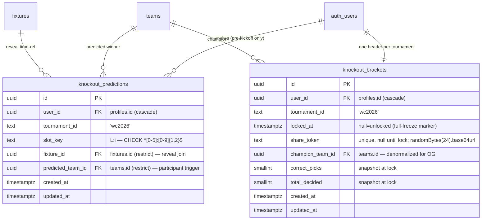

# 🏆 Knockout Circle — radial WC-2026 bracket

## Overview

A new immersive feature for Cashford: a **radial visualization of the World Cup 2026 knockout
stage** (31 matches, R32 → Champion) drawn as six concentric rings around a central trophy, with
two modes:

- **Live Bracket** — a calm, read-only board of official results. Slots fill in **only when a
  match is final**.
- **My Picks** — an interactive bracket builder: tap a team to advance it one round, complete the
  bracket to pick a champion, **lock**, then **share it as an image**.

Reached from home via a new **Bracket** tab and an attention **banner**. This plan implements
**Direction 1a only** (the `Orbit` 1b and `Sunburst` 1c explorations in the same handoff file are
explicitly **not** built).

**Priority order (Ananth):** ① Perfect UI/UX · ② Sharability · ③ Navigation · ④ Animations.
Every phase is unit-tested + browser-QC'd on staging **before** the staging link is handed over.

### Locked decisions (confirmed with Ananth, 2026-07-01)

| # | Decision | Choice | Consequence |
|---|----------|--------|-------------|
| 1 | **Stakes model** | **Accuracy only, no money** | No settlement/ledger/transfers changes. Score = correct picks over *decided* matches. Zero risk to the existing per-match ₹ pots. |
| 2 | **Social scope** | **Personal bracket + per-league leaderboard** | One bracket per user (global for the tournament). Each league shows a bracket-accuracy leaderboard among its members. |
| 3 | **Share** | **Shareable link + live preview** | Public `/b/<id>` page + server-rendered OG image (WhatsApp/iMessage/X thumbnails) + Web Share of the URL + "Save image". Doubles as an invite/join growth loop. |
| 4 | **v1 scope** | **Core: bracket + picks + share** | v1 = Bracket tab, Live Bracket, My Picks builder, lock, leaderboard, share. **Deferred fast-follow:** live cron auto-scoring + the first-login teaser reveal. |

### Defaults set without asking (override any of these)

- **Navigation (③):** the bracket is its **own `/bracket` route** (dark, immersive, multi-screen)
  reached from a new 4th top-tab entry `Leagues · Matches · Analytics · Bracket`, plus the home
  banner. *Not* an in-home tab panel (a dark full-screen experience + teaser + share sub-screens
  does not belong inside the light tabbed home shell).
- **Animations (④):** **CSS keyframes + `components/motion.tsx` only — no animation library**
  (hard codebase constraint, per `docs/plans/2026-06-23-001-feat-home-tabs-motion-system-plan.md`).
  The ring "draw-on" mirrors `AccuracyRing`'s `strokeDashoffset` sweep; tab-panel reveals go
  through `observeVisible()`; `prefers-reduced-motion` is already handled globally.
- **Look:** real flags via `teams.flag_url` on the roomier inner rings, 3-letter codes on the dense
  outer ring; a derived accent color per team. Bracket page runs **always-dark** (immersive "arena";
  matches the prototype and the existing `html.dark` tokens exactly).
- **Banner "seen" state:** `localStorage` for v1 (a `profiles` column is a later nicety).

---

## Enhancement Summary (deepened 2026-07-01)

Ran 10 parallel enhancement agents (architecture, correctness, security, simplicity, testing,
data-integrity, performance + 3 implementation Explores: UI/UX, SVG/animation, share). Full
refinements in **[Deepening — refinements](#deepening--refinements-from-the-enhancement-pass)** at the
end; the body below is updated for the contradictions they caught.

**Key improvements folded in:**
1. **Auto-picks are never persisted → scoring is self-cleaning.** The RLS write-timing gate only
   admits a pick while its match's `kickoff_at` is still future, so every stored row is a genuine
   pre-kickoff user prediction. `autoPicks()` becomes a **display-only client overlay**; `score()`
   reads only persisted user picks. This dissolves the whole "auto-locked inflates the leaderboard"
   bug class (correctness C-02/C-06/C-09) with **no `is_auto` column**.
2. **Two tables, not one.** A `knockout_brackets` **header** (one row per user per tournament) owns
   `locked_at` + the opaque `share_token` + a denormalized score snapshot; `knockout_predictions`
   holds per-slot picks. Fixes lock-atomicity across the N per-slot rows, gives the share token a
   home, and lets the OG card render without a 31-row join (architecture #5, data-integrity #4.2,
   share-pipeline, correctness C-08).
3. **Reveal RLS joins `fixtures.kickoff_at`** — `fixtures` has **no** `lock_at` (that's on
   `contests`). Verified in schema (`schema.sql:86` vs `:133`). Correlated per-row subquery, leaguemate
   gate joins `league_members` on both viewer and owner (security #1, data-integrity #1.3).
4. **OG image = branded champion card (primary).** Satori/resvg can't reliably rasterize our SVG's
   text/flags inside a data-URI; ship the flex-only champion card (flag + name + accuracy), defer the
   SVG-bracket embed to v2 (share-pipeline verdict).
5. **Interactive-SVG performance:** CSS-class dimming (`.kc-has-selection`/`data-node-path`) instead
   of re-rendering ~123 elements on tap; animate the 6 ring `<g>` groups, not 123 leaves; memoized
   Connector/Node layers (performance P0/P1).
6. **Accessibility spec** (was under-specified): per-node `role="button"` + `aria-label`, roving
   tabindex by ring, a `role="status"` live region, and a synchronized linear round-list fallback
   (UI/UX §2 — acceptance-gated).
7. **Testing hardened:** a Phase-1-gating `scripts/qa-knockout-verify.mjs` two-user RLS check, a
   manual FIFA-bracket cross-check gating Phase-0, an OG bot-UA curl, and ~15 named unit cases
   (testing T01–T14, correctness C-01…C-13).

**New considerations discovered:**
- ESPN `RO32 N` labels ≠ `external_id` order → the frozen `BRACKET` map's unresolved pairings can't
  be auto-verified until matches resolve; **manual cross-check against the official FIFA draw is a
  Phase-0 gate** (correctness R-01, testing R01).
- The public share reveals the **whole** bracket (not just the champion) — a deliberate, post-lock,
  opt-in trade-off; confirm copy must say "shares your full bracket" (security #12, correctness R-04).
- `next/image` `remotePatterns` for `a.espncdn.com` is only needed if we use `<Image>`; SVG `<image>`
  and Satori `` don't require it (performance §5).

---

## Source & fidelity

- Handoff bundle: `Downloads/Cashford_knockoutbracket.zip` → `design_handoff_knockout_circle/`
  (`README.md` + `Knockout Circle.dc.html` prototype + `support.js` design-tool runtime).
- **High-fidelity**: colors, type, spacing, radii, motion, and interaction rules are final and
  matched closely. The prototype is a **design reference**, *not* code to copy — recreate it with
  Cashford's patterns (Next 15 App Router, React 19, Tailwind v4 tokens, `@supabase/ssr`, pure
  `lib/` logic + Vitest).
- The only intentionally "mock" parts of the prototype are the tournament data (real fixtures/teams
  replace it) and the share plumbing (specified below).

---

## Research findings that shape the build

1. **The bracket *tree* does not exist in the DB** (top technical risk — now de-risked).
   `fixtures` has `round`, `is_knockout`, `advancer_team_id`, `home_label`/`away_label`, but **no**
   `feeds_into` / `slot_key` / `parent_fixture_id`. The tree (which R32 winner meets which in R16,
   etc.) is reconstructable but **must be frozen as a static map** in `lib/knockout.ts` — see
   [The bracket tree](#the-bracket-tree-the-crux).
2. **Satori (behind `next/og` `ImageResponse`) cannot render native inline `<svg>`**
   (`<circle>`/`<line>`/`<text>`) — it converts HTML→SVG, not the reverse (vercel/satori#86). So the
   server image either embeds our bracket as a **base64 data-URI ``** or falls back to a
   branded champion card. The *interactive* on-screen bracket stays **React-SVG**. Because we're
   already building the server route, **one server image generator produces both the OG thumbnail
   and the downloadable PNG** — no client-side `html-to-image` (avoids its Safari/`foreignObject` +
   font-embed pitfalls).
3. **OG link previews require a server-rendered image** — WhatsApp/iMessage/X/Slack crawlers never
   run JS; they read `<head>` and fetch `og:image`. Next 15 auto-disables streaming metadata for
   these bots, so blocking `generateMetadata` is guaranteed.
4. **Animations** are compositor-thread CSS (`stroke-dashoffset` draw-on + staggered entrance via
   the existing `cf-rv-stagger`), honoring `prefers-reduced-motion`. No `motion`/`framer-motion`.
5. **Theming:** the prototype's dark palette (`#0B0F14`, `#11161D`, `#15A66A`, `#F2C94C`) **is** the
   app's existing `html.dark` token set (`app/globals.css:42-63`). No new tokens for a dark bracket.
6. **`teams.flag_url`** = `https://a.espncdn.com/i/teamlogos/countries/500/<code>.png`; **some rows
   are `null`** (placeholder/junk teams) → the ring must fall back to code + derived color.
   `next.config.ts` must add `a.espncdn.com` to `images.remotePatterns` (currently only
   `media.api-sports.io`).
7. **Tests are pure `lib/*.test.ts` only** — no jsdom / RTL / component tests in this repo. So
   "thoroughly tested" = **exhaustive `lib/knockout.test.ts`** + typecheck + build + **browser QC on
   staging** (the design-verification substitute for component tests).

---

## Architecture

### Where everything lives

```
lib/knockout.ts            # PURE core (no I/O): frozen bracket map + geometry + promote/ready/
                           #   pathToFinal/score/autoPicks + an SVG-string generator. Fully unit-tested.
lib/knockout.test.ts       # golden bracket map, geometry determinism, builder rules, scoring, SVG snapshot
lib/knockout-data.ts       # server loader: fixtures+teams+my picks → a serializable KnockoutView
lib/knockout-share.ts      # server: build the share SVG string + resolve the "join" invite link

app/bracket/page.tsx       # /bracket route (server) — dark shell; loads KnockoutView; renders client island
components/KnockoutCircle.tsx   # "use client" controller: mode toggle, selection, promote, lock, panels
components/KnockoutRing.tsx     # the SVG ring (React) — renders geometry from lib/knockout.ts
components/KnockoutBanner.tsx   # home attention banner (shimmer + rise); localStorage seen-flag
components/KnockoutShare.tsx    # "use client" share sheet: Web Share URL + Save image + targets

app/b/[id]/page.tsx             # PUBLIC share landing (bracket + champion + join CTA) + generateMetadata
app/b/[id]/opengraph-image.tsx  # server OG image (next/og) — data-URI SVG bracket OR branded card

supabase/migrations/20260701000007_knockout_predictions.sql   # new table + RLS

# edits to existing files:
components/HomeTabs.tsx     # add 4th "Bracket" tab entry → routes to /bracket (+ NEW badge)
app/page.tsx               # mount <KnockoutBanner/> atop the Leagues panel (line ~80)
next.config.ts             # add a.espncdn.com remotePattern
app/globals.css            # +1 keyframe: kc ring "draw-on" (stroke-dashoffset), reusing --cf-ease
```

**No changes to** `lib/settlement.ts`, `lib/contest-state.ts` core, `predictions`, `contests`,
`transfers`, `contest_results`, the settle/lock cron, or any existing home tab/flow (decision 1 +
the standing "zero change to existing flows" guardrail).

### Scoring is derived-on-read in v1 (no cron)

Accuracy and the locked scorecard are **pure functions of already-final fixtures** — exactly how
`lib/analytics.ts` derives skill accuracy today. `score(picks, results)` compares a user's picks
against `fixtures.advancer_team_id` (ground truth) for **decided** matches only. No new cron step in
v1. The deferred fast-follow "live auto-scoring" is only about push/refresh niceties, not
correctness — the leaderboard and scorecard already work from reads.

### The bracket tree (the crux)

**Ring model** (`298×298` SVG, center `(149,149)`; geometry verbatim from the handoff):

```
radii  = [137, 110, 84, 58, 32, 0]      // ring L distance from center
nodeR  = [8, 9.5, 11.5, 13.5, 16, 21]   // node radius per ring
counts = [32, 16, 8, 4, 2, 1]           // nodes per ring
```

| Ring | Nodes | Meaning | Cashford fixtures |
|------|-------|---------|-------------------|
| 0 | 32 | R32 entrants (the field) | the 32 teams in the 16 `r32` fixtures |
| 1 | 16 | winners of R32 | `round='r32'` (16 fixtures) → each feeds a ring-1 slot |
| 2 | 8 | winners of R16 | `round='r16'` (8) |
| 3 | 4 | QF winners | `round='qf'` (4) |
| 4 | 2 | SF winners (finalists) | `round='sf'` (2) |
| 5 | 1 | Champion | `round='final'` (1) |

`round='third'` is **excluded**. Slot key = `"L:i"`; a slot at ring `L≥1` holds the winner of the
match between ring-`L-1` siblings `2i` and `2i+1`. Positions/links derive from the binary tree
exactly as the prototype (`Knockout Circle.dc.html:151-171`).

**The one thing to freeze: which two feeders meet at each parent.** This is the official FIFA
WC-2026 bracket seeding — fixed, but *irregular* relative to ESPN's match numbering, and the
in-DB label evidence **decays** as matches resolve. Live evidence captured 2026-07-01
(`scripts` read-only query, 32 KO fixtures):

- **Upper tree — labels fully intact** (nothing resolved yet):
  - `qf 760510 = R16 1·W v R16 2·W` · `qf 760511 = R16 5·W v R16 6·W` ·
    `qf 760512 = R16 3·W v R16 4·W` · `qf 760513 = R16 7·W v R16 8·W`
  - `sf 760514 = QF 1 v QF 2` · `sf 760515 = QF 3 v QF 4` · `final 760517 = SF 1 v SF 2`
- **R16 → R32 — 3 edges are ground-truth** (from resolved advancers), the rest still labelled:
  - `r16 760502 (CAN v MAR) ← {760486, 760488}` · `r16 760503 (PAR v FRA) ← {760489, 760492}` ·
    `r16 760504 (BRA v NOR) ← {760487, 760490}`
  - `760505=RO32 7·8` · `760506=RO32 11·12` · `760507=RO32 9·10` · `760508=RO32 13·15` ·
    `760509=RO32 14·16` (⚠️ ESPN's `RO32 N` ≠ `external_id` order — must be decoded, not assumed).

> **Phase-0 deliverable:** freeze `BRACKET = { [slotKey]: { fixtureExternalId, feeders:[childKey,childKey] } }`
> for all 31 nodes in `lib/knockout.ts`, reconstructed from **(surviving feeder labels) ∪ (resolved
> advancer edges) ∪ (the fixed official FIFA WC-2026 bracket)**. A **golden test** asserts: it's a
> valid binary tree of 31 nodes; every edge is consistent with every *currently-resolved*
> `advancer_team_id`; each ring has the right count. As more R32 matches finish, the test's
> live-consistency check tightens automatically.

### ERD — two new tables *(revised in deepening)*



- **`knockout_predictions`** — one row per **(user_id, tournament_id, slot_key)**, per-slot user
  picks only. Mirrors `predictions` RLS so per-slot time-based reveal + no-peek apply.
  **`fixture_id` is mandatory** *(spec-flow #2)*: RLS needs a time reference and **cannot run the TS
  bracket map inside Postgres**; every ring-`L≥1` slot maps to one fixture, and RLS joins
  `fixture_id → fixtures.kickoff_at` (⚠️ **not `lock_at` — `fixtures` has no `lock_at`; that's on
  `contests`**, verified `schema.sql:86/133`).
- **`knockout_brackets`** — the **header**, one row per user per tournament: owns `locked_at`
  (full-freeze), the opaque `share_token` (minted at lock), and a denormalized `champion_team_id` +
  score snapshot so the OG card renders without a 31-row join. Resolves lock-atomicity + gives the
  share token a proper home *(architecture #5, data-integrity #4.2, share-pipeline)*.
- **Auto-picks are NEVER stored** *(correctness C-02/06/09)*: the insert/update RLS gate
  (`kickoff_at > now()+10s`) rejects writing a pick for an already-finished match, so every persisted
  row is a genuine pre-kickoff prediction. `autoPicks()` is a display-only overlay; `score()` reads
  only persisted rows. No `is_auto` column needed.
- No `league_id` on either table: the bracket is global-per-user (decision 2); leaderboards join
  through `league_members` at read time.

---

## Interaction model — My Picks (the state machine)

Faithful to the prototype (`Knockout Circle.dc.html:534-606`), all rules as **pure functions** in
`lib/knockout.ts` (so they're unit-tested, not trapped in the component):

1. **One tap = one round of promotion.** Tapping a *filled* node at ring `L≤4` advances that team
   into its parent slot `L+1` — **only if both feeder siblings are filled** and the parent match is
   not already final (auto-locked).
2. **Gating.** Tap a team whose sibling feeder isn't decided → don't advance; pulse the empty
   sibling (`kc-ringpulse`, gold) + hint "Decide the other match first…" (auto-clears ~1.7s). A slot
   with both feeders ready but itself empty renders as a **gold dashed "?"** ("pick next") with a
   slow rotating halo; a slot without ready feeders is a faint dashed "upcoming" outline.
3. **Re-picking invalidates downstream.** Picking the *other* team in a matchup replaces the parent
   winner and **clears every downstream slot toward the champion** on that path (`promote()` deletes
   `L+1..5` on the path). Never clears auto-locked results.
4. **Auto-lock (mid-tournament reality).** On open, every slot whose match is **already final** is
   pre-filled with the real winner and is **non-editable**; visually distinct (thin white ring vs
   your gold ring). Recomputed from the latest results — `autoPicks(results)` — and **Reset**
   re-seeds to "all finished games filled, everything else empty."
5. **Champion ⇒ complete bracket.** Because a parent only fills when both feeders are set, ring-5
   requires all 31 slots. "Pick a champion" ≡ "complete bracket." Then **Lock** freezes picks.
6. **After lock** the ring becomes a scorecard: green = your pick already proved correct, red =
   wrong, steel = still alive/pending (all derived-on-read via `score()`).

**Lock = full freeze (resolves the spec-flow #4 contradiction).** Two independent mechanisms, no
conflict:
- **Per-slot commit (the real integrity gate):** RLS forbids inserting/updating a slot's pick once
  its match kicks off (`fixtures.kickoff_at > now()+10s`). This is what actually stops mid-match
  changes and powers no-peek — it exists whether or not the user "locks".
- **Lock (the user's finalize action):** sets `knockout_brackets.locked_at` (a **separate header
  row**, not a per-slot flag — avoids the N-row atomicity + RLS-self-block problems, correctness
  C-08), flips the ring to the scorecard, mints the `share_token`, and enables **Share**. Reversible
  via **Edit** (clears `locked_at`) — but Edit can still only change not-yet-kicked-off slots (RLS).
  The `knockout_predictions` write policy additionally requires the user's header row to be unlocked.
  **Lock is gated on `completeBracket(picks)`** (all 31 ring-1…5 slots filled) — *not* `ready(5,0)`,
  which is only a local two-feeder check (correctness C-12).

**Reconciliation & validity (pure, client-side — no server cron).** On open, `autoPicks(results)`
overwrites finished slots with the real winner (non-editable). A `validate(picks, results)` fn marks
any downstream pick whose feeder resolved to a *different* team as stale → that slot reopens as
"pick next" (unlocked brackets) and **blocks Lock** until re-picked. A **locked** bracket is a frozen
snapshot: a busted pick simply **scores as wrong** (derived-on-read) — which is correct and honest.

> **Server-side cascade eviction is an explicit NON-goal for v1** *(re: spec-flow finding #1)*. That
> finding assumed post-lock per-slot editing; with **full-freeze Lock + derived-on-read scoring**, a
> stale pick in a locked bracket is just a wrong pick — no cron needs to scrub rows, and decision 1's
> "no cron changes" holds. (If we ever switch to *keep-editing-after-lock*, server eviction becomes
> necessary — noted so the choice isn't silently reversed.)

**No-peek** (in-app, to leaguemates): a slot's pick is revealed only *after* its match's `lock_at` —
enforced in RLS via the `fixture_id` join, mirroring `predictions`
(`20260618000002_rls_functions.sql:174-213`). Undecided future picks never leak in-app, and the
leaderboard only ever counts decided matches, so it never exposes a hidden pick. *(The **public
share** page is a separate, user-initiated reveal — see Phase 5.)*

---

## Implementation phases

Each phase ends with **`npm run typecheck` + `npm run build` + `npm test` green** and, where UI is
involved, a **staging browser-QC pass** before the next phase. Deploy is gated (bottom).

### Phase 0 — Pure core `lib/knockout.ts` + frozen bracket map  *(foundation; no UI)*
- Freeze `BRACKET` map (31 nodes) + `GEO` (positions/links) + round labels (extend `ROUND_LABEL`).
- Pure fns: `geometry()`, `autoPicks(results)`, `ready(picks,L,i)`, `promote(picks,results,L,i)`,
  `pathToFinal(slotKey)`, `score(picks,results)`, and `bracketSvg(view, opts)` → **SVG string**.
- **Tests (`lib/knockout.test.ts`, exhaustive):** valid-tree + ring-count invariants; map edges
  consistent with live resolved advancers; `ready`/`promote` gating; re-pick downstream
  invalidation; `autoPicks` re-seed; `score` counts *decided-and-user-predicted* only (auto-locked
  finished games excluded from skill); `pathToFinal` for each ring; `bracketSvg` deterministic
  snapshot. **Gate: this phase must be rock-solid — it's the whole feature's spine.**

### Phase 1 — DB migration (`knockout_predictions` + `knockout_brackets` + RLS)
- `supabase/migrations/20260701000007_knockout_predictions.sql` in schema `cashford`: **two tables**
  per the revised ERD — `knockout_predictions` (per-slot picks, `fixture_id` mandatory) +
  `knockout_brackets` header (`locked_at`, `share_token`, champion + score snapshot). Full DDL,
  triggers (participant + immutable-cols), CHECKs, indexes, and the exact RLS policies are in
  **[Deepening §B](#b-schema--rls-ddl-20260701000007_knockout_predictionssql--data-integrity--security)**.
- **RLS mirrors `predictions`** but joins **`fixtures.kickoff_at`** (⚠️ not `lock_at`): select own
  always / leaguemate only after `kickoff_at` (correlated per-row subquery, `league_members` on the
  row owner); write gates on `kickoff_at > now()+10s` + unlocked header; no delete of kicked-off/locked
  slots. `knockout_brackets` = owner-read + public-read-when-locked; service-role writes. Both dropped
  from `supabase_realtime`.
- Apply via **Supabase Management API + PAT** (not CLI, not service-role). Additive/safe (shared DB).
- **Gate:** `scripts/qa-knockout-verify.mjs` two-user no-peek RLS check must pass before Phase 2
  (Deepening §H).

### Phase 2 — `KnockoutRing` + Live Bracket + `/bracket` route + nav + dark shell  *(priority ③)*
- `components/KnockoutRing.tsx`: React SVG from `lib/knockout.ts` geometry; flags (`flag_url`) on
  rings 3–5, codes on 0–2, null-flag fallback to code+color; connector lines; tap-to-select →
  path-to-final highlight (dim others to ~22%).
- `app/bracket/page.tsx`: server loader (`lib/knockout-data.ts`) → dark shell; header
  (`OFFICIAL`/`PREDICTING`/`LOCKED`), segmented control (reuse `SlideTrack variant="thumb"`), ring,
  info panel. Live Bracket = read-only `N/31 decided`.
- `components/HomeTabs.tsx`: 4th `Bracket` entry (TABS→`0|1|2|3`, `%4`) that **navigates to
  `/bracket`** (a `<Link>` entry, not a panel) + red `NEW` badge until first open.
- Draw-on animation via new `@keyframes` in `globals.css` + `observeVisible()`.

### Phase 3 — My Picks interactive builder + lock  *(priority ①)*
- Wire `promote`/`ready`/`autoPicks`/gating/hint into `components/KnockoutCircle.tsx`; node visual
  language (your-pick gold / result-locked white / pick-next gold-dashed / upcoming faint);
  legend + `made/31` progress bar; `[Reset] [Lock in bracket →]`; auto-lock finished slots.
- Persist **only** user picks via a server action (upsert per slot; path-based downstream clear on
  re-pick), RLS-guarded. `autoPicks()` is a display-only overlay — never written (Deepening §A).
- Lock (server action) sets `knockout_brackets.locked_at` + mints `share_token`, gated on
  `completeBracket()`; locked → scorecard (green/red/steel via `score()`). Edit clears `locked_at`.

### Phase 4 — Per-league bracket-accuracy leaderboard  *(priority ②-adjacent, decision 2)*
- In `lib/knockout-data.ts`: for a league, read members' revealed picks (RLS-scoped, decided slots
  only) + `score()` each → a ranked accuracy board. Surface as a panel on `/bracket` (league picker
  if multi-league; smallest footprint). Empty state before any predicted match finishes = "scoring
  starts as matches finish."
- **Late-joiner accuracy inflation** *(spec-flow product risk)*: a QF-stage first-timer could show
  4/4 = 100% and outrank someone at 22/28. v1 defaults (Ananth can adjust): **always display `X/Y`**
  (Y = decided matches the user actually predicted — sample size visible, never a bare %), and
  **rank by correct-count `X` first, then %** (rewards predicting more). **Open decision flagged:**
  whether to gate leaderboard appearance behind a minimum pick count. Honest copy over hidden ranking.

### Phase 5 — Share: public page + OG image + Web Share  *(priority ②)*
- **Gated on lock** *(reveal-leak mitigation, spec-flow #3):* a share link can only be generated for
  a **locked** bracket. The public page publishes the user's own deliberately-finalized bracket —
  never a pre-lock or involuntary reveal. In-app leaguemate visibility stays strictly per-slot
  (no-peek); the public URL is an out-of-band, user-initiated reveal via an **opaque, unguessable
  token** (no auth UUID, not enumerable).
- `app/b/[id]/opengraph-image.tsx` (`next/og`, node runtime, `revalidate 300`): **branded champion
  card is the PRIMARY** (flex-only, Satori-safe: flag + name + `X/Y correct` + join line), reading the
  denormalized `knockout_brackets` snapshot by `share_token`. The data-URI-SVG bracket embed is a
  **v2** (resvg drops nested flags + fallback-fonts inside a data-URI SVG — share Explore verdict).
  One size (1200×630); Save reuses it; portrait 1080×1350 = fast-follow. Full code + `generateMetadata`
  + `KnockoutShare` ladder + CSP/SSRF/host-header hardening in **[Deepening §G](#g-share-pipeline-priority--share-explore-verdict-branded-card-primary)**.
  **`/b/[id]/page.tsx` needs its own `revalidate`** (else the scorecard freezes — correctness C-11).
- `app/b/[id]/page.tsx`: public landing (no auth) — renders the locked bracket + champion + "Think
  you can beat me? Build yours on Cashford" + a real **join CTA** (reuse `league_invites` /
  `lib/site-url.ts` `originFromHeaders()`), with `generateMetadata` OG/Twitter tags.
- `components/KnockoutShare.tsx`: Web Share of the `/b/<id>` URL (`navigator.canShare` gate,
  `AbortError` handled separately from real errors), "Save image" (fetch server PNG), Copy link,
  WhatsApp/X deep-links; **honest Instagram** = "Save then share" (no web pre-attach exists).
- **Accepted low-severity tradeoff (flagged):** a leaguemate who receives a shared URL could see the
  sharer's champion before the final and copy it. Acceptable for a friendly, accuracy-only, opt-in,
  post-lock share; optional hardening = a "this publishes your bracket" confirm on first share.

### Phase 6 — Home attention banner + motion polish  *(priorities ①/④)*
- `components/KnockoutBanner.tsx` atop the Leagues panel (`app/page.tsx:~80`): green gradient,
  `kc-shimmer` sweep (first-view) + `kc-rise`, pill `NEW · LIVE` + `Round of 16`, CTA "Tap to enter
  →" → routes to `/bracket`. `localStorage('cf-seen-knockout')` collapses it after first open.
- Final animation/easing polish (`--cf-ease`), reduced-motion hard-skip, light/dark + 360px checks.

### Deferred to fast-follow (after Ananth signs off on core v1)
- **First-login teaser reveal** (full-screen dark, `kc-draw` staggered ring draw-on → title → into
  `/bracket`). Greenfield overlay; the "wow", but not core. Banner opens `/bracket` directly until then.
- **Live cron auto-scoring / realtime refresh** (a `/api/cron/tick` step to push score updates during
  live matches). v1 already scores correctly on read.
- **Server-side banner-seen column** on `profiles` (cross-device) replacing localStorage.

---

## Testing strategy (the user's explicit priority)

**Unit (`lib/knockout.test.ts`) — the backbone, since there's no component-test infra:**
bracket-map validity + live-advancer consistency; geometry determinism; every builder rule
(ready/promote/gating/re-pick-invalidation/champion-completeness); `autoPicks` re-seed; `score`
decided-only + auto-lock-excluded; `pathToFinal`; `bracketSvg` snapshot. Plus keep **all existing
golden tests green** (settlement untouched).

**Gate per phase:** `npm run typecheck` && `npm run build` && `npm test`.

**Browser QC on staging (the design-fidelity check that stands in for component tests):**
- **Public/unauthed** (`chrome-devtools-axi`): `/b/<id>` share page renders; OG image 200s and looks
  right; open-graph tags present; 360px + desktop.
- **Authed** (`claude-in-chrome`, Ananth10 profile — the only route that reaches logged-in screens):
  the full `/bracket` flow.
- **Matrix:** mid-tournament auto-lock correctness (finished R32 pre-filled, non-editable) · promote
  · gating hint · re-pick downstream clear · complete → champion → lock → scorecard · Live Bracket
  read-only `N/31` · leaderboard (multi-user via a QA league) · share on mobile (Web Share sheet) ·
  light/dark parity · reduced-motion · **single-league, multi-league, and zero-league** users ·
  not-logged-in `/b/<id>` · null-flag team fallback.
- **QA data rule (hard):** never touch the 3 real leagues (Solid Yenne Boys, KK Bois, PES Bois) or
  real accounts. Use throwaway `qa-*` users / `zz-qa-*` leagues with guarded teardown (existing
  `scripts/qa-*` pattern). Staging shares prod Supabase — namespacing + teardown is load-bearing.
- **Concrete per-phase test list** (named unit cases, the `qa-knockout-verify.mjs` RLS gate, the OG
  bot-UA curl, unlocked-`/b/<id>`→404, and the Phase-0 manual FIFA-bracket cross-check) is in
  **[Deepening §H](#h-testing-additions--testing-reviewer--correctness)**.

---

## Edge cases & flows

Hardened by an adversarial spec-flow pass (full review artifact:
https://claude.ai/code/artifact/32b5d2ab-77bc-4a7d-81e3-a7cc91f9a78d):

- **Sibling not decided** → no promote; gold pulse + hint (auto-clear).
- **Re-pick with downstream picks** → replace parent, clear all downstream on path; never touch
  auto-locked.
- **A predicted match finishes with a *different* winner** → **Live:** just the result. **My Picks,
  unlocked:** `autoPicks` flips the slot to the real winner (non-editable); `validate()` marks the
  now-impossible downstream picks on that path stale → they reopen as "pick next" and **block Lock**
  until re-picked. **My Picks, locked:** frozen — the busted pick scores **red** (derived-on-read).
  *No server eviction* — see the interaction-model note.
- **Match finishes mid-build** → same reconciliation on next read; the user's other-path picks are
  untouched (only the affected path's downstream is invalidated).
- **First open at QF stage (July ~10)** — most slots auto-locked; few predictable. **Product risk:**
  thin skill signal → honest `X/Y` + "N still to predict"; leaderboard ranks by correct-count then %
  (Phase 4); optional min-pick gate flagged.
- **Champion slot before final played** → gold "?" center; not lockable until the bracket is complete.
- **TBD future teams** → upcoming slots render faint-dashed; if a feeder resolves to an unexpected
  team, the downstream pick is invalidated per above.
- **Zero-league user** → can still build + share a bracket (bracket is global-per-user); the
  *leaderboard* simply has no league context (empty/absent).
- **Multi-league user** → share card names a chosen league (picker), defaulting to the first; the
  in-app leaderboard has a league picker.
- **Not-logged-in `/b/<id>`** → public read of a **locked** bracket + join CTA; no editing.
- **Accessibility** — tap-only radial SVG gets focusable, labelled nodes (`role`, `aria-label` with
  round + team + status) and keyboard activation; a linear round-by-round list is the documented
  fallback. *(Acceptance-gated.)*
- **Stale bracket data** (poller hasn't resolved teams) → labels/`tbd` render; never crash on null
  team/flag (code+color fallback).
- **Empty leaderboard** (no member's predicted match has finished yet) → "scoring starts as matches
  finish", not `0/0` noise.

---

## Acceptance criteria (core v1)

- [ ] `/bracket` reachable from the new **Bracket** tab and the home **banner**; dark, immersive;
      back-navigates cleanly.
- [ ] **Live Bracket**: slots fill only on final matches; `N/31 decided`; no live scores; read-only.
- [ ] **My Picks**: auto-locks finished games; tap-promote + gating + hint; re-pick clears downstream;
      stale-feeder picks reopen + block Lock; champion requires complete bracket.
- [ ] **Lock = full freeze**, reversible via Edit; per-slot RLS blocks editing any slot whose match
      has kicked off (with or without Lock); locked bracket → scorecard (green/red/steel).
- [ ] Picks persist (RLS-guarded upsert, `fixture_id`-based reveal); **in-app no-peek** holds (a
      leaguemate cannot see an undecided pick).
- [ ] **Per-league leaderboard** ranks members by decided-match accuracy, always shows `X/Y` with a
      visible denominator; correct empty state.
- [ ] **Share** (only for a **locked** bracket, opaque token): `/b/<id>` public page renders; OG image
      yields a WhatsApp/iMessage/X thumbnail; Web Share shares the URL; Save downloads a PNG; join CTA
      links a real invite. No pre-lock or involuntary reveal.
- [ ] Real flags where present, graceful code+color fallback for null-flag teams.
- [ ] Light/dark, 360px, and `prefers-reduced-motion` all correct.
- [ ] `typecheck` + `build` + `test` green; all pre-existing golden tests untouched and passing.
- [ ] Accessible: bracket nodes reachable and labelled without a mouse (or a documented linear fallback).

---

## System-wide impact

- **Interaction graph:** new read path (`lib/knockout-data.ts`) + a server action for picks; the
  `/api/cron/tick` pipeline is **untouched** in v1 (scoring is derived-on-read). No settlement,
  transfers, or `contest_results` writes (decision 1).
- **RLS:** one new table with the proven `predictions`-style time-based reveal. No changes to
  existing policies.
- **Config:** `next.config.ts` gains `a.espncdn.com`; `globals.css` gains one keyframe. No new
  runtime deps (server image via built-in `next/og`; no `motion`, no `html-to-image`).
- **Existing flows:** zero change to Leagues/Matches/Analytics tabs or any match/settlement path
  (guardrail). The home gains a banner + a 4th tab entry only.
- **Failure modes:** null teams/flags → fallbacks; Satori SVG fidelity → branded-card fallback;
  stale poller data → dashed/`tbd` slots; share on Safari/desktop → download/copy fallbacks.

## Risks & mitigations

| Risk | Mitigation |
|------|------------|
| Bracket-map wrong pairing (ESPN numbering ≠ id order) | Phase-0 freeze from labels+advancers+official bracket; golden test asserts validity + live-advancer consistency; tightens as R32 finishes |
| Satori can't render the SVG bracket in OG | Embed as data-URI ``; verified in Phase 5 with a branded-champion-card fallback |
| Mid-tournament = little left to predict | Honest copy ("N still to predict"); accuracy over decided-only; ship anyway (Live Bracket + share stand alone) |
| No-peek leak via leaderboard/RLS | Per-slot time-based reveal via `fixture_id` join (proven pattern); leaderboard counts decided matches only |
| Public share URL leaks future picks to leaguemates | Share gated on **lock** (deliberate) + opaque unguessable token; in-app view stays per-slot; accepted low-severity copy risk flagged |
| Lock vs per-slot-deadline contradiction | Resolved: **full-freeze Lock** (reversible Edit) + independent per-slot RLS commit; server eviction not needed |
| Late-joiner accuracy inflation (4/4 > 22/28) | Always show `X/Y`; rank by correct-count then %; optional min-pick gate flagged for Ananth |
| Radial SVG a11y | Focusable/labelled nodes + keyboard activation; linear round-list fallback (acceptance-gated) |
| Web Share unsupported (desktop/Firefox/Safari) | `canShare` gate + Download/Copy/deep-link ladder; honest Instagram "Save then share" |

---

## Deploy (gated — only on Ananth's go-ahead)

Established Cashford flow: build on a **`staging` branch**; `vercel deploy --yes` →
`vercel alias set <url> cashford-staging.vercel.app`; **self-test in browser first**, then hand the
staging link to Ananth for QC. On sign-off: `node scripts/stamp-version.mjs` (commits
`lib/version.ts`), commit the tracked files **explicitly** (never `git add .` — many `qa-*`/ops
scripts stay untracked), conventional HEREDOC message **without a `Co-Authored-By` footer**, then
merge → `git push origin main` → Vercel prod (bom1). Migration applied via Management API + PAT.

---

## Deepening — refinements from the enhancement pass

Concrete, implementation-ready detail from the 10-agent pass. Organized by area; each item tagged
with its source finding.

### A. Pure core & builder state machine (`lib/knockout.ts`)

- **`BRACKET` = exactly 31 nodes (rings 1–5), no ring-0 keys** (correctness C-10). Ring-0 (32
  entrants) is the fixed input field — not in `BRACKET`, not in the picks map. Golden test:
  `Object.values(BRACKET).length === 31`; per-ring counts `[16,8,4,2,1]`; each `fixtureExternalId`
  appears exactly once (T01).
- **Ring-0 handling** (correctness C-07): `promote(picks, results, 0, i)` writes to
  `picks['1:'+⌊i/2⌋]`, never a `'0:*'` key. `ready(picks, 1, *)` is **always true** (ring-0 feeders
  always exist); the both-feeders gate only applies for `L≥2`. `pathToFinal('5:0') === []`.
- **Re-pick clear is PATH-based, not team-identity-based** (correctness C-01): `promote` deletes
  every slot in `pathToFinal('L:i')` unconditionally, then writes the new pick — otherwise a manually
  overridden mid-path slot survives and yields a structurally invalid bracket.
- **`autoPicks(results)` is display-only** (never persisted): fills a ring-`L≥1` slot with the real
  `advancer_team_id` **only when** the match is finished **and** `advancer_team_id` is non-null, and
  **skips `round='third'`** (R-03, T-02). Merge order matters: the component always computes
  `validate(merge(persisted, autoPicks(results)), results)` on the post-merge map (correctness C-04).
- **Two distinct "not-editable" states** (correctness C-05): a slot can be **auto-locked** (its own
  match finished — non-editable, shows real result) or **stale-but-editable** (a feeder changed, its
  own match hasn't kicked off — must be re-picked). `validate()` returns
  `staleSlotsBlockingLock: Set<slotKey>`; a stale slot whose own match is still future is re-pickable
  and blocks Lock until fixed. Staleness cascades **all the way to ring 5** (testing T04 / correctness
  full-path test).
- **`score(picks, results)`** counts only persisted (pre-kickoff) user picks over **decided** slots;
  empty picks → `{correct:0, decided:0}`; a pick for a slot whose actual match never included that
  team scores as wrong; `results` is keyed by **slot_key** (built by iterating `BRACKET`), never
  fixture_id (correctness C-03). Happy-path golden: full correct bracket → `{31,31}` (T06).
- **`completeBracket(picks)`** — all 31 slots filled + consistent; the only gate for enabling Lock
  (correctness C-12). `score()` tolerates missing slots without throwing.

### B. Schema & RLS DDL (`20260701000007_knockout_predictions.sql`) — data-integrity + security

Mirror `predictions` (`20260618000002_rls_functions.sql:174-213`), with these deltas:

- **FKs with explicit `on delete`:** `user_id → cashford.profiles(id) on delete cascade`;
  `fixture_id → fixtures(id) on delete restrict`; `predicted_team_id → teams(id) on delete restrict`
  (data-integrity 1.1).
- **`chk_slot_key_format check (slot_key ~ '^[0-5]:[0-9]{1,2}$')`** (2.3); `tournament_id` non-empty
  CHECK (3.4).
- **Participant trigger** `trg_knockout_pick_participant` (mirrors `trg_no_draw_knockout`): when both
  fixture teams are resolved, reject a `predicted_team_id` that isn't `home`/`away` (1.2). Immutable-
  columns trigger for `user_id/tournament_id/slot_key/fixture_id` (3.2).
- **RLS select** (correlated per-row, security #1 / data-integrity 1.3):
  ```sql
  using (
    user_id = (select auth.uid())
    or ( exists (select 1 from cashford.league_members lm
                 where lm.league_id in (select cashford.my_league_ids())
                   and lm.user_id = knockout_predictions.user_id)
         and (select f.kickoff_at from cashford.fixtures f
              where f.id = knockout_predictions.fixture_id) <= now() - interval '10 seconds' )
  )
  ```
  (leaguemate gate joins `league_members` on the **row owner**; `kickoff_at`, not `lock_at`.)
- **RLS insert/update/delete:** own row + `password_change_done()` + `kickoff_at > now()+10s`;
  **no** league-membership check on write (bracket is global-per-user — simpler than `predictions`);
  writes additionally require the user's `knockout_brackets` header to be **unlocked**; delete only
  own **unlocked, future** slots (security #2/#3/#10, data-integrity 3.1).
- **`knockout_brackets` header:** own-row select for the owner; **public (anon) select gated on
  `locked_at is not null`** (only locked brackets are publicly resolvable — the share page); all
  writes service-role only (lock action mints `share_token` via `randomBytes(24).toString('base64url')`,
  reusing `lib/invite.ts`'s generator). Unlock = service-role clears `locked_at`.
- **Realtime:** reproduce the idempotent `supabase_realtime` drop block for **both** tables
  (security #7, data-integrity 1.4).
- **Indexes:** `(user_id)`, **`(fixture_id)`**, `(tournament_id, fixture_id)` on `knockout_predictions`
  (performance P2/P3, data-integrity 2.1); `share_token unique`, `(user_id, tournament_id) unique` on
  `knockout_brackets`. Explicit `grant all … to anon, authenticated, service_role` at file end (3.3).
- Idempotent DDL (`if not exists`/`or replace`), applied via Management API + PAT.

### C. Performance (SVG + queries) — performance-oracle

- **Tap highlight via CSS classes, not re-render** (P0): toggle `.kc-has-selection` on the `<svg>`
  root + `data-node-path` on the ~5 path nodes; dim with `.kc-has-selection [data-node]:not([data-node-path]){opacity:.22}`.
  One class toggle + O(depth) attribute writes per tap — **zero** vdom diff of 123 elements.
- **Split memoized layers:** `ConnectorLayer` (pick-independent, `React.memo`) + `NodeLayer`
  (`React.memo` with set-equality on `highlightSet`). Key nodes on `slotKey`, lines on
  `parent→child` (P1/P5).
- **Animate 6 ring `<g>` groups, not 123 leaves; opacity/transform only inside SVG; no `filter:blur`
  on SVG children** (P1).
- **Leaderboard = one bulk join** (all members' revealed decided picks) → group-by-user + `score()`
  in JS; never N per-member queries (P2). O(31×members) — trivial at league scale.
- **OG:** node runtime (no 500KB edge limit); subset fonts (<20KB); `revalidate 300`; self-contained
  (no external fetches in the raster path) (P4).

### D. Animation (CSS-only, mirror `motion.tsx`) — SVG/animation Explore

- **Draw-on** via `pathLength="1"` + `stroke-dasharray:1; stroke-dashoffset:1` (JSX initial, SSR-safe)
  + `@keyframes kc-drawRing/kc-drawLine {from{stroke-dashoffset:1}to{0}}`, triggered by
  `.kc-bracket.in-view` (reuse `useReveal<SVGSVGElement>()`). Stagger via `--kc-ring-i`/`--kc-line-i`
  CSS vars in `style=` (exact `--bar-i` pattern from `AnalyticsTab.tsx`).
- **`kc-spin` halo + `kc-ringpulse` nudge**: `transform-box:fill-box; transform-origin:center`;
  activate/replay imperatively via `classList` in `useEffect`/handlers (mirrors `ScoreFlash`/`CountUp`
  reflow trick) — never during render.
- **`prefers-reduced-motion`** is inherited from `globals.css:189-196` (collapses all durations);
  `observeVisible` already fires immediately under reduced-motion. `bracketSvg()` output must contain
  **no** `animation:`/`@keyframes` (animation stays in CSS) — asserted in a unit test (T14).
- **`GEO` + `nodePosition()` are the single geometry source** feeding both the React SVG and the pure
  `bracketSvg()` string (geometry identical; not byte-identical, which is fine).

### E. Accessibility (radial SVG) — UI/UX Explore §2 *(acceptance-gated)*

- `<svg role="group" aria-label="Knockout bracket — World Cup 2026">`; each interactive node is a
  `<g role="button" tabIndex={0|-1} aria-label="{round} · {team} · {status} · {hint}" aria-pressed
  aria-disabled>`; read-only nodes `role="img"`, not tab-focusable.
- **Roving tabindex by ring** (outer→inner, L→R): ←/→ within ring, ↑ parent, ↓ child, Enter/Space
  activate, Esc deselect. Plus visually-hidden "Jump to {round}" links.
- **`role="status" aria-live="polite"`** region announces promote/gating/lock/re-pick results.
- **Linear round-by-round list** as a synchronized parallel surface (a visible "View as list"
  toggle), buttons in My Picks / spans in Live — many phone users will prefer it.
- **44pt invisible hit-target** (`<circle r=22>` overlay) per node; nearest-center hit resolution on
  the dense ring-0.

### F. UI/UX & microcopy (priority ①) — UI/UX Explore

- **Ring-0 legibility:** extend viewBox to ~320 with `overflow:visible`; tangential outer labels
  (flip 180° on the bottom half); suppress outer labels ≤360px and rely on the tap → info panel.
  Flags on rings 3–5, codes on 1–2, color-only on ring-0 at rest.
- **Mid-tournament honesty:** first-open panel → *"Late start? No problem — you've got N matches to
  call. Accuracy is scored on picks you actually made, so joining late doesn't inflate your score."*
  Leaderboard shows `X/Y · joined QF`.
- **Auto-locked slot tapped:** *"This match already happened — {team} advanced, can't change it."*
  (distinct from the sibling-gating nudge).
- **Lock confirm = in-page panel** (not `confirm()`): *"31 picks will be saved. You can still Edit
  until matches start."* — reversibility copy lifts completion.
- **Champion moment:** on completing the bracket, a `kc-pop` + ~12 gold particle spans (CSS only) —
  the highest emotional payoff per line; the screen users screenshot.
- **Share card = champion as protagonist** (portrait): champion flag + name full-bleed team color,
  score, `Ananth · Solid Yenne Boys`, "Can you beat me? Join {league} →".

### G. Share pipeline (priority ②) — share Explore *(verdict: branded card primary)*

- **OG `app/b/[id]/opengraph-image.tsx`** (`runtime='nodejs'`, `revalidate=300`, `size 1200×630`):
  flex-only **branded champion card** (flag `` + name + `X/Y correct` + join line), fonts loaded
  once at module scope as ArrayBuffers from `/public/fonts/*.ttf`. Reads the denormalized
  `knockout_brackets` snapshot by `share_token` (no 31-row join). SVG-bracket embed = **v2** (resvg
  drops flags + fallback-fonts inside a data-URI SVG).
- **`generateMetadata`** on `/b/[id]`: `openGraph` + `twitter:summary_large_image` with an **absolute**
  image URL. **`/b/[id]/page.tsx` needs its own `export const revalidate = 300`** (or force-dynamic)
  else it statically renders once and the scorecard freezes (correctness C-11).
- **`KnockoutShare.tsx`** ladder: `navigator.share(url)` (gate on `navigator.share`) → Save (fetch the
  server PNG) → Copy link → optional WhatsApp/X deep-links (desktop fallback). `AbortError` swallowed;
  `canShare({files})` checked before file share; honest Instagram "Save then share".
- **Security hardening:** user-facing share URL from **`NEXT_PUBLIC_SITE_URL`** (not `originFromHeaders`,
  host-header injection, security #9); **CSP + `X-Frame-Options: DENY` + `nosniff` headers on `/b/:path*`**
  (security #11); validate `flag_url` against an `a.espncdn.com` allowlist before any server-side fetch
  (SSRF, security #6); **public read requires `locked_at is not null`** (security #5); confirm copy
  states "shares your **full** bracket" (security #12).
- **`next.config.ts`**: add `a.espncdn.com` to `images.remotePatterns` **only if** `<Image>` is used;
  SVG `<image>` / Satori `` don't need it (performance §5).
- **v1 image size:** ship one size (1200×630, Save reuses it); portrait 1080×1350 = fast-follow
  (simplicity #1).

### H. Testing additions — testing-reviewer + correctness

- **Unit (`lib/knockout.test.ts`):** map invariants + unique fixture ids (T01); ring-0 promote writes
  ring-1 (T-01); `ready(1,*)` always true / `ready(2,*)` gates (C-07); path-based re-pick clear incl.
  auto-locked-on-path preserved (C-01/T02); 4-hop `validate()` staleness cascade (T04); stale-but-
  editable vs auto-locked (C-05); `score()` decided-only, empty-picks, wrong-participant, full-correct
  `{31,31}` (C-02/03/06/09, T06); `autoPicks` skips `third` + null-advancer (R-03/T-02); `pathToFinal`
  boundaries incl. `'5:0'→[]` (T05); `bracketSvg` snapshot **with a null-flag team + a TBD slot** and
  **no `animation:`/`@keyframes`** in output (T07/T14); pinned ring-0/ring-5 coordinates (T08).
- **RLS integration `scripts/qa-knockout-verify.mjs`** (ports `qa-verify.mjs`, **gates Phase 1**):
  two-user no-peek (qa2 can't read qa1's pre-kickoff pick; can after kickoff); write after kickoff
  rejected; insert with a locked header rejected; delete of kicked-off/locked slot rejected (T09/T10).
- **Staging QC additions:** OG bot-UA curl (`User-Agent: Twitterbot/1.0` → 200/image-png/size>1KB, and
  `generateMetadata` image URL is absolute, T11); `/b/<unlocked-id>` → 404, never renders picks (T12);
  identify a real null-flag team for the fallback QC or temporarily null one on a QA team (T13).
- **Phase-0 gate (residual R-01):** manually cross-check the frozen `BRACKET` map against the official
  FIFA WC-2026 draw for all 31 pairings — the live-advancer test can't validate unresolved edges yet.

### I. Simplicity — accepted cuts (simplicity-reviewer)

Cut/deferred from v1: the 1080×1350 Save variant (#1), the multi-league share **picker** (default the
owner's first league, #2), WhatsApp/X deep-links as anything more than a desktop fallback (#4).
**Kept against advice:** the per-league leaderboard (your decision 2) and the 3-color scorecard —
"red" marks only a *decided-wrong* pick, not a mid-match state, so it's honest and on-design.
**Reconsidered:** `tournament_id` retained (near-free; keys the header table cleanly) rather than
dropped.

### J. External references (from framework-docs + best-practices + share Explore)

- `next/og` `ImageResponse` (import from `next/og`, Node runtime fine on Fluid Compute) —
  https://nextjs.org/docs/app/api-reference/functions/image-response
- Satori cannot render native inline `<svg>` — https://github.com/vercel/satori/issues/86
- OG file convention / `generateMetadata` —
  https://nextjs.org/docs/app/api-reference/file-conventions/metadata/opengraph-image
- Web Share (files) + `canShare` — https://developer.mozilla.org/en-US/docs/Web/API/Navigator/canShare
- `html-to-image` Safari/font caveats (why we avoid it) — https://github.com/bubkoo/html-to-image/issues/534
- Supabase RLS own-rows / time-gated reveal — https://supabase.com/docs/guides/database/postgres/row-level-security
- WAI-ARIA APG grid/composite pattern + SVG-AAM (radial a11y) —
  https://www.w3.org/WAI/ARIA/apg/patterns/grid/ · https://www.w3.org/TR/svg-aam-1.0/

---

## Sources & references

**Origin:** `Downloads/Cashford_knockoutbracket.zip` → `design_handoff_knockout_circle/README.md`
+ `Knockout Circle.dc.html` (Direction 1a). Decisions carried forward: accuracy-only · personal
bracket + per-league leaderboard · shareable-link+preview · core-first v1.

**Internal (file:line):**
- `components/HomeTabs.tsx:11` (`TABS`, `%3`→`%4`, add 4th entry) · `components/motion.tsx`
  (`SlideTrack` thumb, `AccuracyRing`, `observeVisible`, `useReveal`)
- `app/globals.css:11-63` (`@theme` light + `html.dark` — matches prototype) · `app/page.tsx:~80`
  (banner insertion above "Your leagues")
- `supabase/migrations/20260618000001_schema.sql:62-119` (`teams`/`fixtures`) ·
  `20260618000002_rls_functions.sql:174-213` (predictions RLS to mirror)
- `lib/contest-state.ts:79-82` (`ROUND_LABEL`) · `lib/settlement.ts` (untouched) ·
  `lib/analytics.ts` (derived-on-read accuracy precedent) · `lib/site-url.ts` (`originFromHeaders`)
- `app/api/cron/tick/route.ts` (pipeline — untouched in v1) · `next.config.ts` (add `a.espncdn.com`)

**External:**
- `next/og` `ImageResponse` — https://nextjs.org/docs/app/api-reference/functions/image-response
- Satori no inline `<svg>` — https://github.com/vercel/satori/issues/86
- OG file convention — https://nextjs.org/docs/app/api-reference/file-conventions/metadata/opengraph-image
- Web Share (files) — https://developer.mozilla.org/en-US/docs/Web/API/Navigator/canShare
- Supabase RLS (own-rows) — https://supabase.com/docs/guides/database/postgres/row-level-security

**Related plans:** `2026-06-23-001-feat-home-tabs-motion-system-plan.md` (motion constraints) ·
`2026-06-20-001-feat-dark-mode-toggle-plan.md` (theming) ·
`2026-06-24-001-feat-accounts-league-creation-invite-join-plan.md` (invite/join for the share CTA).
